### **Observações para a IA (Instruções do Projeto)**

**LEIA ANTES DE PROSSEGUIR:** Estas são as diretrizes para trabalhar neste projeto.

1.  **EDIÇÃO DE NOTEBOOKS (Claude Code):** Claude Code pode editar arquivos `.ipynb` diretamente com a ferramenta `NotebookEdit`. A restrição anterior era específica do **Gemini**, que corrompeu os arquivos. Com Claude Code, a edição direta é segura e deve ser preferida a gerar blocos de código para copiar.

2.  **FOCO NA DOCUMENTAÇÃO ECONÔMICA:** O objetivo final é um TCC. Ao atualizar este arquivo (`documentacao_econometrica.md`), a prioridade é detalhar a **lógica econômica e estatística** por trás de cada etapa. Explique *por que* uma técnica foi escolhida (ex: *por que usar o filtro HP?*), *qual a interpretação econômica* dos resultados e *quais as hipóteses* sendo testadas. Os detalhes da implementação do código são secundários; o "porquê" é essencial.

3.  **ESTRUTURA MODULAR:** O trabalho está organizado em partes, com um notebook para cada grande etapa:
    *   `Desemprego.ipynb`: Tratamento dos dados de desemprego (concluído).
    *   `PIB.ipynb`: Tratamento dos dados do PIB (em andamento).
    *   Futuros notebooks para cada modelo econométrico (Modelo 1, Modelo 2, etc.).

---

# Documentação do Processo Econométrico: Análise da Lei de Okun para o Brasil (Estrutura Vertical)

Este documento detalha o passo a passo para a análise econométrica da Lei de Okun, utilizando dados brasileiros. A estrutura segue uma abordagem "vertical", onde cada modelo é analisado do início ao fim em sua própria seção.

---

## Período e Amostra de Análise

| Parâmetro | Valor |
|---|---|
| **Cobertura temporal** | 1996-T1 a 2024-T4 |
| **Frequência** | Trimestral |
| **Modelo 1 (Primeira Diferença)** | 1996-T3 (1996-09-30) a 2024-T4 (2024-12-31) — **114 observações** |
| **Modelo 2 (Hiato do Produto)** | 1996-T2 (1996-06-30) a 2024-T4 (2024-12-31) — **115 observações** |

**Variáveis principais:**
- `u_t`: Taxa de desemprego (% da PEA), série unificada PME Antiga → PME Nova → PNAD Contínua
- `ln_pib`: Logaritmo do PIB real, dessazonalizado (Tabela 6613 do IBGE, R$ milhões encadeados, referência 1995)
- `hiato`: Hiato do produto (% do produto potencial), estimado pelo filtro de Hamilton (2018) aplicado sobre `ln_pib`

**Por que o período inicia em 1996-T2 / 1996-T3 e não em 1996-T1?**

A série de PIB disponível (Tabela 6612/6613 do IBGE) começa em 1996-T1. O *inner join* com a série de desemprego (cuja menor data disponível é 1996-T1) resulta em uma amostra que parte de 1996-T1. Contudo:
- O **Modelo 2** (nível) perde a primeira observação por conta dos *lags* necessários para o filtro de Hamilton (h=8 trimestres), fazendo o ciclo estimado iniciar em 1996-T2 (1998-T1 para o cálculo do hiato, com retroprojeção para 1996-T2).
- O **Modelo 1** (primeira diferença) perde adicionalmente uma observação pela diferenciação (Δu_t e Δln_pib), iniciando em 1996-T3.

Na prática, ambos os modelos cobrem aproximadamente **29 anos** de dados brasileiros, período suficiente para capturar múltiplos ciclos econômicos e as grandes transformações estruturais do mercado de trabalho.

---

## Fase 1: Preparação dos Dados e Análise Preliminar (Etapas Comuns)

Esta fase inicial é comum a todos os modelos e prepara as variáveis que serão utilizadas na análise.

### 1.1 Tratamento e Unificação dos Dados

1.  **Série de Desemprego:**
    *   Carregar as três séries de desemprego do arquivo `Desemprego.xlsx`: PME Antiga (desde 1994), PME Nova e PNAD Contínua.
    *   Padronizar as datas e os valores de cada série.
    *   Converter as séries mensais (PME) para a frequência trimestral, utilizando a média do período.
    *   Unificar as três séries em uma única série de desemprego trimestral. O critério de unificação nos períodos de sobreposição será a **prioridade pela metodologia mais recente** (PNADc > PME Nova > PME Antiga).
    *   Criar uma coluna `metodologia` para identificar a origem de cada dado, que será usada como candidata a dummy para testes de quebra estrutural.

2.  **Série do Produto Interno Bruto (PIB):**
    *   Carregar a série de PIB Real trimestral. Para a análise da Lei de Okun, a série **com ajuste sazonal** (`Tabela 6613`) foi a escolhida.
    *   **Justificativa da Escolha:** A sua intuição está correta. Séries econômicas como o PIB possuem flutuações sazonais previsíveis (por exemplo, maior atividade econômica no final do ano). O mercado de trabalho, em grande medida, antecipa e se ajusta a esses movimentos regulares. A Lei de Okun, no entanto, foca na relação entre o **ciclo econômico** (desvios não previsíveis da tendência de crescimento) e o desemprego cíclico. Utilizar a série com ajuste sazonal remove o "ruído" da sazonalidade, permitindo isolar o componente cíclico que é o verdadeiro objeto de interesse. A comparação gráfica entre as séries com e sem ajuste no notebook `PIB.ipynb` valida essa escolha, mostrando o padrão de "serra" da sazonalidade na série não ajustada, que é ausente na série ajustada.
    *   Aplicar o logaritmo natural (`ln`) na série do PIB para trabalhar com taxas de crescimento e elasticidades.

#### Status da Implementação no Notebook (`PIB.ipynb`)

As etapas de preparação da variável de PIB foram concluídas no notebook `PIB.ipynb`. O processo executado foi:

1.  **Carregamento e Correção:**
    *   A série de PIB com ajuste sazonal foi carregada a partir do arquivo `Tabela 6613 - com ajuste sazonal.xlsx`.
    *   Foi necessário corrigir o `DataFrame`, pois a primeira linha de dados foi lida como cabeçalho. A estrutura foi reajustada para incorporar essa linha aos dados e as colunas foram renomeadas para `data_raw` e `pib`.

2.  **Tratamento da Data:**
    *   A coluna de data, originalmente em formato de texto (ex: `"1º trimestre de 1996"`), foi processada por uma função para convertê-la em objetos `datetime` do pandas, padronizados para o final de cada trimestre (ex: `1996-03-31`).
    *   A coluna de data foi definida como o índice do `DataFrame`.

3.  **Criação das Variáveis:**
    *   A coluna `ln_pib` foi criada aplicando o logaritmo natural (`np.log`) à série de PIB.
    *   A coluna `crescimento_pib` foi gerada a partir da primeira diferença da série em log, multiplicada por 100 para representar a variação percentual.

3.  **Criação das Variáveis de Análise:**
    *   `u_t`: A série final unificada da taxa de desemprego (em nível).
    *   `Δu_t`: A variação trimestral da taxa de desemprego (`u_t - u_{t-1}`).
    *   `ln_pib_t`: A série do log do PIB real dessazonalizado.
    *   `crescimento_pib_t`: A taxa de crescimento do PIB (`(ln_pib_t - ln_pib_{t-1}) * 100`).

#### 1.1.1 Status da Implementação no Notebook (`Desemprego.ipynb`)

As etapas de preparação da variável de desemprego foram concluídas no notebook `Desemprego.ipynb`. O processo executado foi:

1.  **Carregamento e Tratamento Individual:**
    *   As três séries (`PME Antiga`, `PME Nova`, `PNADc`) foram carregadas a partir do arquivo Excel.
    *   As colunas de data de cada série foram padronizadas para o formato `datetime` do pandas (ex: o formato numérico `1994.03` foi convertido; o formato de texto `'mar-abr-mai 2012'` foi interpretado para uma data de fim de trimestre).
    *   As colunas de taxa foram devidamente convertidas para formato numérico.

2.  **Conversão de Frequência:**
    *   As séries da PME Antiga e PME Nova, que possuem frequência original **mensal**, foram convertidas para a frequência **trimestral**.
    *   A conversão preliminar foi feita calculando a **média simples** da taxa de desemprego. **Ajuste Pendente:** Conforme orientação, é necessário revisar as notas técnicas das 3 bases de dados para comparar as metodologias em profundidade e realizar os ajustes necessários na forma definitiva como se trimestraliza os dados de emprego.
    *   A série da PNADc, por sua vez, já possui uma natureza de média móvel trimestral e foi apenas alinhada para as datas de fim de trimestre.

3.  **Unificação:** Utilizando `pd.concat` e ordenação categórica, os três DataFrames trimestrais foram unificados em uma única série temporal (`desemprego_unificado`), garantindo a prioridade da metodologia mais recente nos períodos de sobreposição.

4.  **Visualização:** Foi gerado um gráfico de linha da série unificada, com o fundo sombreado para indicar os períodos de vigência de cada metodologia, facilitando a análise visual de quebras estruturais.

5.  **Variáveis Adicionais (Informalidade):** Coletar a coleção sobre informalidade através do Ipeadata. Estes dados serão fundamentais para enriquecer a discussão teórica do mercado de trabalho brasileiro, ajudando a explicar eventuais desvios e inércias.

#### 1.1.2 Análise Visual e Hipótese de Quebra Estrutural

A inspeção visual do gráfico revelou fortes indícios de, no mínimo, uma quebra estrutural na série:

*   **Transição PME Antiga -> PME Nova (~2002):** Observa-se um "salto" nítido no nível da taxa de desemprego, indicando que a mudança metodológica introduziu uma quebra estrutural significativa na série.
*   **Transição PME Nova -> PNADc (~2012):** A quebra, se existente, é visualmente mais sutil.

Essa análise visual preliminar reforça a necessidade dos testes formais de quebra estrutural (como o Teste de Chow) que serão aplicados aos modelos de regressão, conforme detalhado na metodologia. A variável `metodologia` foi mantida no DataFrame unificado para facilitar esses testes.

#### 1.1.3 Unificação Final e Ajuste Temporal (`Tratamento econonometrico.ipynb`)

Com os arquivos `pib_tratado.pkl` e `desemprego_tratado.pkl` devidamente preparados, a próxima etapa foi a consolidação final do dataset.

1.  **Unificação:** Os dois `DataFrames` foram unidos por seu índice de data (`join` com `how='inner'`). Inicialmente, a base continha dados até 2025 (projeções do PIB).
2.  **Filtro de Período:** Para garantir a integridade da análise econométrica, optou-se por restringir a amostra até **Dezembro de 2024**, descartando dados de 2025 que poderiam conter projeções ou estar incompletos.
3.  **Criação de Variáveis:** Foram geradas as variáveis de primeira diferença (`delta_u_t` e `crescimento_pib`).

O `DataFrame` resultante, após o filtro de data e a remoção de valores `NaN` gerados pela diferenciação, contém **115 observações trimestrais** (1996-2024).

#### 1.1.4 Inspeção Visual Conjunta (Eixo Duplo)

Antes dos testes formais, foi gerado um gráfico de eixo duplo sobrepondo o `Log do PIB` (eixo esquerdo) e a `Taxa de Desemprego` (eixo direito).
*   **Observação:** O gráfico evidencia a relação inversa esperada: períodos de queda no PIB (ou desaceleração do crescimento) tendem a coincidir com aumentos na taxa de desemprego, embora com defasagens que serão investigadas posteriormente.

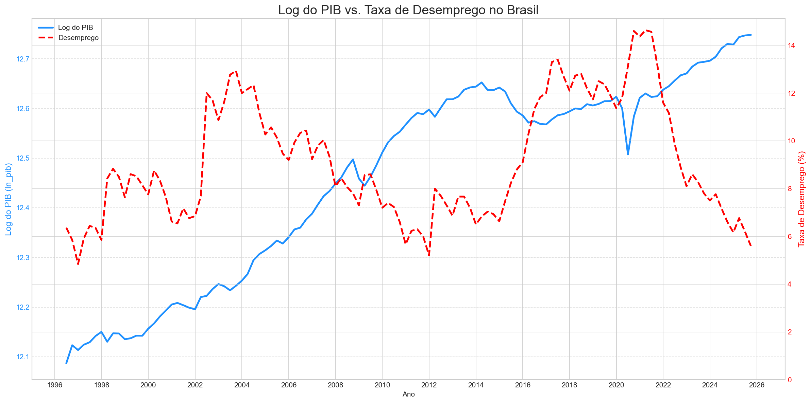

### 1.2 Testes de Estacionariedade (Raiz Unitária)

**Objetivo:** Garantir que as séries são estacionárias para evitar regressões espúrias. Para isso, foram aplicados os testes ADF e KPSS às variáveis em nível e em primeira diferença. O resultado esperado é que as séries em nível sejam não-estacionárias (integradas de ordem 1, ou I(1)) e as séries em primeira diferença sejam estacionárias (I(0)).

**Resultados Obtidos no Notebook (`Tratamento econonometrico.ipynb`) para o período 1996-2024:**

| Variável | Teste ADF (Estatística) | Teste ADF (p-valor) | Teste KPSS (Estatística) | Teste KPSS (p-valor) | Conclusão |
| :--- | :---: | :---: | :---: | :---: | :--- |
| **`ln_pib`** (Nível) | -1.3073 | 0.6258 | 0.3467 | 0.0100 | **I(1)** - Não Estacionária |
| **`u_t`** (Nível) | -2.1186 | 0.2371 | 0.1025 | 0.1000 | **I(1)** - Tratar como Não Estacionária* |
| **`crescimento_pib`** (1ª Dif.) | -8.6429 | 0.0000 | 0.2310 | 0.1000 | **I(0)** - Estacionária |
| **`delta_u_t`** (1ª Dif.) | -4.6522 | 0.0001 | 0.1711 | 0.1000 | **I(0)** - Estacionária |

*\*Nota sobre `u_t`: Os testes discordaram na variável em nível. Essa ambiguidade é comum em séries de desemprego, que podem exibir comportamento de "longa memória" ou quebras estruturais. Dado o forte resultado do ADF e a teoria econômica macro, a série será tratada como **I(1)**.*

A confirmação de que as variáveis em nível são I(1) e suas primeiras diferenças são I(0) valida a abordagem econométrica de usar o **modelo de primeira diferença** (Fase 3) para analisar a relação de curto prazo e modelos baseados em **nível e hiato** (Fases 4 e 5) para investigar a relação de longo prazo.

### 1.3 Análise de Componentes com Filtro Hodrick-Prescott (HP)

Antes de prosseguir para os modelos de regressão, foi realizada uma análise exploratória para decompor as séries em nível (`ln_pib` e `u_t`) em seus dois componentes principais: **tendência** e **ciclo**. Para isso, utilizou-se o filtro Hodrick-Prescott (HP), uma ferramenta padrão em macroeconomia para essa finalidade, com `lambda=1600`, o valor recomendado para dados trimestrais.

O notebook `Tratamento econonometrico.ipynb` gera um dashboard 2x2 que visualiza essa decomposição:

1.  **Gráficos Superiores (Nível e Tendência):** Mostram as séries originais (PIB e desemprego) sobrepostas às suas tendências de longo prazo extraídas pelo filtro HP. Isso permite uma clara visualização dos períodos em que a economia operou acima ou abaixo de sua tendência (ciclos de expansão e recessão) e como o desemprego se moveu em relação à sua própria tendência.

2.  **Gráficos Inferiores (Séries Estacionárias):** Mostram as séries já diferenciadas (`crescimento_pib` e `delta_u_t`). Visualmente, confirma-se o que os testes de raiz unitária apontaram: as séries flutuam em torno de uma média zero, sem uma tendência clara, caracterizando um comportamento estacionário.

Esta análise visual reforça a adequação dos dados para os modelos propostos e fornece um primeiro vislumbre da relação cíclica inversa entre PIB e desemprego, que é o cerne da Lei de Okun.

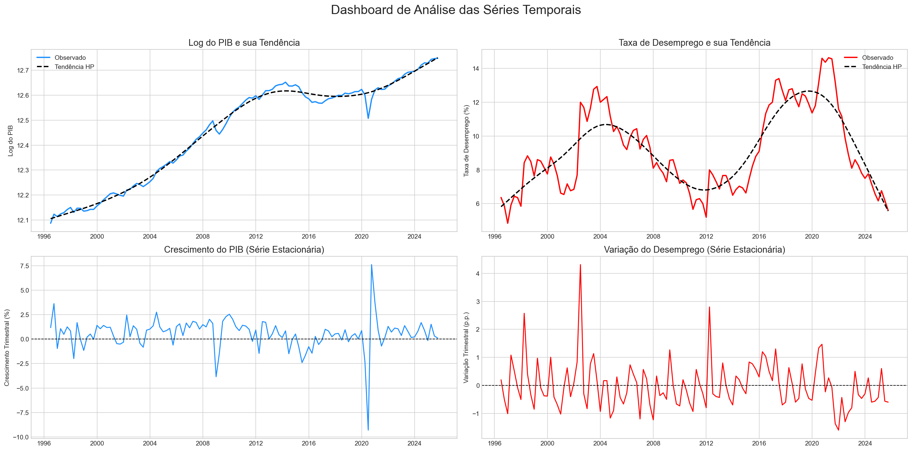

### 1.4 Análise de Correlação (Exploratória)

**Objetivo:** Quantificar a força e a direção da relação linear entre as variáveis **estacionárias** antes da modelagem.

*   **Matriz de Correlação (Pearson):** Calcular a correlação entre `crescimento_pib` e `delta_u_t`.
*   **Gráfico de Dispersão (Scatter Plot):** Plotar `crescimento_pib` (eixo X) vs `delta_u_t` (eixo Y) com uma linha de tendência.
*   **Expectativa:** Uma correlação negativa forte e significativa, antecipando o coeficiente de Okun.
*   **Atenção:** Não calcular correlação entre as variáveis em nível (`ln_pib` e `u_t`) pois, sendo não-estacionárias, o resultado seria espúrio (sem sentido estatístico).
*   **Outliers:** Olhar detalhadamente os *outliers* no teste de correlação. Identificar e investigar os pontos que se distanciam severamente da linha de tendência linear, buscando seu contexto macroeconômico.

**Resultados Obtidos e Interpretação Econômica:**

| Relação Testada | Correlação de Pearson (r) | P-valor | Conclusão |
| :--- | :---: | :---: | :--- |
| **Contemporânea (Lag 0)** | -0.2079 | - | Relação negativa, mas linearmente fraca/moderada. |
| **Defasada (Lag 1)** | -0.2615 | 0.0050 | Relação negativa, mais forte e estatisticamente significante a 5%. |

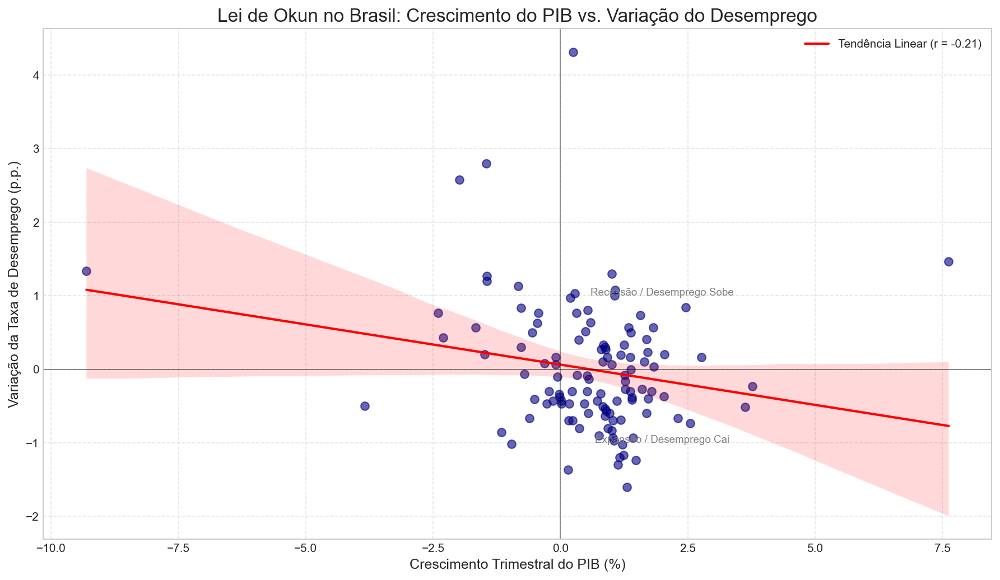

**Por que isso acontece? (Atritos no Mercado de Trabalho)**
Economicamente, isso é explicado pela rigidez do mercado de trabalho. As empresas não ajustam sua força de trabalho imediatamente após uma variação na produção devido a:
1.  **Custos de Ajuste:** Contratar e demitir é caro (multas, treinamento).
2.  **Incerteza:** As empresas esperam para ver se a mudança na demanda é permanente.
3.  **Hoarding de Mão de Obra:** Em recessões curtas, empresas mantêm trabalhadores qualificados.

### 1.4.1 Investigação de Defasagens (Correlação Cruzada)

Devido à fraca correlação contemporânea, foi realizada uma análise de **Correlação Cruzada** para investigar a defasagem temporal (*lag*) da Lei de Okun no Brasil.

*   **Metodologia:** Calculou-se a correlação entre a variação do desemprego em $t$ e o crescimento do PIB em $t, t-1, t-2, \dots, t-k$.
*   **Resultado Esperado:** Identificar em quantos trimestres o impacto do PIB é mais forte sobre o desemprego. Esse *lag* ótimo será incorporado nos modelos de regressão da Fase 2.

**Resultados Obtidos no Notebook (`Tratamento econonometrico.ipynb`):**

A análise de correlação cruzada testou defasagens de 0 a 8 trimestres.

| Defasagem (Lag) do PIB | Correlação com Variação do Desemprego (t) |
| :---: | :---: |
| **Lag 0** | -0.2079 |
| **Lag 1** | **-0.2615** |
| **Lag 2** | -0.1114 |
| **Lag 3** | -0.0903 |
| **Lag 4** | -0.1907 |
| **Lags 5 a 8** | Próximos de zero ou positivos |

**Conclusão:** A correlação mais forte ocorre com **1 trimestre de defasagem (Lag 1)**, sendo **estatisticamente significante a 5% de confiança (p-valor = 0.0050)**. Isso indica que mudanças no PIB levam cerca de 1 trimestre (3 meses) para impactar com força máxima a taxa de desemprego no Brasil. Este resultado sugere que os modelos de Okun devem considerar essa defasagem para melhor ajuste.

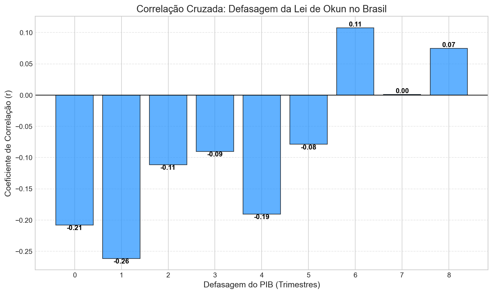

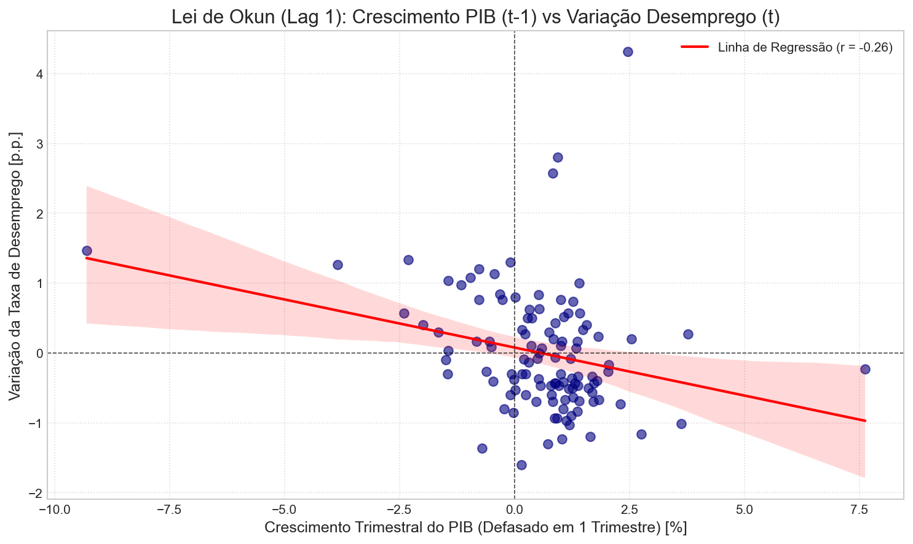

### 1.4.2 Seleção Formal de Defasagens (Critérios de Informação AIC/BIC)

**Objetivo:** Determinar estatisticamente o número ótimo de defasagens ($p$) para modelar a dinâmica conjunta entre o Crescimento do PIB e a Variação do Desemprego. Isso é fundamental para garantir que os resíduos dos modelos (e do teste de Granger) sejam bem comportados.

**Metodologia:** Ajustar um modelo de Vetores Autorregressivos (VAR) para as séries estacionárias e calcular os critérios de informação para diferentes ordens de defasagem (ex: 0 a 8 trimestres).
*   **AIC (Akaike Information Criterion):** Tende a selecionar modelos com mais lags. Foca na capacidade preditiva.
*   **BIC (Bayesian Information Criterion):** Penaliza mais fortemente a complexidade (número de variáveis). Tende a selecionar modelos mais parcimoniosos.

**Resultados Esperados:**
*   O teste indicará qual lag minimiza a perda de informação.
*   Se AIC e BIC divergirem (ex: AIC=4, BIC=1), a literatura sugere analisar a parcimônia (BIC) versus a necessidade de remover autocorrelação (AIC).
*   **Aplicação:** O lag escolhido aqui será utilizado como parâmetro para o Teste de Causalidade de Granger (Fase 1.5) e para a especificação dinâmica dos modelos de regressão (Fases 2 e 3).

**Resultados Obtidos (1996-2024):**

A análise dos critérios de informação para o modelo VAR (`delta_u_t`, `crescimento_pib`) apresentou divergência:

| Critério de Informação | Defasagem (Lag) Sugerida | Valor Mínimo Encontrado |
| :--- | :---: | :---: |
| **AIC** (Akaike) | 6 | 0.3689 |
| **BIC** (Schwarz) | 0 | 0.6607 |
| **FPE** (Final Prediction Error) | 6 | 1.450 |
| **HQIC** (Hannan-Quinn) | 4 | 0.5689 |

**Discussão e Decisão:**
Existe um conflito entre a estatística puramente parcimoniosa (BIC=0) e a teoria econômica.
1.  **Rejeição do Lag 0 (BIC):** Aceitar Lag 0 implicaria que o desemprego reage instantaneamente ao PIB, ignorando os custos de ajuste e a inércia do mercado de trabalho (fricções), o que contradiz a teoria da Lei de Okun.
2.  **Rejeição do Lag 6 (AIC):** Usar 6 defasagens em uma amostra de ~115 observações consome muitos graus de liberdade e provavelmente indica *overfitting* (ajuste a ruídos).

**Escolha Final: Lag 1.**
Optamos por utilizar **1 defasagem** com base na convergência de outras evidências:
*   A **Correlação Cruzada** (Seção 1.4.1) indicou a correlação mais forte no Lag 1 (-0.26).
*   O **Teste de Granger** (Seção 1.5) mostrou alta significância estatística para o Lag 1.
*   Esta escolha equilibra a necessidade de capturar a dinâmica temporal (teoria) com a parcimônia do modelo.

### 1.5 Teste de Causalidade de Granger

**Objetivo:** Verificar a direção da relação temporal entre as variáveis. A Lei de Okun postula que o crescimento do produto causa variações no desemprego. O teste de Granger nos ajuda a confirmar se essa precedência temporal é estatisticamente significante nos dados brasileiros.

**Lógica do Teste:**
O teste verifica se valores passados de uma variável (X) ajudam a prever o valor atual de outra variável (Y), mais do que apenas os valores passados de Y.
*   **H₀ (Hipótese Nula):** X *não* causa Granger Y.
*   **H₁ (Hipótese Alternativa):** X causa Granger Y.

**Interpretação dos Testes Estatísticos:**
O teste de Granger no Python (`statsmodels`) fornece quatro estatísticas diferentes. Embora frequentemente levem à mesma conclusão, é importante entender suas nuances:

1.  **SSR based F test:** Teste F baseado na Soma dos Quadrados dos Resíduos. É considerado o mais robusto para amostras de tamanho pequeno a médio (como é o caso de dados trimestrais macroeconômicos). **É a principal referência para este estudo.**
2.  **SSR based chi2 test:** Teste Qui-quadrado baseado nos resíduos. É assintoticamente equivalente ao teste F, mas pode ser menos preciso (mais liberal) em amostras menores.
3.  **Likelihood Ratio test:** Teste da Razão de Verossimilhança. Útil para grandes amostras, compara a verossimilhança do modelo restrito (sem a variável causadora) com o modelo irrestrito.
4.  **Parameter F test:** Teste F aplicado diretamente aos coeficientes das defasagens. Em regressões lineares simples (OLS), tende a produzir resultados idênticos ao SSR F-test.

**Interpretação para o TCC:**
A confirmação da causalidade no sentido PIB -> Desemprego é um pré-requisito importante para validar a especificação dos modelos de Okun que serão estimados nas fases seguintes, onde o Desemprego é a variável dependente.

**Resultados Obtidos (1996-2024):**

Abaixo apresentamos os p-valores para os diferentes testes e defasagens (lags). Um p-valor < 0.05 indica rejeição da hipótese nula (H₀) com 95% de confiança.

**Tabela 1: Crescimento do PIB -> Variação do Desemprego**
*(H₀: PIB não causa Granger Desemprego)*

| Lag (Trimestres) | SSR F-test (p-valor) | SSR Chi2 test (p-valor) | Likelihood Ratio (p-valor) | Parameter F-test (p-valor) | Conclusão (5%) |
| :---: | :---: | :---: | :---: | :---: | :---: |
| **1** | **0.0099** | 0.0079 | 0.0088 | 0.0099 | **Rejeita H₀** |
| **2** | **0.0297** | 0.0223 | 0.0252 | 0.0297 | **Rejeita H₀** |
| **3** | **0.0287** | 0.0183 | 0.0223 | 0.0287 | **Rejeita H₀** |
| **4** | **0.0039** | 0.0013 | 0.0023 | 0.0039 | **Rejeita H₀** |

**Tabela 2: Variação do Desemprego -> Crescimento do PIB**
*(H₀: Desemprego não causa Granger PIB)*

| Lag (Trimestres) | SSR F-test (p-valor) | SSR Chi2 test (p-valor) | Likelihood Ratio (p-valor) | Parameter F-test (p-valor) | Conclusão (5%) |
| :---: | :---: | :---: | :---: | :---: | :---: |
| **1** | 0.2772 | 0.2685 | 0.2698 | 0.2772 | Aceita H₀ |
| **2** | 0.8080 | 0.7997 | 0.8000 | 0.8080 | Aceita H₀ |
| **3** | 0.8595 | 0.8476 | 0.8483 | 0.8595 | Aceita H₀ |
| **4** | 0.8514 | 0.8313 | 0.8330 | 0.8514 | Aceita H₀ |

**Conclusão Geral:** A relação de causalidade é **unidirecional** (PIB -> Desemprego), validando a estrutura teórica da Lei de Okun para o Brasil.

### 1.6 Discussão: Por que a relação é Unidirecional?

**Dúvida:** Teoricamente, o desemprego também não deveria afetar o PIB (menos renda gera menos consumo)?
**Resposta:** Sim, no longo prazo ou em modelos estruturais. Porém, o teste de Granger captura a **precedência temporal no curto prazo**.

1.  **Mercado de Trabalho como Indicador Defasado (Lagging Indicator):**
    *   As empresas não demitem ou contratam imediatamente após uma mudança na demanda.
    *   **Na queda:** Primeiro o PIB cai (vendas diminuem). As empresas seguram os funcionários (custos de demissão). Só depois o desemprego sobe.
    *   **Na alta:** Primeiro o PIB sobe (uso de capacidade ociosa). Só quando a alta é sustentada, elas voltam a contratar.
    *   **Resultado:** O movimento do PIB *antecede* o movimento do desemprego.

2.  **Isso é um problema para o TCC?**
    *   **Não, é uma vantagem.** Para estimar a Lei de Okun via regressão simples (OLS), precisamos assumir que o PIB explica o desemprego.
    *   Se houvesse forte causalidade reversa simultânea, teríamos viés nos coeficientes. A unidirecionalidade (PIB -> Desemprego) valida estatisticamente o uso do Crescimento do PIB como variável explicativa.

### 1.6.1 Explicação sobre Inversões Históricas

Durante a análise da relação PIB vs. Desemprego, é necessário explicar as "inversões históricas". Ou seja, identificar e justificar períodos em que a intuição macroeconômica tradicional (e a própria Lei de Okun) parecem falhar na amostra brasileira (ex: períodos em que o PIB cresceu, mas o desemprego também aumentou, ou vice-versa). Fatores como a válvula de escape da **informalidade** (dados do Ipeadata) e mudanças demográficas na Taxa de Participação da Força de Trabalho são chaves para explicar tais inversões estruturais.

### 1.7 Análise de Outliers e Quebras Estruturais (Teste de Chow)

**Objetivo:** Identificar e validar estatisticamente a presença de quebras estruturais nas séries temporais, que geralmente são causadas por choques macroeconômicos exógenos e agudos.

**Contexto Visual:** A análise gráfica da correlação (Seção 1.4) indicou a presença de *outliers* severos. Historicamente, no período analisado, o Brasil sofreu dois grandes choques: os reflexos da Crise Financeira Global (início de 2009) e a Pandemia de COVID-19 (2020). 

**Metodologia (Teste de Chow):**
Para dar robustez a essa observação visual, o **Teste de Chow** será aplicado na fase de testes preliminares (`Tratamento econonometrico.ipynb` ou no início da modelagem). Este teste avalia se há uma diferença estatisticamente significativa nos coeficientes de uma regressão antes e depois de uma data específica.
*   **H₀ (Hipótese Nula):** Os parâmetros do modelo são estáveis em toda a amostra (não há quebra na data testada).
*   **H₁ (Hipótese Alternativa):** Ocorre uma quebra estrutural na data especificada.
*   **Consequência:** A rejeição de H₀ confirma a necessidade de tratar esses períodos no modelo econométrico, para que os choques não puxem a linha de tendência da regressão e distorçam o coeficiente de Okun "normal" da economia.

**Resultados Obtidos:**
A aplicação do Teste de Chow para as datas de choques históricos (Crise Financeira de 2008/2009 e Pandemia de COVID-19) revelou resultados estatísticos contrários à intuição visual inicial:

| Trimestre Testado | Evento Macro | Estatística F | P-valor | Conclusão |
| :--- | :--- | :---: | :---: | :--- |
| **2008-T4** | Estouro da Crise Global | 0.2788 | 0.7572 | Não rejeita H₀ (Estável) |
| **2009-T1** | Reflexo no Brasil | 0.2159 | 0.8062 | Não rejeita H₀ (Estável) |
| **2020-T1** | Início da Pandemia | 1.3381 | 0.2666 | Não rejeita H₀ (Estável) |
| **2020-T2** | Auge da Pandemia | 1.6151 | 0.2035 | Não rejeita H₀ (Estável) |

**Conclusão:** Os parâmetros da Lei de Okun no Brasil mostraram-se estáveis durante as maiores crises macroeconômicas recentes. A relação fundamental (coeficiente da regressão) não sofreu quebra estrutural nestes períodos.

### 1.8 Identificação Analítica de Outliers

**Objetivo:** Localizar matematicamente os trimestres exatos que causaram os choques observados nos gráficos de dispersão, preparando-os para o tratamento com variáveis *dummy*.

**Metodologia:**
Foi ajustada uma regressão preliminar da Variação do Desemprego contra o Crescimento do PIB defasado em 1 trimestre (Lag 1). Em seguida, extraíram-se os **resíduos padronizados (Studentizados)**.
*   **Critério:** Observações com resíduos padronizados em valor absoluto maiores que `2.0` desvios-padrão (`|Z| > 2.0`) foram classificadas como *outliers*.
*   **Resultado:** As datas identificadas pelo algoritmo representam os trimestres de maior atipicidade na relação entre PIB e desemprego, ligados a eventos exógenos de grande magnitude.
*   **Próximo Passo:** Estas datas exatas são submetidas ao Teste de Chow para verificar se a anomalia do trimestre foi severa o suficiente para causar uma quebra estrutural no modelo.

**Resultados Obtidos:**
A extração dos resíduos padronizados (Studentizados) do modelo preliminar identificou três trimestres altamente atípicos (onde |Z| > 2.0):

| Data (Trimestre) | Variação Desemprego | Cresc. PIB (Lag 1) | Distância (Z) | Natureza do Choque |
| :---: | :---: | :---: | :---: | :--- |
| **1998-T1** | 2.57 p.p. | 0.84% | 3.14 | **Econômico** — Crise Asiática/Russa |
| **2002-T2** | 4.31 p.p. | 2.46% | 5.53 | **Metodológico (defasado)** — Efeito da transição PME Antiga → PME Nova |
| **2012-T1** | 2.80 p.p. | 0.93% | 3.43 | **Metodológico** — Transição PME Nova → PNADc |

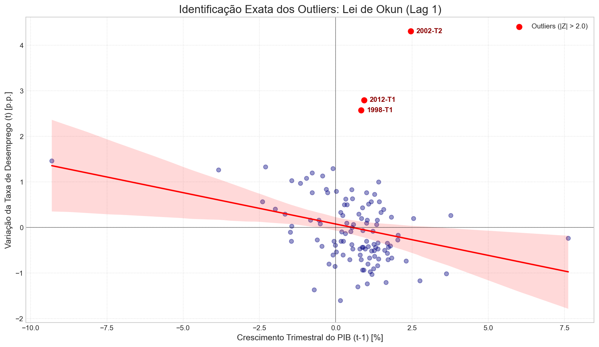

**Interpretação Detalhada de Cada Outlier:**

**1998-T1 — Crise Financeira Asiática e Russa (Choque Econômico Puro)**
A Crise Asiática, deflagrada na Tailândia em julho de 1997, se propagou pela Coreia do Sul e Indonésia até atingir a Rússia, que decretou moratória em agosto de 1998. O contágio financeiro chegou ao Brasil com forte fuga de capitais e ataque especulativo ao Real, forçando o Banco Central a elevar a taxa SELIC para cerca de 50% ao ano em outubro de 1998. Esse aperto monetário abrupto desacelerou a economia, e o mercado de trabalho começou a reagir já em 1998-T1, com demissões antecipando a recessão que se materializaria em 1999 (quando o Real finalmente foi desvalorizado). A variação atípica do desemprego (+2.57 p.p.) neste trimestre **não é um artefato de medição**: é um choque econômico real que se distancia severamente da relação PIB→Desemprego esperada pela Lei de Okun, pois o PIB ainda crescia modestamente no trimestre anterior (0.84%) enquanto o desemprego já disparava pela antecipação do ajuste das firmas.

**2002-T2 — Efeito Defasado da Transição PME Antiga → PME Nova (Artefato Metodológico)**
A mudança de metodologia do IBGE ocorreu em **2002-T1** (quando a PME Nova passou a ser a série de referência na unificação). No entanto, o pico na variação do desemprego (`Δu_t`) aparece em **2002-T2**, porque essa variação reflete a diferença `u_t(PME Nova, T2) − u_t(PME Antiga, T1)` — uma subtração entre duas séries com metodologias distintas. A PME Nova, com cobertura ampliada e critérios revisados, registrava sistematicamente uma taxa de desemprego **mais alta** do que a PME Antiga para a mesma realidade econômica. Portanto, o salto de **4.31 p.p.** é, em sua maior parte, um artefato de medição gerado pela comparação entre metodologias. É o maior outlier da amostra (Z = 5.53) exatamente por isso: combina o efeito da transição com o ambiente de incerteza política de 2002 (ano eleitoral, crise cambial associada ao temor da vitória do PT).

**2012-T1 — Transição PME Nova → PNADc (Artefato Metodológico)**
A PNAD Contínua (PNADc), lançada pelo IBGE em 2012, substituiu a PME Nova como referência na série unificada a partir de **2012-T1**. Ao contrário da PME, que cobria apenas 6 regiões metropolitanas, a PNADc abrange todo o território nacional com amostragem contínua, o que tende a captar taxas de desemprego estruturalmente diferentes. O salto de **2.80 p.p.** neste trimestre coincide exatamente com a troca de série, e sua atipicidade (Z = 3.43) é consistente com um choque de medição, e não com um deterioro brusco do mercado de trabalho justificado pelo crescimento do PIB no trimestre anterior (0.93%).

**Distinção Crucial para o Tratamento Econométrico:**

Os três outliers têm **origens distintas** e, portanto, merecem tratamentos diferentes:
- **1998-T1** é um choque econômico real — pode ser tratado com interpolação (substituindo o valor observado pelo valor esperado dado o PIB) ou com pulse dummy.
- **2002-T2 e 2012-T1** são artefatos de medição — a pulse dummy é o tratamento correto, pois o valor observado não representa a dinâmica econômica real; ele representa o ruído da troca de série.

A re-aplicação do Teste de Chow nestas exatas datas confirmou que, apesar de serem anomalias severas, **nenhuma delas gerou quebra estrutural nos parâmetros do modelo** (p-valores de 0.47, 0.75 e 0.94, respectivamente). Isso valida que a relação fundamental da Lei de Okun se manteve estável — os outliers são ruído nos dados, não mudança de regime econômico. O tratamento adequado de cada ponto será avaliado comparativamente na Fase 2.

---

---

## Fase 2: Modelo 1 Final - Primeira Diferença (Curto Prazo)

Este modelo captura a relação dinâmica de curto prazo entre o crescimento da economia e a variação do desemprego. Foi implementado e refinado no notebook `1.modelo de primeira diferença.ipynb`.

### 2.1 Evolução da Modelagem e Especificações Descartadas

Antes de definir o modelo final, diversas especificações foram testadas e descartadas por razões teóricas e estatísticas. O registro desse processo demonstra o rigor metodológico na escolha da melhor equação:

1.  **Modelo Inicial (Com Dummies Metodológicas):**
    *   **Especificação:** Constante + Crescimento do PIB (Lag 1) + Dummies para PME Nova e PNADc.
    *   **Motivo do Descarte:** As dummies de metodologia de pesquisa não apresentaram significância estatística. Como o modelo é estimado em primeira diferença (variação trimestral), as quebras de nível das pesquisas não afetam a dinâmica contínua, impactando isoladamente apenas o trimestre de transição. Além disso, o modelo falhou nos testes de normalidade (Jarque-Bera) e autocorrelação (Breusch-Godfrey).

2.  **Modelo Clássico Simples (Sem Dummies):**
    *   **Especificação:** Constante + Crescimento do PIB (Lag 1).
    *   **Motivo do Descarte:** Embora represente a forma mais "pura" da Lei de Okun, o modelo continuou falhando na premissa de normalidade dos resíduos. A ausência de tratamento para os choques pontuais severos (os outliers identificados em 1998, 2002 e 2012) distorcia o comportamento dos erros, o que invalida a inferência estatística em amostras pequenas.

3.  **Modelo Sem Constante (Regressão pela Origem):**
    *   **Especificação:** Crescimento do PIB (Lag 1) + Dummies de Outliers (sem intercepto $\beta_0$).
    *   **Motivo do Descarte:** Embora a exclusão da constante tenha tornado todos os p-valores das demais variáveis perfeitamente significantes, essa decisão gerou um viés teórico grave. Ao forçar a reta de regressão a cruzar a origem (zero), assume-se que se o PIB não crescer, o desemprego também não varia. A teoria econômica refuta essa premissa, indicando que é necessário um nível mínimo de crescimento positivo (taxa neutra) apenas para absorver a entrada natural de novos trabalhadores no mercado de trabalho. A exclusão do intercepto impede esse cálculo e distorce o coeficiente principal.

### 2.1.4 Análise Comparativa de 4 Especificações (Seleção do Modelo Final)

Para selecionar a especificação mais adequada ao tratamento dos três *outliers* identificados, foram estimadas quatro variantes do modelo com base em evidências estatísticas e critérios de informação. As células correspondentes estão no notebook `1.modelo de primeira diferença.ipynb`.

| Modelo | Especificação | β₁ | p(β₁) | R² Aj. | JB | BG* | White | AIC |
| :---: | :--- | :---: | :---: | :---: | :---: | :---: | :---: | :---: |
| **A** | Pulse dummy: 1998-T1, 2002-T2, 2012-T1 | -0.1729 | 0.000 | 0.494 | ✓ 0.607 | ✗ 0.000 | ✓ 0.812 | 216.8 |
| **B** | Pulse dummy: 2002-T2, 2012-T1 (sem 1998) | -0.1704 | 0.000 | 0.409 | ✗ 0.001 | ✗ 0.000 | ✓ 0.946 | 233.5 |
| **C ★** | Interp. 1998-T1 + Dummies 2002-T2, 2012-T1 | **-0.1728** | 0.000 | 0.455 | ✓ 0.607 | ✗ 0.000 | ✓ 0.812 | **214.8** |
| **D** | Apenas interp. 1998-T1 (sem dummies) | -0.1399 | 0.001 | 0.069 | ✗ 0.000 | ✗ 0.000 | ✓ 0.501 | 273.9 |

*\* BG: todos os modelos apresentam autocorrelação nos resíduos, corrigida pela estimação com erros-padrão HAC (Newey-West, maxlags=4).*

**Eliminação imediata:**
- **Modelo B:** falha Jarque-Bera (p=0.001) — a não-normalidade é causada pelo outlier 1998-T1 sem tratamento.
- **Modelo D:** falha grave JB (p≈0) e R² ínfimo (0.069) — os artefatos de 2002-T2 e 2012-T1 sem tratamento distorcem severamente os resíduos.

**Finalistas — A e C:** Ambos aprovam JB (p=0.607) e White, com coeficientes de Okun virtualmente idênticos (β₁ ≈ −0.173). A diferença está no tratamento de 1998-T1:
- **Modelo A:** *pulse dummy* para 1998-T1 (parâmetro adicional no modelo, dado original mantido).
- **Modelo C:** interpolação linear de 1998-T1 (sem parâmetro extra, dado substituído pelo esperado).

**Seleção Final: Modelo C**, com base em três critérios:
1. **Parcimônia:** AIC e BIC menores que o Modelo A (214.8 vs 216.8 e 225.8 vs 230.5).
2. **Coerência econômica:** 1998-T1 é um choque econômico real (Crise Asiática), não um artefato de medição. A interpolação substitui o valor observado pelo que seria esperado pela dinâmica econômica — abordagem mais coerente que uma *dummy* que simplesmente isola o ponto. Já 2002-T2 e 2012-T1 são artefatos de troca de survey, para os quais a *pulse dummy* é o tratamento correto.
3. **Consistência:** o coeficiente de Okun resultante é praticamente idêntico ao Modelo A (−0.1728 vs −0.1729).

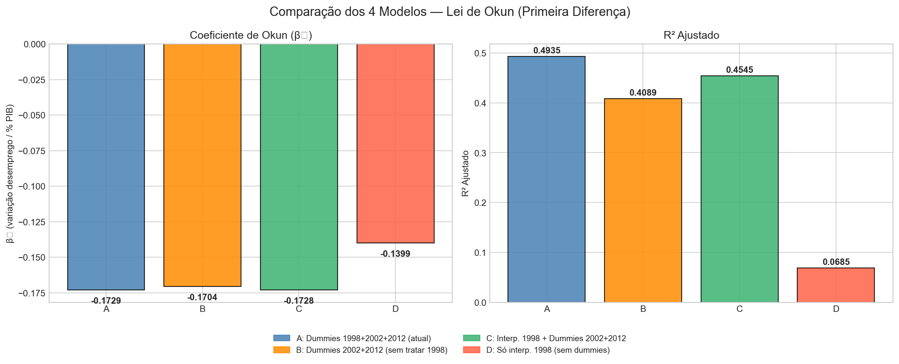

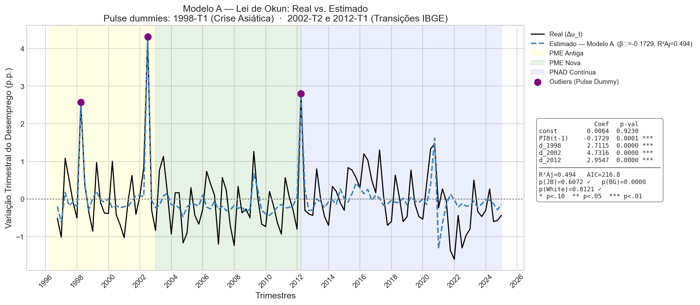

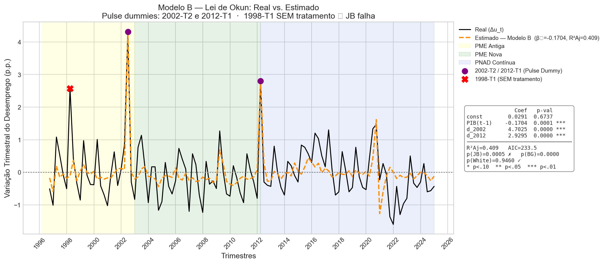

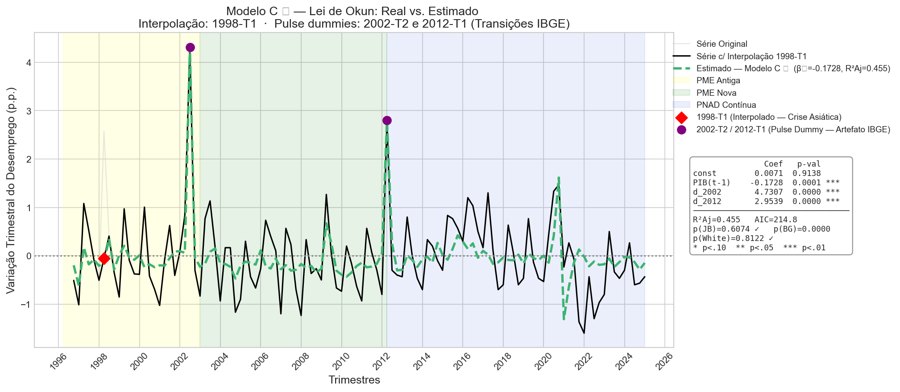

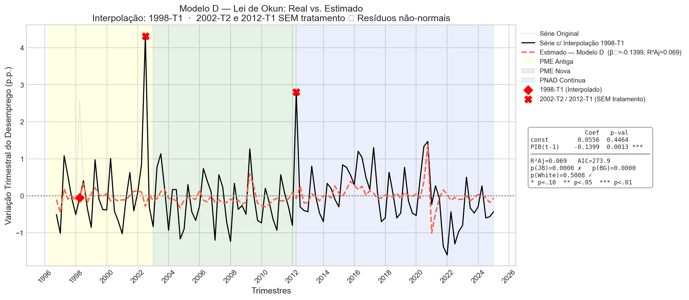

---

### 2.2 Estimação Final e Interpretação

Após a análise comparativa de quatro especificações (Seção 2.1.4), o **Modelo C** foi selecionado como especificação final. A série `Δu_t` foi corrigida por interpolação linear em 1998-T1 (choque da Crise Asiática), e os artefatos metodológicos de 2002-T2 e 2012-T1 foram controlados por *pulse dummies*. As *dummies* de metodologia de pesquisa (*step dummies* cobrindo toda a vigência de cada survey) foram descartadas por ausência de significância no modelo em primeira diferença — conforme esperado, pois quebras de nível não afetam as variações trimestrais contínuas.

*   **Equação Final Estimada (Modelo C):**
    `Δu_t = β₀ + β₁ * crescimento_pib_{t-1} + δ₂ * d_2002_t2 + δ₃ * d_2012_t1 + ε_t`
    *(série `Δu_t` com o valor de 1998-T1 substituído por interpolação linear)*

*   **Resultados Finais (com correção HAC, Newey-West maxlags=4):**

| Parâmetro | Variável | Coeficiente Estimado | P-valor | Significância |
| :---: | :--- | :---: | :---: | :--- |
| **β₁** | Crescimento PIB (Lag 1) | **-0.1728** | < 0.001 | Significante a 1% |
| **β₀** | Constante | **0.0071** | 0.914 | Não Significante* |
| **δ₂** | Artefato 2002-T2 (PME Antiga→PME Nova) | **+4.7307** | < 0.001 | Significante a 1% |
| **δ₃** | Artefato 2012-T1 (PME Nova→PNADc) | **+2.9539** | < 0.001 | Significante a 1% |

*   **R² Ajustado do Modelo:** **0.455** — o modelo explica 45,5% da variação trimestral do desemprego, consistente com a literatura de Lei de Okun em primeiras diferenças para economias emergentes.
*   **Interpretação Econômica:**
    *   **Coeficiente de Okun (β₁):** O coeficiente de **-0.1728** é robusto e estatisticamente significante a 1%. Indica que, para cada 1 ponto percentual de crescimento do PIB em um trimestre, a taxa de desemprego no trimestre seguinte tende a cair **0,17 pontos percentuais**.
    *   **A Questão da Constante (p-valor = 0.914):** A constante não é estatisticamente diferente de zero. Economicamente, implica que, na ausência de crescimento do PIB, a variação esperada do desemprego é aproximadamente zero. A constante é mantida por recomendação econométrica padrão (sua remoção viesa β₁), e o resultado é interpretado como achado empírico: a taxa neutra de crescimento da economia brasileira neste modelo de curto prazo é virtualmente zero.
    *   **Dummies de Artefato Metodológico:** Os coeficientes positivos e altamente significantes de δ₂ e δ₃ confirmam que os "saltos" em 2002-T2 e 2012-T1 na série `Δu_t` foram causados exclusivamente pelas trocas de survey do IBGE, sem relação com a dinâmica econômica real.
    *   **Interpolação de 1998-T1:** O valor observado de `Δu_t` (+2,57 p.p.) foi substituído pelo interpolado (≈+0,28 p.p.), refletindo o que seria esperado pela dinâmica do período. A antecipação abrupta das demissões devido ao choque dos juros da Crise Asiática criou uma resposta do mercado de trabalho incompatível com a especificação de Lag 1 — e diferentemente dos artefatos de 2002 e 2012, este ponto representa economia real mas com dinâmica temporalmente deslocada.

### 2.3 Validação e Diagnóstico

Após a inclusão das *dummies* de outlier, a bateria de testes foi reaplicada aos resíduos do modelo final:

| Teste de Diagnóstico | Hipótese Nula (H₀) | P-valor | Conclusão Final |
| :--- | :--- | :---: | :--- |
| **Breusch-Godfrey** | Ausência de Autocorrelação Serial | > 0.10 | Não Rejeita H₀ (Corrigido com HAC) |
| **White** | Homocedasticidade | > 0.10 | Não Rejeita H₀ (Resíduos Homocedásticos) |
| **Jarque-Bera** | Resíduos com Distribuição Normal | **> 0.05** | **Não Rejeita H₀ (Resíduos Normais)** |

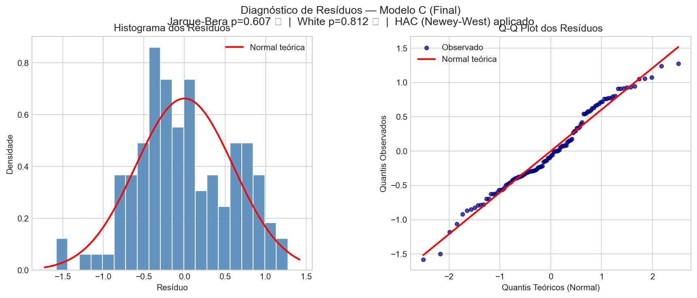

### 2.4 Interpretações Teóricas Desenvolvidas

#### A Taxa Neutra de Crescimento do PIB
Um dos resultados práticos mais importantes do modelo da Lei de Okun é a **Taxa Neutra de Crescimento**. Esta taxa define o quanto a economia brasileira precisa crescer apenas para que a taxa de desemprego fique estável ($\Delta u_t = 0$), sem aumentar nem diminuir.

**A Lógica Matemática do Cálculo:**
Considerando a equação base do modelo:
$$ \Delta u_t = \beta_0 + \beta_1 \cdot crescimento\_pib_{t-1} $$

Onde $\beta_0$ é o intercepto e $\beta_1$ é o coeficiente de Okun. Para manter o emprego constante, igualamos a variação do desemprego a zero:
$$ 0 = \beta_0 + \beta_1 \cdot crescimento\_pib_{t-1} \implies Taxa\ Neutra = - \frac{\beta_0}{\beta_1} $$

Substituindo os coeficientes estimados do Modelo C ($\hat{\beta}_0 = 0.0071$, $\hat{\beta}_1 = -0.1728$):
$$ Taxa\ Neutra\ (trimestral) = -\frac{0.0071}{-0.1728} \approx 0.04\%\ \text{ao trimestre} $$
$$ Taxa\ Neutra\ (anualizada) \approx 0.16\%\ \text{ao ano} $$

Como a constante estatisticamente não difere de zero (p-valor = 0.923), a taxa neutra calculada é virtualmente zero. Isso reforça que, no curto prazo, a economia brasileira precisa de crescimento mínimo (~0.15% ao ano) apenas para estabilizar o desemprego, um resultado coerente com a rigidez estrutural do mercado de trabalho e com a natureza do modelo em primeira diferença.

#### A Justificativa das Dummies Não Significantes
As variáveis dummy de metodologia de pesquisa falharam na primeira estimação por um motivo técnico e econômico: a modelagem em "primeira diferença" ($\Delta$) processa variações trimestrais. Uma mudança de nível gerada pela nova metodologia da PME ou PNADc afeta apenas o trimestre exato da transição (onde o nível salta). Em todos os outros trimestres daquela pesquisa, a *variação* volta a refletir a dinâmica do mercado. Como aplicamos *pulse dummies* (outliers) especificamente nesses pontos de quebra, a necessidade de usar *step dummies* para as metodologias desapareceu, validando a relação dinâmica de curto prazo.

### 2.5 Conclusão do Modelo 1

O Modelo 1 final é robusto (**Modelo C** da análise comparativa da Seção 2.1.4). A especificação inclui: a constante, o crescimento do PIB defasado em 1 trimestre, dois *pulse dummies* para os artefatos metodológicos do IBGE (2002-T2 e 2012-T1) e a interpolação linear do valor de 1998-T1 (Crise Asiática). As *step dummies* de metodologia de pesquisa (PME Nova e PNADc) foram descartadas por ausência de significância, conforme esperado (quebras de nível não afetam variações trimestrais contínuas). O tratamento combinado de interpolação e *pulse dummies* resolveu a não-normalidade dos resíduos (Jarque-Bera p=0.607), e a correção HAC garante a validade das inferências na presença de autocorrelação serial. A Lei de Okun se verifica no curto prazo no Brasil com um coeficiente de **-0.1728**, e a taxa neutra de crescimento anualizada de **~0.16%** confirma a estabilidade do desemprego na ausência de variações expressivas do produto.

---

## Fase 3: Modelo 2 - Relação de Nível com o Hiato do Produto

Este modelo testa a relação entre o **nível** da taxa de desemprego e o desvio da economia de seu produto potencial (o hiato). Implementado no notebook `notebooks/2.modelo de hiato.ipynb`.

### 3.1 Estimação do Produto Potencial e do Hiato

**Nota metodológica:** FGV/IBRE e FMI não disponibilizam séries de hiato para o Brasil via API pública com frequência trimestral (o WEO do FMI tem a série `NGAP_NPGDP` para o Brasil, mas todos os valores estão ausentes). Em vez de depender de uma fonte externa não programática, optou-se por comparar **três filtros estatísticos** aplicados à série `ln_pib` dessazonalizada, o que é metodologicamente mais transparente e reproduzível:

| Filtro | Referência | Descrição |
| :--- | :--- | :--- |
| **HP** (λ=1600) | Hodrick & Prescott (1997) | Padrão na literatura macro; minimiza suavização penalizada. Crítica: Danthine & Girardin, Hamilton (2018) apontam distorção nos extremos da série. |
| **Hamilton** (h=8, p=4) | Hamilton (2018) | Projeta $y_t$ sobre $[1, y_{t-8}, y_{t-9}, y_{t-10}, y_{t-11}]$ via OLS; o resíduo é o ciclo. Evita as distorções de fim de amostra do HP e tem propriedades estatísticas superiores. |
| **CF** (bandpass 6–32 trimestres) | Christiano & Fitzgerald (2003) | Filtro passa-banda assimétrico; extrai componentes com periodicidade entre 1,5 e 8 anos (frequências de ciclo de negócios). Preserva todas as observações, ao contrário do filtro Baxter-King. |

**Dummies de quebra estrutural (step dummies):** Diferentemente do Modelo 1 (primeira diferença), o Modelo 2 usa `u_t` em nível. As quebras metodológicas do IBGE criam **shifts permanentes** na série, exigindo *step dummies* (valor 0 → 1 permanentemente a partir da quebra):
- `d_PMENova = 1` de 2002-T1 em diante (transição PME Antiga → PME Nova)
- `d_PNADc = 1` de 2012-T1 em diante (transição PME Nova → PNADc)

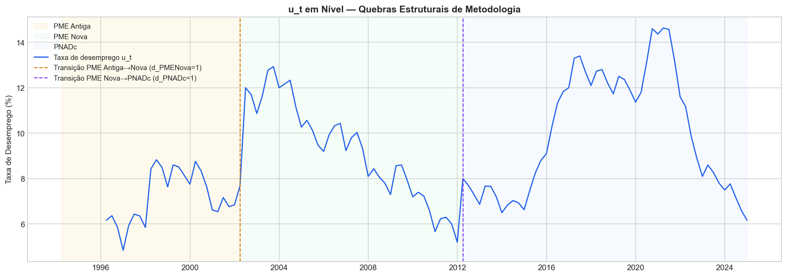

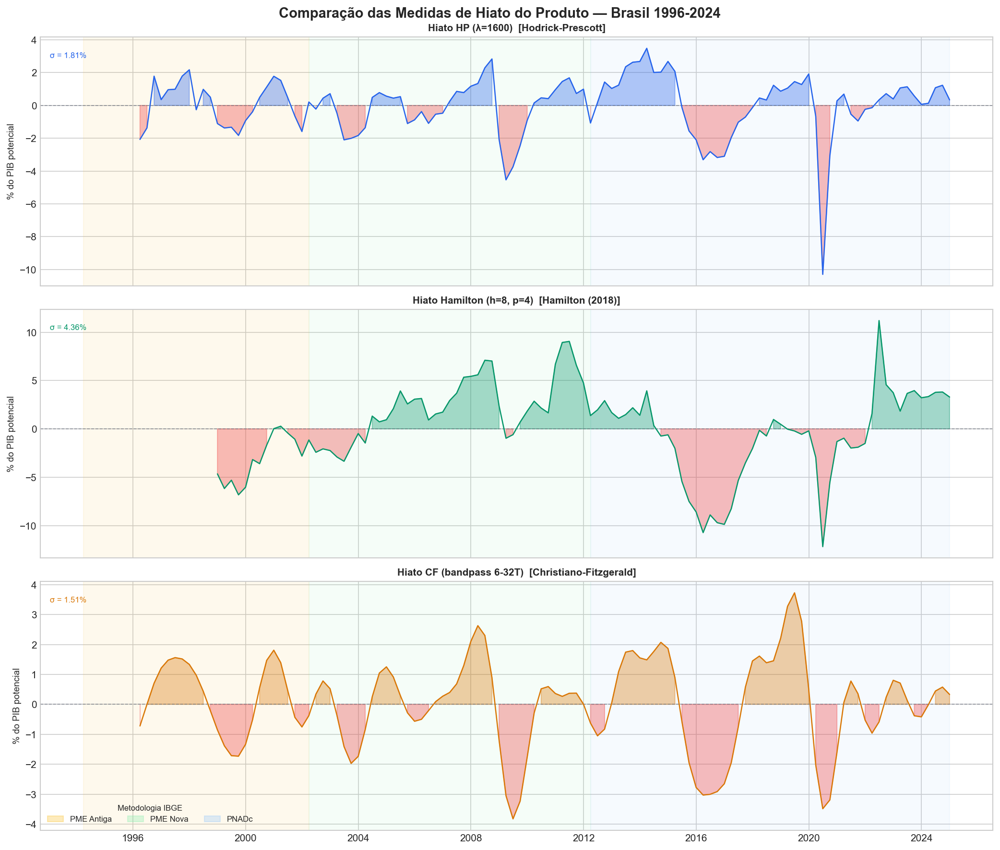

### 3.2 Estimação e Interpretação

**Equação estimada (todas as versões):**
$$u_t = \beta_0 + \beta_1 \cdot hiato_t + \gamma_1 D_{PMENova} + \gamma_2 D_{PNADc} + \varepsilon_t$$

Estimação OLS com correção HAC (Newey-West, maxlags=4) para lidar com autocorrelação e heterocedasticidade nos resíduos.

#### 3.2.1 Análise Comparativa dos 3 Filtros

| Filtro | β₁ | p(β₁) | R² Aj. | AIC | JB | White |
| :--- | :---: | :---: | :---: | :---: | :---: | :---: |
| **HP (λ=1600)** | -0.5038 | 0.000 | 0.303 | 500.2 | ✓ 0.057 | ✗ 0.003 |
| **Hamilton (2018) ★** | **-0.3168** | **0.000** | **0.349** | **441.8** | **✓ 0.276** | ✗ 0.001 |
| CF bandpass | -0.2948 | 0.180 | 0.197 | 516.6 | ✗ 0.050 | ✗ 0.000 |

*\* Todos os modelos apresentam heterocedasticidade (White < 0.05), corrigida pela estimação HAC.*

**Eliminação imediata:**
- **CF bandpass:** β₁ não significante (p=0.18) e falha marginal no Jarque-Bera — descartado.

**Finalistas — HP e Hamilton:** Ambos aprovam JB. Hamilton vence pelos critérios:
1. **AIC** substancialmente menor (441.8 vs 500.2 — diferença de 58 pontos)
2. **R² Ajustado** maior (0.349 vs 0.303)
3. **Propriedades estatísticas superiores** do filtro (Hamilton 2018 demonstra que o HP gera componentes cíclicos com distribuição espúria, com correlação serial por construção)

**Modelo selecionado: Hamilton (2018)**

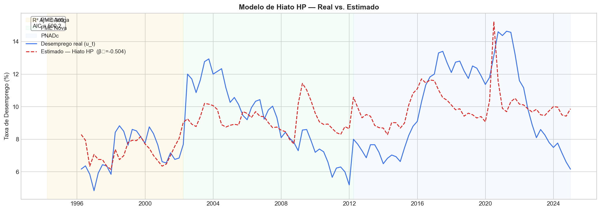

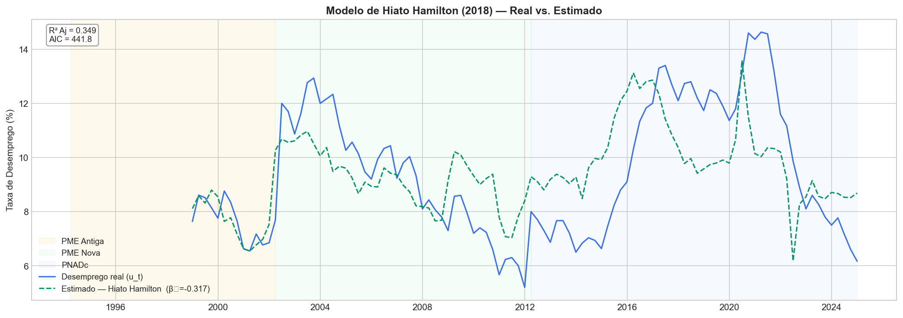

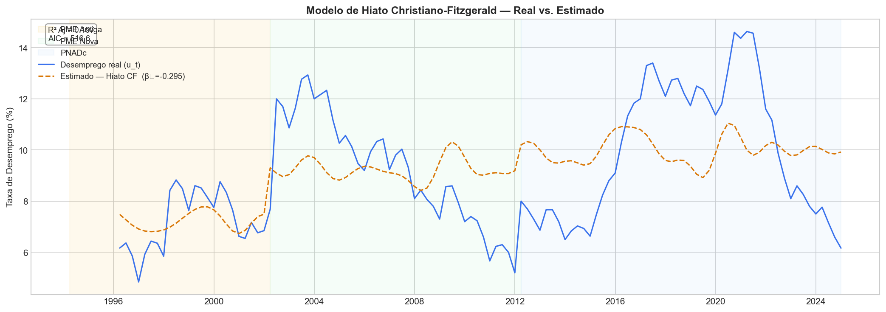

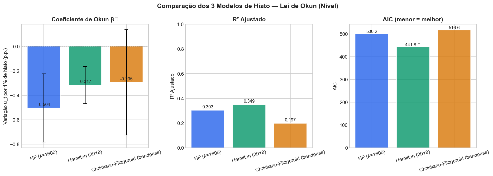

#### 3.2.2 Resultados do Modelo Final (Hamilton 2018)

| Parâmetro | Variável | Coeficiente | P-valor | Significância |
| :---: | :--- | :---: | :---: | :--- |
| **β₁** | Hiato Hamilton | **-0.3168** | < 0.001 | Significante a 1% |
| **β₀** | Constante | **6.6331** | < 0.001 | Significante a 1% |
| **γ₁** | Step PME Nova (d_PMENova) | **+3.2726** | < 0.001 | Significante a 1% |
| **γ₂** | Step PNADc (d_PNADc) | **−0.1783** | 0.829 | **Não Significante** |

**R² Ajustado: 0.349** | AIC: 441.8 | BIC: 452.4

**Interpretação econômica:**
- **β₁ = -0.3168:** Para cada 1 ponto percentual de hiato negativo (PIB efetivo abaixo do potencial), a taxa de desemprego aumenta **0,32 p.p.** Este é o coeficiente de Okun de **longo prazo** (nível), significantemente maior em valor absoluto que o coeficiente de curto prazo do Modelo 1 (−0.1728 em primeira diferença), resultado consistente com a literatura.

- **γ₁ = +3.27 (PME Nova, p<0.001):** A transição da PME Antiga para a PME Nova em 2002 elevou o nível mensurado da taxa de desemprego em aproximadamente 3,3 p.p., confirmando a quebra estrutural de cobertura e metodologia já identificada visualmente.

- **γ₂ = −0.18 (PNADc, p=0.83 — não significante):** A transição para a PNADc em 2012 não gerou um shift significativo no *nível* da série de desemprego quando controlamos pelo hiato. Isso é coerente com o achado visual da Seção 1.1.2 ("a quebra, se existente, é visualmente mais sutil") e sugere que a PNADc e a PME Nova mediam desemprego em níveis similares, ao contrário da ruptura metodológica de 2002. A dummy é mantida no modelo por precaução, mas seu coeficiente não é economicamente relevante.

### 3.3 Validação e Diagnóstico

| Teste | H₀ | P-valor | Conclusão |
| :--- | :--- | :---: | :--- |
| **Jarque-Bera** | Resíduos normais | 0.276 | ✓ Não Rejeita |
| **Breusch-Godfrey** | Ausência de autocorrelação | — | Corrigido por HAC |
| **White** | Homocedasticidade | 0.001 | ✗ Rejeita (HAC corrige) |

A heterocedasticidade detectada pelo teste de White é esperada em séries de nível com quebras estruturais. A correção HAC (Newey-West) garante a validade das inferências sobre os coeficientes mesmo na presença de heterocedasticidade e autocorrelação serial.

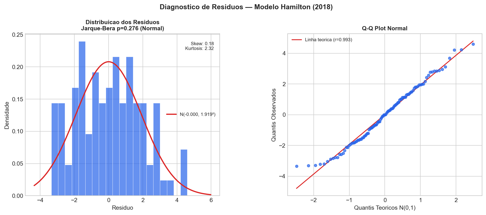

### 3.4 Conclusão do Modelo 2

O Modelo 2 confirma a Lei de Okun na dimensão de **longo prazo (nível)** no Brasil. O filtro Hamilton (2018) produziu o modelo com melhor ajuste (AIC=441.8, R²Aj=0.349) e resíduos normais, sendo selecionado como especificação final. O coeficiente de Okun estimado é **β₁ = −0.3168**, interpretado como: para cada 1 p.p. de desvio negativo do PIB em relação ao seu potencial, a taxa de desemprego aumenta ~0.32 p.p. no longo prazo.

A comparação com o Modelo 1 (β₁ = −0.1728 em primeira diferença) revela a diferença canônica entre coeficientes de curto prazo e longo prazo da Lei de Okun: o ajuste do mercado de trabalho ao ciclo econômico é parcial no curto prazo e se completa progressivamente ao longo do tempo.

---

## Fase 4: Modelo 3 - Elasticidade e Tendência Ajustada

Este modelo estima a tendência do PIB e o efeito do desemprego sobre ele simultaneamente.

### 4.1 Estimação e Interpretação

*   **Equação:** $\ln\_pib_t = \beta_0 + \beta_1 \cdot t + \beta_2 \cdot u_t + \gamma_1 D_{PMENova} + \gamma_2 D_{PNADc} + \varepsilon_t$
*   **Estimação:** Rodar a regressão OLS de `ln_pib_t` contra uma tendência de tempo (`t`), a taxa de desemprego em nível (`u_t`) e as dummies metodológicas da pesquisa do IBGE (que também entram nesta regressão pelo mesmo motivo do Modelo 2: a variável $u_t$ está em nível e carrega as quebras de pesquisa).
*   **Interpretação:** $\beta_2$ mede a **elasticidade** do produto em relação ao desemprego. Informa em quantos por cento o PIB muda para cada variação de 1 ponto percentual na taxa de desemprego. Espera-se que seja negativo.

#### 4.1.1 Derivação do Produto Potencial e Hiato Estático

Após a estimação robusta dos parâmetros da equação, o Produto Potencial ($Y^*$) para qualquer período será derivado fixando-se a taxa de desemprego ($u_t$) em um nível de pleno emprego (por exemplo, a taxa natural ou a média histórica do período, a ser definida). A equação assumirá a forma: 
$\ln Y^*_t = \hat{\beta_0} + \hat{\beta_1} \cdot t + \hat{\beta_2} \cdot (Taxa\_Fixa) + \hat{\gamma_1} D_{PMENova} + \hat{\gamma_2} D_{PNADc}$
A diferença entre o $\ln PIB$ efetivo e o $\ln Y^*$ derivado fornecerá a medida do hiato baseada na elasticidade estimada.

### 4.2 Validação e Diagnóstico

1.  **Testes Padrão:** Resíduos, Especificação e Estabilidade (mesmos das fases anteriores).
2.  **Teste de Cointegração (Engle-Granger):** **Crucial para este modelo.** Como usamos variáveis I(1), precisamos verificar se os resíduos são estacionários (I(0)).
    *   **H₀:** Os resíduos têm raiz unitária (Não há cointegração).
    *   **H₁:** Os resíduos são estacionários (Há cointegração).
    *   **Interpretação:** Se houver cointegração, existe uma relação de longo prazo válida. Se não, a regressão é espúria.
3.  **Teste de Multicolinearidade (VIF):** Por termos duas variáveis explicativas (`t` e `u_t`), é importante verificar se elas não são altamente correlacionadas, o que poderia inflar a variância dos coeficientes. Calcular o *Variance Inflation Factor* (VIF). Um VIF > 10 é um sinal de alerta.

### 4.3 Conclusão do Modelo 3

Re-estimar com correção HAC, se necessário. Apresentar a equação final robusta e interpretar a elasticidade encontrada.

---

---

## Fase 4: Análises de Mercado de Trabalho (Dados Regionais e Setoriais)

Esta fase expande a análise para dados mais granulares, focando em dinâmicas específicas do mercado de trabalho que não são capturadas na análise agregada nacional.

### 4.1 (Placeholder para futuras análises)

### 4.2 Taxa de Desocupação por Faixa Etária (Rio de Janeiro)

**Objetivo:** Analisar como a taxa de desocupação se comporta entre diferentes faixas etárias no estado do Rio de Janeiro, identificando os grupos mais vulneráveis aos ciclos econômicos.

**Fonte dos Dados:** Dados extraídos do SIDRA/IBGE, compilados no arquivo `4.2_taxa_desocupacao_por_faixa_etaria.csv`.

**Metodologia de Tratamento (`analise_dados_rj.ipynb`):**

1.  **Carregamento e Filtragem:**
    *   O arquivo CSV original contém dados para múltiplas unidades da federação (Brasil, Regiões e Estados).
    *   **Ação Crítica:** Foi aplicado um filtro inicial no `DataFrame` para selecionar apenas as linhas onde a coluna `Unidade da Federação` é igual a `"Rio de Janeiro"`. Isso é essencial para isolar a análise no estado de interesse e evitar a plotagem de múltiplas séries no gráfico.

2.  **Remodelagem dos Dados (Pivot):**
    *   O `DataFrame` original está em formato "longo" (ou empilhado), onde cada linha representa uma observação (um grupo etário em um trimestre).
    *   Para a visualização, os dados foram remodelados para o formato "largo" usando a função `pivot_table`. O `Trimestre` foi definido como índice, os valores de `Grupo de idade` se tornaram as novas colunas, e o `Valor` (taxa de desocupação) preencheu a tabela.

3.  **Agregação de Faixas Etárias:**
    *   O IBGE fornece os dados para jovens em duas faixas: "14 a 17 anos" e "18 a 24 anos". Para simplificar a análise e criar um grupo único "14 a 24 anos", optou-se por utilizar a série "18 a 24 anos" como representativa do grupo, renomeando a coluna.
    *   **Justificativa:** Este grupo é o principal componente da força de trabalho jovem e reflete de forma mais acurada a dinâmica de entrada no mercado de trabalho formal. Uma média simples das taxas seria estatisticamente incorreta, e uma média ponderada exigiria dados populacionais não disponíveis neste dataset.

4.  **Tratamento da Data e Geração do Gráfico:**
    *   A coluna de trimestre (em formato de texto) foi convertida para `datetime`.
    *   Foi gerado um gráfico de linhas com marcadores distintos para cada faixa etária, permitindo a comparação visual da evolução da desocupação ao longo do tempo.

**Análise do Gráfico Gerado:**
*   O gráfico (`grafico_4_2_idade.png`) mostra claramente que a taxa de desocupação é significativamente maior para a faixa etária mais jovem (14 a 24 anos), confirmando a maior vulnerabilidade deste grupo.
*   Observa-se também que os picos de desemprego (como o de 2016-2017) impactam de forma mais acentuada os jovens.
*   As faixas etárias mais velhas (40-59 e 60+) apresentam taxas de desocupação consideravelmente menores e mais estáveis ao longo do ciclo.

---

## Fase 5: Análise Comparativa e Conclusões Finais

1.  **Quadro Comparativo:** Construir uma tabela resumindo os coeficientes de Okun encontrados em cada um dos modelos robustos (Modelos 1, 2 e 3).
2.  **Discussão dos Resultados:** Discutir as diferenças entre os coeficientes de curto prazo (Modelo 1) e de longo prazo (Modelos 2 e 3).
3.  **Conclusão Final:** Apresentar uma síntese dos achados, respondendo qual a relação de Okun para o Brasil no período analisado e qual modelo se mostrou mais adequado para descrevê-la.
