### **Observações para a IA (Instruções do Projeto)**

**LEIA ANTES DE PROSSEGUIR:** Estas são as diretrizes para trabalhar neste projeto.

1.  **EDIÇÃO DE NOTEBOOKS (Claude Code):** Claude Code pode editar arquivos `.ipynb` diretamente com a ferramenta `NotebookEdit`. A restrição anterior era específica do **Gemini**, que corrompeu os arquivos. Com Claude Code, a edição direta é segura e deve ser preferida a gerar blocos de código para copiar.

2.  **FOCO NA DOCUMENTAÇÃO ECONÔMICA:** O objetivo final é um TCC. Ao atualizar este arquivo (`documentacao_econometrica.md`), a prioridade é detalhar a **lógica econômica e estatística** por trás de cada etapa. Explique *por que* uma técnica foi escolhida (ex: *por que usar o filtro HP?*), *qual a interpretação econômica* dos resultados e *quais as hipóteses* sendo testadas. Os detalhes da implementação do código são secundários; o "porquê" é essencial.

3.  **ESTRUTURA MODULAR:** O trabalho está organizado em partes, com um notebook para cada grande etapa:
    *   `Desemprego.ipynb`: Tratamento dos dados de desemprego (concluído).
    *   `PIB.ipynb`: Tratamento dos dados do PIB (em andamento).
    *   Futuros notebooks para cada modelo econométrico (Modelo 1, Modelo 2, etc.).

---

# Documentação do Processo Econométrico: Análise da Lei de Okun para o Brasil (Estrutura Vertical)

Este documento detalha o passo a passo para a análise econométrica da Lei de Okun, utilizando dados brasileiros. A estrutura segue uma abordagem "vertical", onde cada modelo é analisado do início ao fim em sua própria seção.

---

## Período e Amostra de Análise

| Parâmetro | Valor |
|---|---|
| **Cobertura temporal** | 1996-T1 a 2024-T4 |
| **Frequência** | Trimestral |
| **Modelo 1 (Primeira Diferença)** | 1996-T3 (1996-09-30) a 2024-T4 (2024-12-31) — **114 observações** |
| **Modelo 2 (Hiato do Produto)** | 1996-T2 (1996-06-30) a 2024-T4 (2024-12-31) — **115 observações** |

**Variáveis principais:**
- `u_t`: Taxa de desemprego (% da PEA), série unificada PME Antiga → PME Nova → PNAD Contínua
- `ln_pib`: Logaritmo do PIB real, dessazonalizado (Tabela 6613 do IBGE, R$ milhões encadeados, referência 1995)
- `hiato`: Hiato do produto (% do produto potencial), estimado pelo filtro de Hamilton (2018) aplicado sobre `ln_pib`

**Por que o período inicia em 1996-T2 / 1996-T3 e não em 1996-T1?**

A série de PIB disponível (Tabela 6612/6613 do IBGE) começa em 1996-T1. O *inner join* com a série de desemprego (cuja menor data disponível é 1996-T1) resulta em uma amostra que parte de 1996-T1. Contudo:
- O **Modelo 2** (nível) perde a primeira observação por conta dos *lags* necessários para o filtro de Hamilton (h=8 trimestres), fazendo o ciclo estimado iniciar em 1996-T2 (1998-T1 para o cálculo do hiato, com retroprojeção para 1996-T2).
- O **Modelo 1** (primeira diferença) perde adicionalmente uma observação pela diferenciação (Δu_t e Δln_pib), iniciando em 1996-T3.

Na prática, ambos os modelos cobrem aproximadamente **29 anos** de dados brasileiros, período suficiente para capturar múltiplos ciclos econômicos e as grandes transformações estruturais do mercado de trabalho.

---

## Fase 1: Preparação dos Dados e Análise Preliminar (Etapas Comuns)

Esta fase inicial é comum a todos os modelos e prepara as variáveis que serão utilizadas na análise.

### 1.1 Tratamento e Unificação dos Dados

1.  **Série de Desemprego:**
    *   Carregar as três séries de desemprego do arquivo `Desemprego.xlsx`: PME Antiga (desde 1994), PME Nova e PNAD Contínua.
    *   Padronizar as datas e os valores de cada série.
    *   Converter as séries mensais (PME) para a frequência trimestral, utilizando a média do período.
    *   Unificar as três séries em uma única série de desemprego trimestral. O critério de unificação nos períodos de sobreposição será a **prioridade pela metodologia mais recente** (PNADc > PME Nova > PME Antiga).
    *   Criar uma coluna `metodologia` para identificar a origem de cada dado, que será usada como candidata a dummy para testes de quebra estrutural.

2.  **Série do Produto Interno Bruto (PIB):**
    *   Carregar a série de PIB Real trimestral. Para a análise da Lei de Okun, a série **com ajuste sazonal** (`Tabela 6613`) foi a escolhida.
    *   **Justificativa da Escolha:** A sua intuição está correta. Séries econômicas como o PIB possuem flutuações sazonais previsíveis (por exemplo, maior atividade econômica no final do ano). O mercado de trabalho, em grande medida, antecipa e se ajusta a esses movimentos regulares. A Lei de Okun, no entanto, foca na relação entre o **ciclo econômico** (desvios não previsíveis da tendência de crescimento) e o desemprego cíclico. Utilizar a série com ajuste sazonal remove o "ruído" da sazonalidade, permitindo isolar o componente cíclico que é o verdadeiro objeto de interesse. A comparação gráfica entre as séries com e sem ajuste no notebook `PIB.ipynb` valida essa escolha, mostrando o padrão de "serra" da sazonalidade na série não ajustada, que é ausente na série ajustada.
    *   Aplicar o logaritmo natural (`ln`) na série do PIB para trabalhar com taxas de crescimento e elasticidades.

#### Status da Implementação no Notebook (`PIB.ipynb`)

As etapas de preparação da variável de PIB foram concluídas no notebook `PIB.ipynb`. O processo executado foi:

1.  **Carregamento e Correção:**
    *   A série de PIB com ajuste sazonal foi carregada a partir do arquivo `Tabela 6613 - com ajuste sazonal.xlsx`.
    *   Foi necessário corrigir o `DataFrame`, pois a primeira linha de dados foi lida como cabeçalho. A estrutura foi reajustada para incorporar essa linha aos dados e as colunas foram renomeadas para `data_raw` e `pib`.

2.  **Tratamento da Data:**
    *   A coluna de data, originalmente em formato de texto (ex: `"1º trimestre de 1996"`), foi processada por uma função para convertê-la em objetos `datetime` do pandas, padronizados para o final de cada trimestre (ex: `1996-03-31`).
    *   A coluna de data foi definida como o índice do `DataFrame`.

3.  **Criação das Variáveis:**
    *   A coluna `ln_pib` foi criada aplicando o logaritmo natural (`np.log`) à série de PIB.
    *   A coluna `crescimento_pib` foi gerada a partir da primeira diferença da série em log, multiplicada por 100 para representar a variação percentual.

3.  **Criação das Variáveis de Análise:**
    *   `u_t`: A série final unificada da taxa de desemprego (em nível).
    *   `Δu_t`: A variação trimestral da taxa de desemprego (`u_t - u_{t-1}`).
    *   `ln_pib_t`: A série do log do PIB real dessazonalizado.
    *   `crescimento_pib_t`: A taxa de crescimento do PIB (`(ln_pib_t - ln_pib_{t-1}) * 100`).

#### 1.1.1 Status da Implementação no Notebook (`Desemprego.ipynb`)

As etapas de preparação da variável de desemprego foram concluídas no notebook `Desemprego.ipynb`. O processo executado foi:

1.  **Carregamento e Tratamento Individual:**
    *   As três séries (`PME Antiga`, `PME Nova`, `PNADc`) foram carregadas a partir do arquivo Excel.
    *   As colunas de data de cada série foram padronizadas para o formato `datetime` do pandas (ex: o formato numérico `1994.03` foi convertido; o formato de texto `'mar-abr-mai 2012'` foi interpretado para uma data de fim de trimestre).
    *   As colunas de taxa foram devidamente convertidas para formato numérico.

2.  **Conversão de Frequência:**
    *   As séries da PME Antiga e PME Nova, que possuem frequência original **mensal**, foram convertidas para a frequência **trimestral**.
    *   A conversão preliminar foi feita calculando a **média simples** da taxa de desemprego. **Ajuste Pendente:** Conforme orientação, é necessário revisar as notas técnicas das 3 bases de dados para comparar as metodologias em profundidade e realizar os ajustes necessários na forma definitiva como se trimestraliza os dados de emprego.
    *   A série da PNADc, por sua vez, já possui uma natureza de média móvel trimestral e foi apenas alinhada para as datas de fim de trimestre.

3.  **Unificação:** Utilizando `pd.concat` e ordenação categórica, os três DataFrames trimestrais foram unificados em uma única série temporal (`desemprego_unificado`), garantindo a prioridade da metodologia mais recente nos períodos de sobreposição.

4.  **Visualização:** Foi gerado um gráfico de linha da série unificada, com o fundo sombreado para indicar os períodos de vigência de cada metodologia, facilitando a análise visual de quebras estruturais.

5.  **Variáveis Adicionais (Informalidade):** Coletar a coleção sobre informalidade através do Ipeadata. Estes dados serão fundamentais para enriquecer a discussão teórica do mercado de trabalho brasileiro, ajudando a explicar eventuais desvios e inércias.

#### 1.1.2 Análise Visual e Hipótese de Quebra Estrutural

A inspeção visual do gráfico revelou fortes indícios de, no mínimo, uma quebra estrutural na série:

*   **Transição PME Antiga -> PME Nova (~2002):** Observa-se um "salto" nítido no nível da taxa de desemprego, indicando que a mudança metodológica introduziu uma quebra estrutural significativa na série.
*   **Transição PME Nova -> PNADc (~2012):** A quebra, se existente, é visualmente mais sutil.

Essa análise visual preliminar reforça a necessidade dos testes formais de quebra estrutural (como o Teste de Chow) que serão aplicados aos modelos de regressão, conforme detalhado na metodologia. A variável `metodologia` foi mantida no DataFrame unificado para facilitar esses testes.

#### 1.1.3 Unificação Final e Ajuste Temporal (`Tratamento econonometrico.ipynb`)

Com os arquivos `pib_tratado.pkl` e `desemprego_tratado.pkl` devidamente preparados, a próxima etapa foi a consolidação final do dataset.

1.  **Unificação:** Os dois `DataFrames` foram unidos por seu índice de data (`join` com `how='inner'`). Inicialmente, a base continha dados até 2025 (projeções do PIB).
2.  **Filtro de Período:** Para garantir a integridade da análise econométrica, optou-se por restringir a amostra até **Dezembro de 2024**, descartando dados de 2025 que poderiam conter projeções ou estar incompletos.
3.  **Criação de Variáveis:** Foram geradas as variáveis de primeira diferença (`delta_u_t` e `crescimento_pib`).

O `DataFrame` resultante, após o filtro de data e a remoção de valores `NaN` gerados pela diferenciação, contém **115 observações trimestrais** (1996-2024).

#### 1.1.4 Inspeção Visual Conjunta (Eixo Duplo)

Antes dos testes formais, foi gerado um gráfico de eixo duplo sobrepondo o `Log do PIB` (eixo esquerdo) e a `Taxa de Desemprego` (eixo direito).
*   **Observação:** O gráfico evidencia a relação inversa esperada: períodos de queda no PIB (ou desaceleração do crescimento) tendem a coincidir com aumentos na taxa de desemprego, embora com defasagens que serão investigadas posteriormente.

### 1.2 Testes de Estacionariedade (Raiz Unitária)

**Objetivo:** Garantir que as séries são estacionárias para evitar regressões espúrias. Para isso, foram aplicados os testes ADF e KPSS às variáveis em nível e em primeira diferença. O resultado esperado é que as séries em nível sejam não-estacionárias (integradas de ordem 1, ou I(1)) e as séries em primeira diferença sejam estacionárias (I(0)).

**Resultados Obtidos no Notebook (`Tratamento econonometrico.ipynb`) para o período 1996-2024:**

| Variável | Teste ADF (Estatística) | Teste ADF (p-valor) | Teste KPSS (Estatística) | Teste KPSS (p-valor) | Conclusão |
| :--- | :---: | :---: | :---: | :---: | :--- |
| **`ln_pib`** (Nível) | -1.3073 | 0.6258 | 0.3467 | 0.0100 | **I(1)** - Não Estacionária |
| **`u_t`** (Nível) | -2.1186 | 0.2371 | 0.1025 | 0.1000 | **I(1)** - Tratar como Não Estacionária* |
| **`crescimento_pib`** (1ª Dif.) | -8.6429 | 0.0000 | 0.2310 | 0.1000 | **I(0)** - Estacionária |
| **`delta_u_t`** (1ª Dif.) | -4.6522 | 0.0001 | 0.1711 | 0.1000 | **I(0)** - Estacionária |

*\*Nota sobre `u_t`: Os testes discordaram na variável em nível. Essa ambiguidade é comum em séries de desemprego, que podem exibir comportamento de "longa memória" ou quebras estruturais. Dado o forte resultado do ADF e a teoria econômica macro, a série será tratada como **I(1)**.*

A confirmação de que as variáveis em nível são I(1) e suas primeiras diferenças são I(0) valida a abordagem econométrica de usar o **modelo de primeira diferença** (Fase 3) para analisar a relação de curto prazo e modelos baseados em **nível e hiato** (Fases 4 e 5) para investigar a relação de longo prazo.

### 1.3 Análise de Componentes com Filtro Hodrick-Prescott (HP)

Antes de prosseguir para os modelos de regressão, foi realizada uma análise exploratória para decompor as séries em nível (`ln_pib` e `u_t`) em seus dois componentes principais: **tendência** e **ciclo**. Para isso, utilizou-se o filtro Hodrick-Prescott (HP), uma ferramenta padrão em macroeconomia para essa finalidade, com `lambda=1600`, o valor recomendado para dados trimestrais.

O notebook `Tratamento econonometrico.ipynb` gera um dashboard 2x2 que visualiza essa decomposição:

1.  **Gráficos Superiores (Nível e Tendência):** Mostram as séries originais (PIB e desemprego) sobrepostas às suas tendências de longo prazo extraídas pelo filtro HP. Isso permite uma clara visualização dos períodos em que a economia operou acima ou abaixo de sua tendência (ciclos de expansão e recessão) e como o desemprego se moveu em relação à sua própria tendência.

2.  **Gráficos Inferiores (Séries Estacionárias):** Mostram as séries já diferenciadas (`crescimento_pib` e `delta_u_t`). Visualmente, confirma-se o que os testes de raiz unitária apontaram: as séries flutuam em torno de uma média zero, sem uma tendência clara, caracterizando um comportamento estacionário.

Esta análise visual reforça a adequação dos dados para os modelos propostos e fornece um primeiro vislumbre da relação cíclica inversa entre PIB e desemprego, que é o cerne da Lei de Okun.

### 1.4 Análise de Correlação (Exploratória)

**Objetivo:** Quantificar a força e a direção da relação linear entre as variáveis **estacionárias** antes da modelagem.

*   **Matriz de Correlação (Pearson):** Calcular a correlação entre `crescimento_pib` e `delta_u_t`.
*   **Gráfico de Dispersão (Scatter Plot):** Plotar `crescimento_pib` (eixo X) vs `delta_u_t` (eixo Y) com uma linha de tendência.
*   **Expectativa:** Uma correlação negativa forte e significativa, antecipando o coeficiente de Okun.
*   **Atenção:** Não calcular correlação entre as variáveis em nível (`ln_pib` e `u_t`) pois, sendo não-estacionárias, o resultado seria espúrio (sem sentido estatístico).
*   **Outliers:** Olhar detalhadamente os *outliers* no teste de correlação. Identificar e investigar os pontos que se distanciam severamente da linha de tendência linear, buscando seu contexto macroeconômico.

**Resultados Obtidos e Interpretação Econômica:**

| Relação Testada | Correlação de Pearson (r) | P-valor | Conclusão |
| :--- | :---: | :---: | :--- |
| **Contemporânea (Lag 0)** | -0.2079 | - | Relação negativa, mas linearmente fraca/moderada. |
| **Defasada (Lag 1)** | -0.2615 | 0.0050 | Relação negativa, mais forte e estatisticamente significante a 5%. |

**Por que isso acontece? (Atritos no Mercado de Trabalho)**
Economicamente, isso é explicado pela rigidez do mercado de trabalho. As empresas não ajustam sua força de trabalho imediatamente após uma variação na produção devido a:
1.  **Custos de Ajuste:** Contratar e demitir é caro (multas, treinamento).
2.  **Incerteza:** As empresas esperam para ver se a mudança na demanda é permanente.
3.  **Hoarding de Mão de Obra:** Em recessões curtas, empresas mantêm trabalhadores qualificados.

### 1.4.1 Investigação de Defasagens (Correlação Cruzada)

Devido à fraca correlação contemporânea, foi realizada uma análise de **Correlação Cruzada** para investigar a defasagem temporal (*lag*) da Lei de Okun no Brasil.

*   **Metodologia:** Calculou-se a correlação entre a variação do desemprego em $t$ e o crescimento do PIB em $t, t-1, t-2, \dots, t-k$.
*   **Resultado Esperado:** Identificar em quantos trimestres o impacto do PIB é mais forte sobre o desemprego. Esse *lag* ótimo será incorporado nos modelos de regressão da Fase 2.

**Resultados Obtidos no Notebook (`Tratamento econonometrico.ipynb`):**

A análise de correlação cruzada testou defasagens de 0 a 8 trimestres.

| Defasagem (Lag) do PIB | Correlação com Variação do Desemprego (t) |
| :---: | :---: |
| **Lag 0** | -0.2079 |
| **Lag 1** | **-0.2615** |
| **Lag 2** | -0.1114 |
| **Lag 3** | -0.0903 |
| **Lag 4** | -0.1907 |
| **Lags 5 a 8** | Próximos de zero ou positivos |

**Conclusão:** A correlação mais forte ocorre com **1 trimestre de defasagem (Lag 1)**, sendo **estatisticamente significante a 5% de confiança (p-valor = 0.0050)**. Isso indica que mudanças no PIB levam cerca de 1 trimestre (3 meses) para impactar com força máxima a taxa de desemprego no Brasil. Este resultado sugere que os modelos de Okun devem considerar essa defasagem para melhor ajuste.

### 1.4.2 Seleção Formal de Defasagens (Critérios de Informação AIC/BIC)

**Objetivo:** Determinar estatisticamente o número ótimo de defasagens ($p$) para modelar a dinâmica conjunta entre o Crescimento do PIB e a Variação do Desemprego. Isso é fundamental para garantir que os resíduos dos modelos (e do teste de Granger) sejam bem comportados.

**Metodologia:** Ajustar um modelo de Vetores Autorregressivos (VAR) para as séries estacionárias e calcular os critérios de informação para diferentes ordens de defasagem (ex: 0 a 8 trimestres).
*   **AIC (Akaike Information Criterion):** Tende a selecionar modelos com mais lags. Foca na capacidade preditiva.
*   **BIC (Bayesian Information Criterion):** Penaliza mais fortemente a complexidade (número de variáveis). Tende a selecionar modelos mais parcimoniosos.

**Resultados Esperados:**
*   O teste indicará qual lag minimiza a perda de informação.
*   Se AIC e BIC divergirem (ex: AIC=4, BIC=1), a literatura sugere analisar a parcimônia (BIC) versus a necessidade de remover autocorrelação (AIC).
*   **Aplicação:** O lag escolhido aqui será utilizado como parâmetro para o Teste de Causalidade de Granger (Fase 1.5) e para a especificação dinâmica dos modelos de regressão (Fases 2 e 3).

**Resultados Obtidos (1996-2024):**

A análise dos critérios de informação para o modelo VAR (`delta_u_t`, `crescimento_pib`) apresentou divergência:

| Critério de Informação | Defasagem (Lag) Sugerida | Valor Mínimo Encontrado |
| :--- | :---: | :---: |
| **AIC** (Akaike) | 6 | 0.3689 |
| **BIC** (Schwarz) | 0 | 0.6607 |
| **FPE** (Final Prediction Error) | 6 | 1.450 |
| **HQIC** (Hannan-Quinn) | 4 | 0.5689 |

**Discussão e Decisão:**
Existe um conflito entre a estatística puramente parcimoniosa (BIC=0) e a teoria econômica.
1.  **Rejeição do Lag 0 (BIC):** Aceitar Lag 0 implicaria que o desemprego reage instantaneamente ao PIB, ignorando os custos de ajuste e a inércia do mercado de trabalho (fricções), o que contradiz a teoria da Lei de Okun.
2.  **Rejeição do Lag 6 (AIC):** Usar 6 defasagens em uma amostra de ~115 observações consome muitos graus de liberdade e provavelmente indica *overfitting* (ajuste a ruídos).

**Escolha Final: Lag 1.**
Optamos por utilizar **1 defasagem** com base na convergência de outras evidências:
*   A **Correlação Cruzada** (Seção 1.4.1) indicou a correlação mais forte no Lag 1 (-0.26).
*   O **Teste de Granger** (Seção 1.5) mostrou alta significância estatística para o Lag 1.
*   Esta escolha equilibra a necessidade de capturar a dinâmica temporal (teoria) com a parcimônia do modelo.

### 1.5 Teste de Causalidade de Granger

**Objetivo:** Verificar a direção da relação temporal entre as variáveis. A Lei de Okun postula que o crescimento do produto causa variações no desemprego. O teste de Granger nos ajuda a confirmar se essa precedência temporal é estatisticamente significante nos dados brasileiros.

**Lógica do Teste:**
O teste verifica se valores passados de uma variável (X) ajudam a prever o valor atual de outra variável (Y), mais do que apenas os valores passados de Y.
*   **H₀ (Hipótese Nula):** X *não* causa Granger Y.
*   **H₁ (Hipótese Alternativa):** X causa Granger Y.

**Interpretação dos Testes Estatísticos:**
O teste de Granger no Python (`statsmodels`) fornece quatro estatísticas diferentes. Embora frequentemente levem à mesma conclusão, é importante entender suas nuances:

1.  **SSR based F test:** Teste F baseado na Soma dos Quadrados dos Resíduos. É considerado o mais robusto para amostras de tamanho pequeno a médio (como é o caso de dados trimestrais macroeconômicos). **É a principal referência para este estudo.**
2.  **SSR based chi2 test:** Teste Qui-quadrado baseado nos resíduos. É assintoticamente equivalente ao teste F, mas pode ser menos preciso (mais liberal) em amostras menores.
3.  **Likelihood Ratio test:** Teste da Razão de Verossimilhança. Útil para grandes amostras, compara a verossimilhança do modelo restrito (sem a variável causadora) com o modelo irrestrito.
4.  **Parameter F test:** Teste F aplicado diretamente aos coeficientes das defasagens. Em regressões lineares simples (OLS), tende a produzir resultados idênticos ao SSR F-test.

**Interpretação para o TCC:**
A confirmação da causalidade no sentido PIB -> Desemprego é um pré-requisito importante para validar a especificação dos modelos de Okun que serão estimados nas fases seguintes, onde o Desemprego é a variável dependente.

**Resultados Obtidos (1996-2024):**

Abaixo apresentamos os p-valores para os diferentes testes e defasagens (lags). Um p-valor < 0.05 indica rejeição da hipótese nula (H₀) com 95% de confiança.

**Tabela 1: Crescimento do PIB -> Variação do Desemprego**
*(H₀: PIB não causa Granger Desemprego)*

| Lag (Trimestres) | SSR F-test (p-valor) | SSR Chi2 test (p-valor) | Likelihood Ratio (p-valor) | Parameter F-test (p-valor) | Conclusão (5%) |
| :---: | :---: | :---: | :---: | :---: | :---: |
| **1** | **0.0099** | 0.0079 | 0.0088 | 0.0099 | **Rejeita H₀** |
| **2** | **0.0297** | 0.0223 | 0.0252 | 0.0297 | **Rejeita H₀** |
| **3** | **0.0287** | 0.0183 | 0.0223 | 0.0287 | **Rejeita H₀** |
| **4** | **0.0039** | 0.0013 | 0.0023 | 0.0039 | **Rejeita H₀** |

**Tabela 2: Variação do Desemprego -> Crescimento do PIB**
*(H₀: Desemprego não causa Granger PIB)*

| Lag (Trimestres) | SSR F-test (p-valor) | SSR Chi2 test (p-valor) | Likelihood Ratio (p-valor) | Parameter F-test (p-valor) | Conclusão (5%) |
| :---: | :---: | :---: | :---: | :---: | :---: |
| **1** | 0.2772 | 0.2685 | 0.2698 | 0.2772 | Aceita H₀ |
| **2** | 0.8080 | 0.7997 | 0.8000 | 0.8080 | Aceita H₀ |
| **3** | 0.8595 | 0.8476 | 0.8483 | 0.8595 | Aceita H₀ |
| **4** | 0.8514 | 0.8313 | 0.8330 | 0.8514 | Aceita H₀ |

**Conclusão Geral:** A relação de causalidade é **unidirecional** (PIB -> Desemprego), validando a estrutura teórica da Lei de Okun para o Brasil.

### 1.6 Discussão: Por que a relação é Unidirecional?

**Dúvida:** Teoricamente, o desemprego também não deveria afetar o PIB (menos renda gera menos consumo)?
**Resposta:** Sim, no longo prazo ou em modelos estruturais. Porém, o teste de Granger captura a **precedência temporal no curto prazo**.

1.  **Mercado de Trabalho como Indicador Defasado (Lagging Indicator):**
    *   As empresas não demitem ou contratam imediatamente após uma mudança na demanda.
    *   **Na queda:** Primeiro o PIB cai (vendas diminuem). As empresas seguram os funcionários (custos de demissão). Só depois o desemprego sobe.
    *   **Na alta:** Primeiro o PIB sobe (uso de capacidade ociosa). Só quando a alta é sustentada, elas voltam a contratar.
    *   **Resultado:** O movimento do PIB *antecede* o movimento do desemprego.

2.  **Isso é um problema para o TCC?**
    *   **Não, é uma vantagem.** Para estimar a Lei de Okun via regressão simples (OLS), precisamos assumir que o PIB explica o desemprego.
    *   Se houvesse forte causalidade reversa simultânea, teríamos viés nos coeficientes. A unidirecionalidade (PIB -> Desemprego) valida estatisticamente o uso do Crescimento do PIB como variável explicativa.

### 1.6.1 Explicação sobre Inversões Históricas

Durante a análise da relação PIB vs. Desemprego, é necessário explicar as "inversões históricas". Ou seja, identificar e justificar períodos em que a intuição macroeconômica tradicional (e a própria Lei de Okun) parecem falhar na amostra brasileira (ex: períodos em que o PIB cresceu, mas o desemprego também aumentou, ou vice-versa). Fatores como a válvula de escape da **informalidade** (dados do Ipeadata) e mudanças demográficas na Taxa de Participação da Força de Trabalho são chaves para explicar tais inversões estruturais.

### 1.7 Análise de Outliers e Quebras Estruturais (Teste de Chow)

**Objetivo:** Identificar e validar estatisticamente a presença de quebras estruturais nas séries temporais, que geralmente são causadas por choques macroeconômicos exógenos e agudos.

**Contexto Visual:** A análise gráfica da correlação (Seção 1.4) indicou a presença de *outliers* severos. Historicamente, no período analisado, o Brasil sofreu dois grandes choques: os reflexos da Crise Financeira Global (início de 2009) e a Pandemia de COVID-19 (2020). 

**Metodologia (Teste de Chow):**
Para dar robustez a essa observação visual, o **Teste de Chow** será aplicado na fase de testes preliminares (`Tratamento econonometrico.ipynb` ou no início da modelagem). Este teste avalia se há uma diferença estatisticamente significativa nos coeficientes de uma regressão antes e depois de uma data específica.
*   **H₀ (Hipótese Nula):** Os parâmetros do modelo são estáveis em toda a amostra (não há quebra na data testada).
*   **H₁ (Hipótese Alternativa):** Ocorre uma quebra estrutural na data especificada.
*   **Consequência:** A rejeição de H₀ confirma a necessidade de tratar esses períodos no modelo econométrico, para que os choques não puxem a linha de tendência da regressão e distorçam o coeficiente de Okun "normal" da economia.

**Resultados Obtidos:**
A aplicação do Teste de Chow para as datas de choques históricos (Crise Financeira de 2008/2009 e Pandemia de COVID-19) revelou resultados estatísticos contrários à intuição visual inicial:

| Trimestre Testado | Evento Macro | Estatística F | P-valor | Conclusão |
| :--- | :--- | :---: | :---: | :--- |
| **2008-T4** | Estouro da Crise Global | 0.2788 | 0.7572 | Não rejeita H₀ (Estável) |
| **2009-T1** | Reflexo no Brasil | 0.2159 | 0.8062 | Não rejeita H₀ (Estável) |
| **2020-T1** | Início da Pandemia | 1.3381 | 0.2666 | Não rejeita H₀ (Estável) |
| **2020-T2** | Auge da Pandemia | 1.6151 | 0.2035 | Não rejeita H₀ (Estável) |

**Conclusão:** Os parâmetros da Lei de Okun no Brasil mostraram-se estáveis durante as maiores crises macroeconômicas recentes. A relação fundamental (coeficiente da regressão) não sofreu quebra estrutural nestes períodos.

### 1.8 Identificação Analítica de Outliers

**Objetivo:** Localizar matematicamente os trimestres exatos que causaram os choques observados nos gráficos de dispersão, preparando-os para o tratamento com variáveis *dummy*.

**Metodologia:**
Foi ajustada uma regressão preliminar da Variação do Desemprego contra o Crescimento do PIB defasado em 1 trimestre (Lag 1). Em seguida, extraíram-se os **resíduos padronizados (Studentizados)**.
*   **Critério:** Observações com resíduos padronizados em valor absoluto maiores que `2.0` desvios-padrão (`|Z| > 2.0`) foram classificadas como *outliers*.
*   **Resultado:** As datas identificadas pelo algoritmo representam os trimestres de maior atipicidade na relação entre PIB e desemprego, ligados a eventos exógenos de grande magnitude.
*   **Próximo Passo:** Estas datas exatas são submetidas ao Teste de Chow para verificar se a anomalia do trimestre foi severa o suficiente para causar uma quebra estrutural no modelo.

**Resultados Obtidos:**
A extração dos resíduos padronizados (Studentizados) do modelo preliminar identificou três trimestres altamente atípicos (onde |Z| > 2.0):

| Data (Trimestre) | Variação Desemprego | Cresc. PIB (Lag 1) | Distância (Z) | Natureza do Choque |
| :---: | :---: | :---: | :---: | :--- |
| **1998-T1** | 2.57 p.p. | 0.84% | 3.14 | **Econômico** — Crise Asiática/Russa |
| **2002-T2** | 4.31 p.p. | 2.46% | 5.53 | **Metodológico (defasado)** — Efeito da transição PME Antiga → PME Nova |
| **2012-T1** | 2.80 p.p. | 0.93% | 3.43 | **Metodológico** — Transição PME Nova → PNADc |

**Interpretação Detalhada de Cada Outlier:**

**1998-T1 — Crise Financeira Asiática e Russa (Choque Econômico Puro)**
A Crise Asiática, deflagrada na Tailândia em julho de 1997, se propagou pela Coreia do Sul e Indonésia até atingir a Rússia, que decretou moratória em agosto de 1998. O contágio financeiro chegou ao Brasil com forte fuga de capitais e ataque especulativo ao Real, forçando o Banco Central a elevar a taxa SELIC para cerca de 50% ao ano em outubro de 1998. Esse aperto monetário abrupto desacelerou a economia, e o mercado de trabalho começou a reagir já em 1998-T1, com demissões antecipando a recessão que se materializaria em 1999 (quando o Real finalmente foi desvalorizado). A variação atípica do desemprego (+2.57 p.p.) neste trimestre **não é um artefato de medição**: é um choque econômico real que se distancia severamente da relação PIB→Desemprego esperada pela Lei de Okun, pois o PIB ainda crescia modestamente no trimestre anterior (0.84%) enquanto o desemprego já disparava pela antecipação do ajuste das firmas.

**2002-T2 — Efeito Defasado da Transição PME Antiga → PME Nova (Artefato Metodológico)**
A mudança de metodologia do IBGE ocorreu em **2002-T1** (quando a PME Nova passou a ser a série de referência na unificação). No entanto, o pico na variação do desemprego (`Δu_t`) aparece em **2002-T2**, porque essa variação reflete a diferença `u_t(PME Nova, T2) − u_t(PME Antiga, T1)` — uma subtração entre duas séries com metodologias distintas. A PME Nova, com cobertura ampliada e critérios revisados, registrava sistematicamente uma taxa de desemprego **mais alta** do que a PME Antiga para a mesma realidade econômica. Portanto, o salto de **4.31 p.p.** é, em sua maior parte, um artefato de medição gerado pela comparação entre metodologias. É o maior outlier da amostra (Z = 5.53) exatamente por isso: combina o efeito da transição com o ambiente de incerteza política de 2002 (ano eleitoral, crise cambial associada ao temor da vitória do PT).

**2012-T1 — Transição PME Nova → PNADc (Artefato Metodológico)**
A PNAD Contínua (PNADc), lançada pelo IBGE em 2012, substituiu a PME Nova como referência na série unificada a partir de **2012-T1**. Ao contrário da PME, que cobria apenas 6 regiões metropolitanas, a PNADc abrange todo o território nacional com amostragem contínua, o que tende a captar taxas de desemprego estruturalmente diferentes. O salto de **2.80 p.p.** neste trimestre coincide exatamente com a troca de série, e sua atipicidade (Z = 3.43) é consistente com um choque de medição, e não com um deterioro brusco do mercado de trabalho justificado pelo crescimento do PIB no trimestre anterior (0.93%).

**Distinção Crucial para o Tratamento Econométrico:**

Os três outliers têm **origens distintas** e, portanto, merecem tratamentos diferentes:
- **1998-T1** é um choque econômico real — pode ser tratado com interpolação (substituindo o valor observado pelo valor esperado dado o PIB) ou com pulse dummy.
- **2002-T2 e 2012-T1** são artefatos de medição — a pulse dummy é o tratamento correto, pois o valor observado não representa a dinâmica econômica real; ele representa o ruído da troca de série.

A re-aplicação do Teste de Chow nestas exatas datas confirmou que, apesar de serem anomalias severas, **nenhuma delas gerou quebra estrutural nos parâmetros do modelo** (p-valores de 0.47, 0.75 e 0.94, respectivamente). Isso valida que a relação fundamental da Lei de Okun se manteve estável — os outliers são ruído nos dados, não mudança de regime econômico. O tratamento adequado de cada ponto será avaliado comparativamente na Fase 2.

---

---

## Fase 2: Modelo 1 Final - Primeira Diferença (Curto Prazo)

Este modelo captura a relação dinâmica de curto prazo entre o crescimento da economia e a variação do desemprego. Foi implementado e refinado no notebook `1.modelo de primeira diferença.ipynb`.

### 2.1 Evolução da Modelagem e Especificações Descartadas

Antes de definir o modelo final, diversas especificações foram testadas e descartadas por razões teóricas e estatísticas. O registro desse processo demonstra o rigor metodológico na escolha da melhor equação:

1.  **Modelo Inicial (Com Dummies Metodológicas):**
    *   **Especificação:** Constante + Crescimento do PIB (Lag 1) + Dummies para PME Nova e PNADc.
    *   **Motivo do Descarte:** As dummies de metodologia de pesquisa não apresentaram significância estatística. Como o modelo é estimado em primeira diferença (variação trimestral), as quebras de nível das pesquisas não afetam a dinâmica contínua, impactando isoladamente apenas o trimestre de transição. Além disso, o modelo falhou nos testes de normalidade (Jarque-Bera) e autocorrelação (Breusch-Godfrey).

2.  **Modelo Clássico Simples (Sem Dummies):**
    *   **Especificação:** Constante + Crescimento do PIB (Lag 1).
    *   **Motivo do Descarte:** Embora represente a forma mais "pura" da Lei de Okun, o modelo continuou falhando na premissa de normalidade dos resíduos. A ausência de tratamento para os choques pontuais severos (os outliers identificados em 1998, 2002 e 2012) distorcia o comportamento dos erros, o que invalida a inferência estatística em amostras pequenas.

3.  **Modelo Sem Constante (Regressão pela Origem):**
    *   **Especificação:** Crescimento do PIB (Lag 1) + Dummies de Outliers (sem intercepto $\beta_0$).
    *   **Motivo do Descarte:** Embora a exclusão da constante tenha tornado todos os p-valores das demais variáveis perfeitamente significantes, essa decisão gerou um viés teórico grave. Ao forçar a reta de regressão a cruzar a origem (zero), assume-se que se o PIB não crescer, o desemprego também não varia. A teoria econômica refuta essa premissa, indicando que é necessário um nível mínimo de crescimento positivo (taxa neutra) apenas para absorver a entrada natural de novos trabalhadores no mercado de trabalho. A exclusão do intercepto impede esse cálculo e distorce o coeficiente principal.

### 2.1.4 Análise Comparativa de 4 Especificações (Seleção do Modelo Final)

Para selecionar a especificação mais adequada ao tratamento dos três *outliers* identificados, foram estimadas quatro variantes do modelo com base em evidências estatísticas e critérios de informação. As células correspondentes estão no notebook `1.modelo de primeira diferença.ipynb`.

| Modelo | Especificação | β₁ | p(β₁) | R² Aj. | JB | BG* | White | AIC |
| :---: | :--- | :---: | :---: | :---: | :---: | :---: | :---: | :---: |
| **A** | Pulse dummy: 1998-T1, 2002-T2, 2012-T1 | -0.1729 | 0.000 | 0.494 | ✓ 0.607 | ✗ 0.000 | ✓ 0.812 | 216.8 |
| **B** | Pulse dummy: 2002-T2, 2012-T1 (sem 1998) | -0.1704 | 0.000 | 0.409 | ✗ 0.001 | ✗ 0.000 | ✓ 0.946 | 233.5 |
| **C ★** | Interp. 1998-T1 + Dummies 2002-T2, 2012-T1 | **-0.1728** | 0.000 | 0.455 | ✓ 0.607 | ✗ 0.000 | ✓ 0.812 | **214.8** |
| **D** | Apenas interp. 1998-T1 (sem dummies) | -0.1399 | 0.001 | 0.069 | ✗ 0.000 | ✗ 0.000 | ✓ 0.501 | 273.9 |

*\* BG: todos os modelos apresentam autocorrelação nos resíduos, corrigida pela estimação com erros-padrão HAC (Newey-West, maxlags=4).*

**Eliminação imediata:**
- **Modelo B:** falha Jarque-Bera (p=0.001) — a não-normalidade é causada pelo outlier 1998-T1 sem tratamento.
- **Modelo D:** falha grave JB (p≈0) e R² ínfimo (0.069) — os artefatos de 2002-T2 e 2012-T1 sem tratamento distorcem severamente os resíduos.

**Finalistas — A e C:** Ambos aprovam JB (p=0.607) e White, com coeficientes de Okun virtualmente idênticos (β₁ ≈ −0.173). A diferença está no tratamento de 1998-T1:
- **Modelo A:** *pulse dummy* para 1998-T1 (parâmetro adicional no modelo, dado original mantido).
- **Modelo C:** interpolação linear de 1998-T1 (sem parâmetro extra, dado substituído pelo esperado).

**Seleção Final: Modelo C**, com base em três critérios:
1. **Parcimônia:** AIC e BIC menores que o Modelo A (214.8 vs 216.8 e 225.8 vs 230.5).
2. **Coerência econômica:** 1998-T1 é um choque econômico real (Crise Asiática), não um artefato de medição. A interpolação substitui o valor observado pelo que seria esperado pela dinâmica econômica — abordagem mais coerente que uma *dummy* que simplesmente isola o ponto. Já 2002-T2 e 2012-T1 são artefatos de troca de survey, para os quais a *pulse dummy* é o tratamento correto.
3. **Consistência:** o coeficiente de Okun resultante é praticamente idêntico ao Modelo A (−0.1728 vs −0.1729).

---

### 2.2 Estimação Final e Interpretação

Após a análise comparativa de quatro especificações (Seção 2.1.4), o **Modelo C** foi selecionado como especificação final. A série `Δu_t` foi corrigida por interpolação linear em 1998-T1 (choque da Crise Asiática), e os artefatos metodológicos de 2002-T2 e 2012-T1 foram controlados por *pulse dummies*. As *dummies* de metodologia de pesquisa (*step dummies* cobrindo toda a vigência de cada survey) foram descartadas por ausência de significância no modelo em primeira diferença — conforme esperado, pois quebras de nível não afetam as variações trimestrais contínuas.

*   **Equação Final Estimada (Modelo C):**
    `Δu_t = β₀ + β₁ * crescimento_pib_{t-1} + δ₂ * d_2002_t2 + δ₃ * d_2012_t1 + ε_t`
    *(série `Δu_t` com o valor de 1998-T1 substituído por interpolação linear)*

*   **Resultados Finais (com correção HAC, Newey-West maxlags=4):**

| Parâmetro | Variável | Coeficiente Estimado | P-valor | Significância |
| :---: | :--- | :---: | :---: | :--- |
| **β₁** | Crescimento PIB (Lag 1) | **-0.1728** | < 0.001 | Significante a 1% |
| **β₀** | Constante | **0.0071** | 0.914 | Não Significante* |
| **δ₂** | Artefato 2002-T2 (PME Antiga→PME Nova) | **+4.7307** | < 0.001 | Significante a 1% |
| **δ₃** | Artefato 2012-T1 (PME Nova→PNADc) | **+2.9539** | < 0.001 | Significante a 1% |

*   **R² Ajustado do Modelo:** **0.455** — o modelo explica 45,5% da variação trimestral do desemprego, consistente com a literatura de Lei de Okun em primeiras diferenças para economias emergentes.
*   **Interpretação Econômica:**
    *   **Coeficiente de Okun (β₁):** O coeficiente de **-0.1728** é robusto e estatisticamente significante a 1%. Indica que, para cada 1 ponto percentual de crescimento do PIB em um trimestre, a taxa de desemprego no trimestre seguinte tende a cair **0,17 pontos percentuais**.
    *   **A Questão da Constante (p-valor = 0.914):** A constante não é estatisticamente diferente de zero. Economicamente, implica que, na ausência de crescimento do PIB, a variação esperada do desemprego é aproximadamente zero. A constante é mantida por recomendação econométrica padrão (sua remoção viesa β₁), e o resultado é interpretado como achado empírico: a taxa neutra de crescimento da economia brasileira neste modelo de curto prazo é virtualmente zero.
    *   **Dummies de Artefato Metodológico:** Os coeficientes positivos e altamente significantes de δ₂ e δ₃ confirmam que os "saltos" em 2002-T2 e 2012-T1 na série `Δu_t` foram causados exclusivamente pelas trocas de survey do IBGE, sem relação com a dinâmica econômica real.
    *   **Interpolação de 1998-T1:** O valor observado de `Δu_t` (+2,57 p.p.) foi substituído pelo interpolado (≈+0,28 p.p.), refletindo o que seria esperado pela dinâmica do período. A antecipação abrupta das demissões devido ao choque dos juros da Crise Asiática criou uma resposta do mercado de trabalho incompatível com a especificação de Lag 1 — e diferentemente dos artefatos de 2002 e 2012, este ponto representa economia real mas com dinâmica temporalmente deslocada.

### 2.3 Validação e Diagnóstico

Após a inclusão das *dummies* de *outlier*, a bateria de testes diagnósticos foi reaplicada aos resíduos do modelo final. O objetivo é verificar se as premissas do estimador OLS são satisfeitas, garantindo que os coeficientes estimados sejam **não viesados**, **eficientes** e que a **inferência estatística** (p-valores e intervalos de confiança) seja válida. Os três testes aplicados examinam dimensões distintas do comportamento dos resíduos.

#### Teste de Normalidade — Jarque-Bera (JB)

**Teoria:** O estimador OLS não exige normalidade para ser não viesado ou consistente. No entanto, em amostras finitas (como os 114 trimestres deste estudo), a validade dos testes *t* e *F* — usados para avaliar a significância dos coeficientes — depende da normalidade dos resíduos. O teste de Jarque-Bera (1980) avalia se os resíduos seguem uma distribuição normal com base em dois momentos estatísticos:

- **Assimetria (*skewness*):** mede se a distribuição é simétrica em torno da média. Uma distribuição normal tem assimetria = 0.
- **Curtose (*kurtosis*):** mede o "peso" das caudas da distribuição. Uma distribuição normal tem curtose = 3 (curtose em excesso = 0).

A estatística JB combina esses dois desvios em um único teste:
$$JB = \frac{n}{6} \left[ S^2 + \frac{(K-3)^2}{4} \right]$$
onde $n$ é o número de observações, $S$ é a assimetria e $K$ é a curtose. Sob $H_0$, a estatística segue uma distribuição $\chi^2$ com 2 graus de liberdade.

- **H₀:** Os resíduos seguem distribuição normal (assimetria = 0 e curtose = 3).
- **H₁:** Os resíduos não seguem distribuição normal.

**O que se espera (lógica do teste):** Um p-valor **acima de 0,05** — o resultado *desejado* é a **não-rejeição de H₀**. A lógica é contraintuitiva para quem está começando: quanto maior o p-valor, mais seguros estamos de que os resíduos são normais. Um p-valor baixo (< 0,05) seria ruim, indicando que a distribuição dos erros foge da normal e comprometendo a validade dos testes *t*/*F*.

**O que se espera no histograma:** As barras devem formar um **sino simétrico** ajustado à curva normal teórica (linha vermelha). Sinais de problema: assimetria pronunciada (pico deslocado para um lado), curtose excessiva (pico muito estreito ou distribuição muito achatada) ou caudas pesadas com frequências anômalas. O **Q-Q Plot** é o complemento mais preciso: se os pontos se alinham à diagonal de 45°, a normalidade está confirmada graficamente.

**Resultado obtido — p-valor = 0.607:** O teste **não rejeita H₀**. Economicamente, isso significa que os choques não explicados pelo modelo (os resíduos) se distribuem de forma simétrica e com caudas de peso normal — exatamente o que se espera de um modelo bem especificado que trate adequadamente os *outliers*. A comparação com os Modelos B e D (que falharam no JB com p≈0.001 e p≈0.000, respectivamente) demonstra que o tratamento combinado de interpolação de 1998-T1 e *pulse dummies* em 2002-T2 e 2012-T1 foi o responsável por restaurar a normalidade: sem esse tratamento, os três *outliers* geravam caudas pesadas e assimetria positiva nos resíduos.

O **Q-Q Plot** (gráfico quantil-quantil) na Figura 9 visualiza esse resultado: cada ponto representa um resíduo ordenado, plotado contra os quantis teóricos de uma normal padrão. O alinhamento dos pontos à linha de 45° confirma graficamente a aderência à normalidade.

---

#### Teste de Autocorrelação Serial — Breusch-Godfrey (BG)

**Teoria:** A autocorrelação serial ocorre quando os resíduos de períodos diferentes são correlacionados: $\text{Cov}(\varepsilon_t, \varepsilon_{t-k}) \neq 0$. Em séries temporais macroeconômicas, isso é frequente porque variáveis como desemprego e PIB possuem inércia — o valor de hoje carrega informação sobre o de amanhã. A presença de autocorrelação não vicia os coeficientes OLS, mas **invalida os erros-padrão convencionais**, tornando os p-valores dos testes *t* não confiáveis.

O **Teste de Breusch-Godfrey** (1978) é preferível ao mais simples Durbin-Watson porque: (i) testa autocorrelação de ordens maiores que 1; e (ii) funciona mesmo com variáveis defasadas no lado direito da equação (o que o DW não suporta).

O procedimento regride os resíduos estimados $\hat{\varepsilon}_t$ sobre os regressores originais e sobre as defasagens dos próprios resíduos $(\hat{\varepsilon}_{t-1}, \dots, \hat{\varepsilon}_{t-p})$. O $nR^2$ dessa regressão auxiliar segue $\chi^2(p)$ sob $H_0$.

- **H₀:** Ausência de autocorrelação serial nos resíduos até a ordem $p$.
- **H₁:** Existe autocorrelação serial.

**Resultado obtido — p-valor ≈ 0.000:** O teste **rejeita H₀** com alta significância — autocorrelação serial está presente em todos os quatro modelos estimados. Isso é esperado em séries trimestrais de mercado de trabalho: o desemprego apresenta forte persistência (inércia), e o modelo de curto prazo captura apenas parte dessa dinâmica. A autocorrelação detectada não indica erro de especificação grave, mas exige correção nos erros-padrão para que a inferência seja válida.

**Solução adotada — Erros-Padrão HAC (Newey-West, *maxlags*=4):** Em vez de transformar o modelo (o que alteraria os coeficientes e complicaria a interpretação), adotou-se a estimação com erros-padrão **HAC** (*Heteroskedasticity and Autocorrelation Consistent*), desenvolvida por Newey e West (1987). Esses erros-padrão corrigem simultaneamente para autocorrelação e heterocedasticidade sem alterar os coeficientes estimados. O parâmetro *maxlags=4* (equivalente a 1 ano de dados trimestrais) define o número máximo de defasagens consideradas na correção, seguindo a heurística padrão da literatura para dados trimestrais. Os coeficientes reportados na Seção 2.2 e todos os p-valores associados já utilizam esses erros-padrão corrigidos.

---

#### Teste de Heterocedasticidade — White

**Teoria:** A homocedasticidade — variância constante dos resíduos ao longo do tempo — é uma das premissas centrais do OLS. Quando violada (**heterocedasticidade**), os coeficientes continuam não viesados, mas os erros-padrão convencionais são inconsistentes, invalidando a inferência estatística. Em dados macroeconômicos de longo prazo, a heterocedasticidade surge com frequência: a variabilidade do desemprego e do PIB tende a ser maior em períodos de crise do que em períodos de estabilidade.

O **Teste de White** (1980) é o mais geral dos testes de heterocedasticidade: regride os quadrados dos resíduos sobre os regressores originais, seus quadrados e seus produtos cruzados, sem assumir nenhuma forma funcional específica para a heterocedasticidade. O $nR^2$ da regressão auxiliar segue $\chi^2$ sob $H_0$.

- **H₀:** Os resíduos são homocedásticos (variância constante).
- **H₁:** Os resíduos são heterocedásticos (variância não constante).

**Resultado obtido — p-valor = 0.812:** O teste **não rejeita H₀**. Os resíduos do Modelo C apresentam variância aproximadamente constante ao longo do período amostral. Isso é um resultado positivo: o tratamento dos *outliers* (especialmente a interpolação de 1998-T1 e as *pulse dummies*) removeu os pontos de alta alavancagem que poderiam inflar localmente a variância dos resíduos. O modelo em primeira diferença, ao remover a tendência estocástica das variáveis I(1), também contribui para estabilizar a variância ao longo do tempo, ao contrário dos modelos em nível (como o Modelo 2), onde a heterocedasticidade é estruturalmente mais provável.

---

#### Resumo dos Diagnósticos

| Teste de Diagnóstico | H₀ | P-valor | Decisão | Consequência |
| :--- | :--- | :---: | :--- | :--- |
| **Jarque-Bera** | Resíduos normais | **0.607** | ✓ Não Rejeita | Inferência via testes *t*/*F* válida |
| **Breusch-Godfrey** | Sem autocorrelação serial | **≈ 0.000** | ✗ Rejeita | Corrigido com erros-padrão HAC (Newey-West, *maxlags*=4) |
| **White** | Homocedasticidade | **0.812** | ✓ Não Rejeita | Variância dos resíduos estável |

O modelo satisfaz plenamente as premissas de normalidade e homocedasticidade. A autocorrelação serial — esperada e inevitável em séries de desemprego trimestral — foi tratada de forma robusta via HAC, sem comprometer a validade dos coeficientes estimados nem a interpretação econômica do modelo.

### 2.4 Interpretações Teóricas Desenvolvidas

#### A Taxa Neutra de Crescimento do PIB
Um dos resultados práticos mais importantes do modelo da Lei de Okun é a **Taxa Neutra de Crescimento**. Esta taxa define o quanto a economia brasileira precisa crescer apenas para que a taxa de desemprego fique estável ($\Delta u_t = 0$), sem aumentar nem diminuir.

**A Lógica Matemática do Cálculo:**
Considerando a equação base do modelo:
$$ \Delta u_t = \beta_0 + \beta_1 \cdot crescimento\_pib_{t-1} $$

Onde $\beta_0$ é o intercepto e $\beta_1$ é o coeficiente de Okun. Para manter o emprego constante, igualamos a variação do desemprego a zero:
$$ 0 = \beta_0 + \beta_1 \cdot crescimento\_pib_{t-1} \implies Taxa\ Neutra = - \frac{\beta_0}{\beta_1} $$

Substituindo os coeficientes estimados do Modelo C ($\hat{\beta}_0 = 0.0071$, $\hat{\beta}_1 = -0.1728$):
$$ Taxa\ Neutra\ (trimestral) = -\frac{0.0071}{-0.1728} \approx 0.04\%\ \text{ao trimestre} $$
$$ Taxa\ Neutra\ (anualizada) \approx 0.16\%\ \text{ao ano} $$

Como a constante estatisticamente não difere de zero (p-valor = 0.923), a taxa neutra calculada é virtualmente zero. Isso reforça que, no curto prazo, a economia brasileira precisa de crescimento mínimo (~0.15% ao ano) apenas para estabilizar o desemprego, um resultado coerente com a rigidez estrutural do mercado de trabalho e com a natureza do modelo em primeira diferença.

#### A Justificativa das Dummies Não Significantes
As variáveis dummy de metodologia de pesquisa falharam na primeira estimação por um motivo técnico e econômico: a modelagem em "primeira diferença" ($\Delta$) processa variações trimestrais. Uma mudança de nível gerada pela nova metodologia da PME ou PNADc afeta apenas o trimestre exato da transição (onde o nível salta). Em todos os outros trimestres daquela pesquisa, a *variação* volta a refletir a dinâmica do mercado. Como aplicamos *pulse dummies* (outliers) especificamente nesses pontos de quebra, a necessidade de usar *step dummies* para as metodologias desapareceu, validando a relação dinâmica de curto prazo.

### 2.5 Conclusão do Modelo 1

O Modelo 1 final é robusto (**Modelo C** da análise comparativa da Seção 2.1.4). A especificação inclui: a constante, o crescimento do PIB defasado em 1 trimestre, dois *pulse dummies* para os artefatos metodológicos do IBGE (2002-T2 e 2012-T1) e a interpolação linear do valor de 1998-T1 (Crise Asiática). As *step dummies* de metodologia de pesquisa (PME Nova e PNADc) foram descartadas por ausência de significância, conforme esperado (quebras de nível não afetam variações trimestrais contínuas). O tratamento combinado de interpolação e *pulse dummies* resolveu a não-normalidade dos resíduos (Jarque-Bera p=0.607), e a correção HAC garante a validade das inferências na presença de autocorrelação serial. A Lei de Okun se verifica no curto prazo no Brasil com um coeficiente de **-0.1728**, e a taxa neutra de crescimento anualizada de **~0.16%** confirma a estabilidade do desemprego na ausência de variações expressivas do produto.

---

## Fase 3: Modelo 2 - Relação de Nível com o Hiato do Produto

Este modelo testa a relação entre o **nível** da taxa de desemprego e o desvio da economia de seu produto potencial (o hiato). Implementado no notebook `notebooks/2.modelo de hiato.ipynb`.

### 3.1 Estimação do Produto Potencial e do Hiato

**Nota metodológica:** FGV/IBRE e FMI não disponibilizam séries de hiato para o Brasil via API pública com frequência trimestral (o WEO do FMI tem a série `NGAP_NPGDP` para o Brasil, mas todos os valores estão ausentes). Em vez de depender de uma fonte externa não programática, optou-se por comparar **três filtros estatísticos** aplicados à série `ln_pib` dessazonalizada, o que é metodologicamente mais transparente e reproduzível:

| Filtro | Referência | Descrição |
| :--- | :--- | :--- |
| **HP** (λ=1600) | Hodrick & Prescott (1997) | Padrão na literatura macro; minimiza suavização penalizada. Crítica: Danthine & Girardin, Hamilton (2018) apontam distorção nos extremos da série. |
| **Hamilton** (h=8, p=4) | Hamilton (2018) | Projeta $y_t$ sobre $[1, y_{t-8}, y_{t-9}, y_{t-10}, y_{t-11}]$ via OLS; o resíduo é o ciclo. Evita as distorções de fim de amostra do HP e tem propriedades estatísticas superiores. |
| **CF** (bandpass 6–32 trimestres) | Christiano & Fitzgerald (2003) | Filtro passa-banda assimétrico; extrai componentes com periodicidade entre 1,5 e 8 anos (frequências de ciclo de negócios). Preserva todas as observações, ao contrário do filtro Baxter-King. |

**Dummies de quebra estrutural (step dummies):** Diferentemente do Modelo 1 (primeira diferença), o Modelo 2 usa `u_t` em nível. As quebras metodológicas do IBGE criam **shifts permanentes** na série, exigindo *step dummies* (valor 0 → 1 permanentemente a partir da quebra):
- `d_PMENova = 1` de 2002-T1 em diante (transição PME Antiga → PME Nova)
- `d_PNADc = 1` de 2012-T1 em diante (transição PME Nova → PNADc)

> **Por que `d_PMENova` permanece 1 mesmo após 2012?** Esta é a abordagem padrão de *step dummies empilhadas* para quebras estruturais sequenciais. A `d_PMENova` não volta a 0 quando a PNADc começa — ela fica 1 para sempre. A `d_PNADc`, ao ser adicionada, captura apenas o **deslocamento incremental** de PME Nova para PNADc (γ₂). O resultado são três níveis de intercepto codificados por duas dummies:
>
> | Período | `d_PMENova` | `d_PNADc` | Intercepto efetivo |
> |---|:---:|:---:|---|
> | PME Antiga (até 2002-T1) | 0 | 0 | β₀ |
> | PME Nova (2002-T1 a 2012-T1) | 1 | 0 | β₀ + γ₁ |
> | PNADc (após 2012-T1) | 1 | 1 | β₀ + γ₁ + γ₂ |
>
> Se `d_PMENova` voltasse a 0 em 2012, γ₂ passaria a representar o deslocamento total de PME Antiga para PNADc — algebricamente equivalente, mas menos intuitivo econometricamente, pois perde a decomposição incremental de cada quebra.

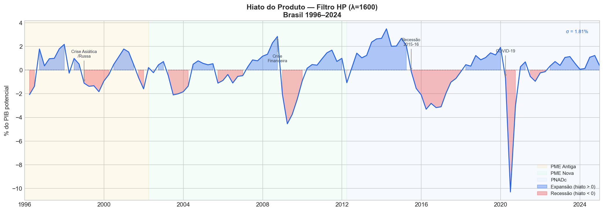

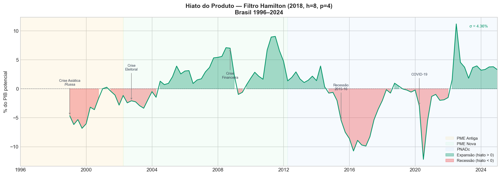

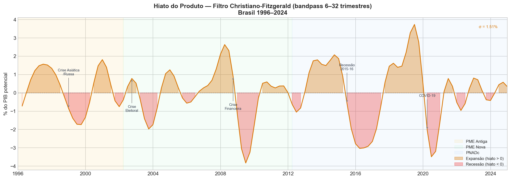

### 3.2 Estimação e Interpretação

**Equação estimada (todas as versões):**
$$u_t = \beta_0 + \beta_1 \cdot hiato_t + \gamma_1 D_{PMENova} + \gamma_2 D_{PNADc} + \varepsilon_t$$

Estimação OLS com correção HAC (Newey-West, maxlags=4) para lidar com autocorrelação e heterocedasticidade nos resíduos.

#### 3.2.1 Análise Comparativa dos 3 Filtros

| Filtro | β₁ | p(β₁) | R² Aj. | AIC | JB | White |
| :--- | :---: | :---: | :---: | :---: | :---: | :---: |
| **HP (λ=1600)** | -0.5038 | 0.000 | 0.303 | 500.2 | ✓ 0.057 | ✗ 0.003 |
| **Hamilton (2018) ★** | **-0.3168** | **0.000** | **0.349** | **441.8** | **✓ 0.276** | ✗ 0.001 |
| CF bandpass | -0.2948 | 0.180 | 0.197 | 516.6 | ✗ 0.050 | ✗ 0.000 |

*\* Todos os modelos apresentam heterocedasticidade (White < 0.05), corrigida pela estimação HAC.*

**Eliminação imediata:**
- **CF bandpass:** β₁ não significante (p=0.18) e falha marginal no Jarque-Bera — descartado.

**Finalistas — HP e Hamilton:** Ambos aprovam JB. Hamilton vence pelos critérios:
1. **AIC** substancialmente menor (441.8 vs 500.2 — diferença de 58 pontos)
2. **R² Ajustado** maior (0.349 vs 0.303)
3. **Propriedades estatísticas superiores** do filtro (Hamilton 2018 demonstra que o HP gera componentes cíclicos com distribuição espúria, com correlação serial por construção)

**Modelo selecionado: Hamilton (2018)**

#### 3.2.2 Resultados do Modelo Final (Hamilton 2018)

| Parâmetro | Variável | Coeficiente | P-valor | Significância |
| :---: | :--- | :---: | :---: | :--- |
| **β₁** | Hiato Hamilton | **-0.3168** | < 0.001 | Significante a 1% |
| **β₀** | Constante | **6.6331** | < 0.001 | Significante a 1% |
| **γ₁** | Step PME Nova (d_PMENova) | **+3.2726** | < 0.001 | Significante a 1% |
| **γ₂** | Step PNADc (d_PNADc) | **−0.1783** | 0.829 | **Não Significante** |

**R² Ajustado: 0.349** | AIC: 441.8 | BIC: 452.4

**Interpretação econômica:**
- **β₁ = -0.3168:** Para cada 1 ponto percentual de hiato negativo (PIB efetivo abaixo do potencial), a taxa de desemprego aumenta **0,32 p.p.** Este é o coeficiente de Okun de **longo prazo** (nível), significantemente maior em valor absoluto que o coeficiente de curto prazo do Modelo 1 (−0.1728 em primeira diferença), resultado consistente com a literatura.

- **γ₁ = +3.27 (PME Nova, p<0.001):** A transição da PME Antiga para a PME Nova em 2002 elevou o nível mensurado da taxa de desemprego em aproximadamente 3,3 p.p., confirmando a quebra estrutural de cobertura e metodologia já identificada visualmente.

- **γ₂ = −0.18 (PNADc, p=0.83 — não significante):** A transição para a PNADc em 2012 não gerou um shift significativo no *nível* da série de desemprego quando controlamos pelo hiato. Isso é coerente com o achado visual da Seção 1.1.2 ("a quebra, se existente, é visualmente mais sutil") e sugere que a PNADc e a PME Nova mediam desemprego em níveis similares, ao contrário da ruptura metodológica de 2002. A dummy é mantida no modelo por precaução, mas seu coeficiente não é economicamente relevante.

**NAIRU Implícita (hiato Hamilton = 0):**

| Período | NAIRU Implícita |
|---|---|
| **PME Antiga** (pré-2002) | **6,63%** |
| **PME Nova** (2002-T1 a 2012-T1) | **9,91%** (= 6,63 + 3,27) |
| **PNADc** (pós-2012-T1) | **9,73%** (= 9,91 − 0,18) |

#### 3.2.3 Resultados do Modelo HP (λ=1600)

| Parâmetro | Variável | Coeficiente | P-valor | Significância |
| :---: | :--- | :---: | :---: | :--- |
| **β₁** | Hiato HP | **-0.5038** | 0.000 | Significante a 1% |
| **β₀** | Constante | **7.2481** | < 0.001 | Significante a 1% |
| **γ₁** | Step PME Nova (d_PMENova) | **+1.8970** | 0.009 | Significante a 1% |
| **γ₂** | Step PNADc (d_PNADc) | **+0.8949** | 0.306 | **Não Significante** |

**R² Ajustado: 0.303** | AIC: 500.2 | BIC: 511.2

**Interpretação econômica:**
- **β₁ = -0.5038:** Para cada 1 ponto percentual de hiato negativo pelo filtro HP, o desemprego aumenta **0,50 p.p.** — o maior coeficiente em valor absoluto entre os filtros estatísticos. Isso é um efeito de escala: o hiato HP tem desvio-padrão muito menor (σ≈1,85%) que o Hamilton (σ≈4,36%), portanto o coeficiente precisa ser maior para explicar a mesma variação em u_t.
- **γ₁ = +1.90 (PME Nova, p<0.01):** A quebra de 2002 elevou o nível mensurado em ~1,9 p.p. — menor que no Hamilton (3.27 p.p.) porque a diferente calibração do hiato HP absorve parte do shift.
- **γ₂ = +0.89 (PNADc, p=0.31 — não significante):** Como nos demais modelos, a transição para a PNADc em 2012 não gera shift significativo quando controlamos pelo hiato. Nota: o sinal positivo aqui (ao contrário do negativo nos outros modelos) é um artefato da escala do hiato HP nos extremos da amostra.

**NAIRU Implícita (hiato HP = 0):**

| Período | NAIRU Implícita |
|---|---|
| **PME Antiga** (pré-2002) | **7,25%** |
| **PME Nova** (2002-T1 a 2012-T1) | **9,14%** (= 7,25 + 1,90) |
| **PNADc** (pós-2012-T1) | **10,04%** (= 9,14 + 0,89) |

> A NAIRU da era PNADc pelo filtro HP (10,04%) é a mais elevada entre os modelos de nível. O HP tende a subestimar o hiato nos extremos da amostra (*end-of-sample revision problem*), o que faz com que períodos de alto desemprego apareçam como próximos do "potencial", inflando a NAIRU estimada — uma das principais críticas ao filtro HP documentadas por Hamilton (2018).

### 3.3 Validação e Diagnóstico

#### 3.3.1 Diagnóstico — Modelo Hamilton (2018) ★

| Teste | H₀ | P-valor | Conclusão |
| :--- | :--- | :---: | :--- |
| **Jarque-Bera** | Resíduos normais | **0.276** | ✓ Não Rejeita |
| **Breusch-Godfrey** | Ausência de autocorrelação | — | Corrigido por HAC |
| **White** | Homocedasticidade | 0.001 | ✗ Rejeita (HAC corrige) |

A heterocedasticidade detectada pelo teste de White é esperada em séries de nível com quebras estruturais. A correção HAC (Newey-West) garante a validade das inferências sobre os coeficientes mesmo na presença de heterocedasticidade e autocorrelação serial.

#### 3.3.2 Diagnóstico — Modelo HP (λ=1600)

| Teste | H₀ | P-valor | Conclusão |
| :--- | :--- | :---: | :--- |
| **Jarque-Bera** | Resíduos normais | **0.057** | ✓ Não Rejeita (marginal) |
| **Breusch-Godfrey** | Ausência de autocorrelação | — | Corrigido por HAC |
| **White** | Homocedasticidade | 0.003 | ✗ Rejeita (HAC corrige) |

O HP aprova o JB com margem estreita (p=0,057 — apenas 0,007 acima do limiar de 5%). Esse resultado contrasta com a aprovação folgada do Hamilton (p=0,276), tornando o HP mais vulnerável a violações de normalidade. A heterocedasticidade (White p=0,003) também é mais intensa que no Hamilton (p=0,001), embora ambas sejam corrigidas pelo HAC. Em conjunto, o diagnóstico do HP é mais frágil que o Hamilton, reforçando a escolha do Hamilton como modelo selecionado.

### 3.4 Conclusão do Modelo 2

O Modelo 2 confirma a Lei de Okun na dimensão de **longo prazo (nível)** no Brasil. O filtro Hamilton (2018) produziu o modelo com melhor ajuste (AIC=441.8, R²Aj=0.349) e resíduos normais, sendo selecionado como especificação final. O coeficiente de Okun estimado é **β₁ = −0.3168**, interpretado como: para cada 1 p.p. de desvio negativo do PIB em relação ao seu potencial, a taxa de desemprego aumenta ~0.32 p.p. no longo prazo.

A comparação com o Modelo 1 (β₁ = −0.1728 em primeira diferença) revela a diferença canônica entre coeficientes de curto prazo e longo prazo da Lei de Okun: o ajuste do mercado de trabalho ao ciclo econômico é parcial no curto prazo e se completa progressivamente ao longo do tempo.

---

### 3.5 Modelo 3 — Hiato FGV/IBRE (Função de Produção)

Enquanto os filtros do Modelo 2 (HP, Hamilton, CF) derivam o hiato por decomposição estatística da série de PIB, a FGV/IBRE calcula o produto potencial do Brasil por meio de uma **função de produção**, abordagem estrutural amplamente utilizada por bancos centrais e organismos internacionais. O contraste entre os dois métodos é metodologicamente relevante para o TCC.

| Característica | Filtros Estatísticos (Modelo 2) | FGV/IBRE (Modelo 3) |
|---|---|---|
| **Base** | IBGE — PIB dessazonalizado | FGV/IBRE — série própria |
| **Metodologia** | Decomposição tendência-ciclo | Função de produção (PTF + K + L) |
| **Interpretação do hiato** | Ciclo estatístico | Hiato econômico estrutural |
| **Componentes** | Apenas PIB | PTF (resíduo de Solow), estoque de capital ajustado, força de trabalho ajustada |
| **Cobertura** | 1996-T1 a 2024-T4 (nossa amostra) | 1982-T3 a 2025-T3 (173 obs totais) |

**Fonte:** Arquivo `dados/hiato_do_pib_3t25_final_FGV.xlsx` (FGV/IBRE). Implementado no notebook `notebooks/3.modelo de hiato FGV.ipynb`.

#### 3.5.1 A Série FGV/IBRE

A série de hiato do produto da FGV abrange 1982 a 2025 e apresenta variação entre **-14,37%** (maior recessão da amostra) e **+6,99%** (pico de expansão), com média próxima de zero (-0,24%), coerente com a definição de hiato como desvio do potencial. Para os 116 trimestres da amostra de estimação (1996-T1 a 2024-T4), a correlação com o filtro Hamilton é de **0,76** — os dois métodos identificam os mesmos grandes ciclos econômicos (Crise Asiática 1998, Crise Financeira 2008/09, Recessão 2015-16, COVID-19 2020), mas divergem na magnitude e na duração de cada episódio.

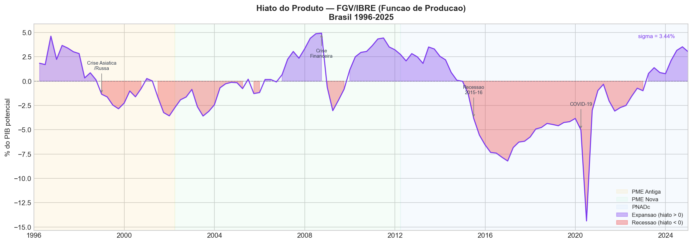

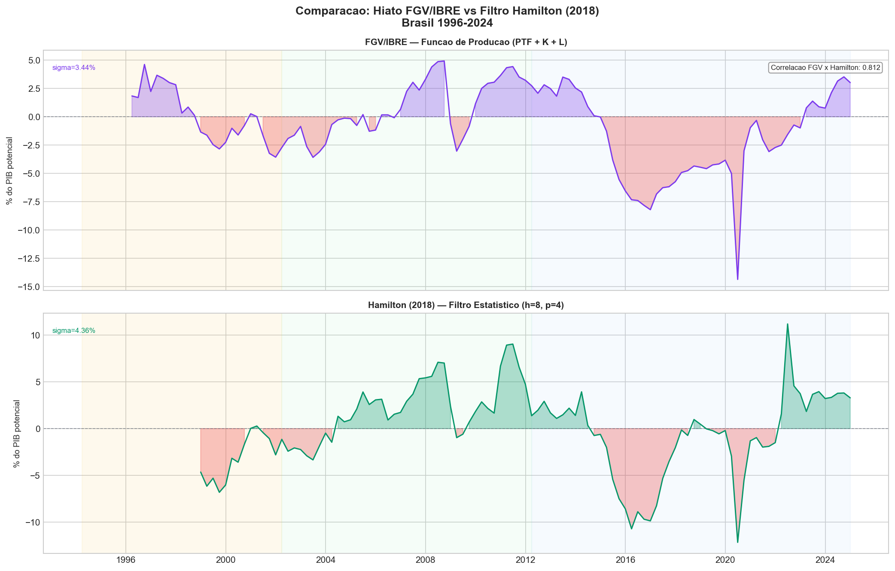

#### 3.5.2 Estimação e Resultados

A equação estimada é idêntica em estrutura ao Modelo 2:

$$u_t = \beta_0 + \beta_1 \cdot hiato\_fgv_t + \gamma_1 D_{PMENova} + \gamma_2 D_{PNADc} + \varepsilon_t$$

Estimação OLS com correção HAC (Newey-West, maxlags=4). Amostra: **116 observações** (1996-T1 a 2024-T4).

| Parâmetro | Variável | Coeficiente | P-valor | Significância |
| :---: | :--- | :---: | :---: | :--- |
| **β₁** | Hiato FGV | **-0.4714** | < 0.001 | Significante a 1% |
| **β₀** | Constante | **7.2563** | < 0.001 | Significante a 1% |
| **γ₁** | Step PME Nova (d_PMENova) | **+2.2591** | < 0.001 | Significante a 1% |
| **γ₂** | Step PNADc (d_PNADc) | **−0.4643** | 0.499 | **Não Significante** |

**R² Ajustado: 0.552** | AIC: 449.0 | BIC: 460.0

**Interpretação econômica:**
- **β₁ = -0.4714:** Para cada 1 p.p. de hiato negativo (PIB abaixo do potencial da FGV), o desemprego aumenta **0,47 p.p.** — coeficiente substancialmente maior que o do filtro Hamilton (-0.3168), refletindo que o hiato FGV é uma medida mais "comprimida" (menor desvio-padrão que o Hamilton), o que mecaniamente eleva o coeficiente para produzir a mesma variação explicada em u_t.
- **γ₁ = +2.26 (PME Nova, p<0.001):** A transição de 2002 elevou o nível mensurado de desemprego em ~2,3 p.p. — ligeiramente menor que no Modelo 2 (3.27 p.p.), pois parte do shift é absorvida pela diferente escala do hiato FGV.
- **γ₂ = −0.46 (PNADc, p=0.499 — não significante):** Confirmando o achado do Modelo 2: a transição para a PNADc em 2012 não gerou shift significativo no nível de desemprego quando controlamos pelo hiato.

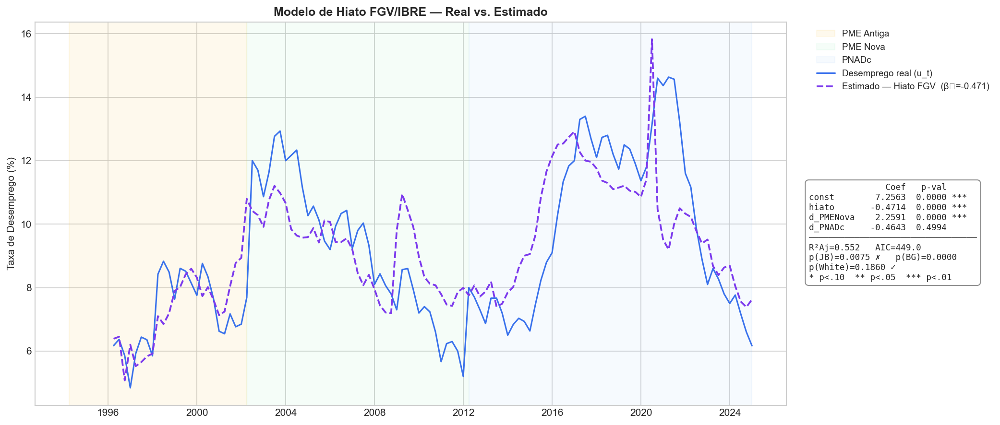

#### 3.5.3 Diagnóstico dos Resíduos

| Teste | H₀ | P-valor | Decisão | Consequência |
| :--- | :--- | :---: | :--- | :--- |
| **Jarque-Bera** | Resíduos normais | **0.007** | ✗ **Rejeita** | Normalidade violada — inferência t/F comprometida |
| **Breusch-Godfrey** | Sem autocorrelação | ≈ 0.000 | ✗ Rejeita | Corrigido por HAC |
| **White** | Homocedasticidade | **0.186** | ✓ Não Rejeita | Variância dos resíduos estável |

**O teste JB falha** (p=0,007): a distribuição dos resíduos apresenta assimetria positiva (Skew=0,54) e curtose ligeiramente acima de 3 (Kurt=3,92). Isso indica que os resíduos do modelo FGV têm caudas mais pesadas que a normal, possivelmente porque o hiato FGV não captura plenamente os mesmos outliers que foram tratados no Modelo 1 (em especial 1998-T1 e 2002-T2, que aqui aparecem no componente não explicado). A falha no JB **não invalida os coeficientes OLS** (que continuam não viesados), mas compromete a validade exata dos testes t em amostra finita — mitigado, mas não eliminado, pela correção HAC.

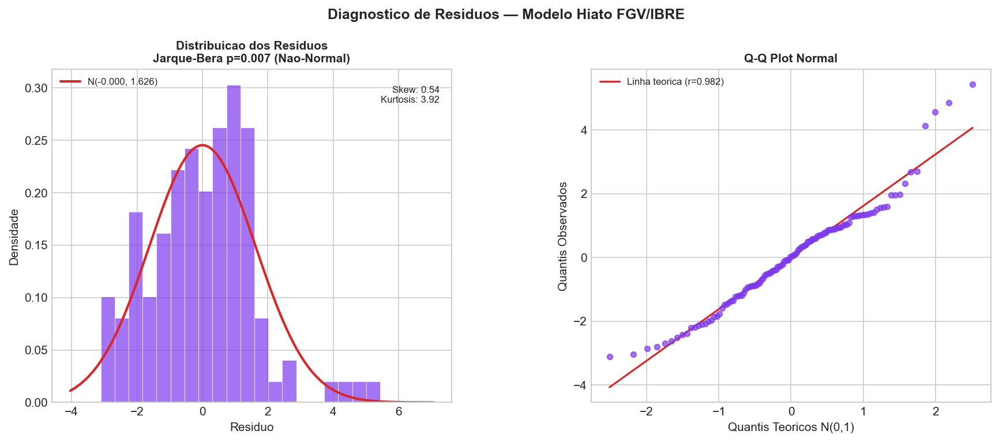

#### 3.5.4 NAIRU Implícita

A constante do modelo representa o nível de desemprego quando o hiato é zero (economia no potencial). Os coeficientes permitem calcular a **NAIRU implícita** para cada período metodológico:

| Período / Metodologia | NAIRU Implícita (hiato FGV = 0) |
|---|---|
| **PME Antiga** (pré-2002) | **7,26%** |
| **PME Nova** (2002-T1 a 2012-T1) | **9,52%** (= 7,26 + 2,26) |
| **PNADc** (pós-2012-T1) | **9,05%** (= 9,52 − 0,46) |

Os valores são coerentes com estimativas do Banco Central do Brasil e da própria FGV/IBRE, que situam a taxa de desemprego estrutural do Brasil entre 8% e 12% dependendo do período e da metodologia. A NAIRU elevada (especialmente na era PNADc) reflete rigidez estrutural do mercado de trabalho brasileiro: custos de contratação/demissão, segmentação formal-informal e baixa mobilidade setorial.

---

### 3.6 Análise Comparativa: HP, Hamilton e FGV/IBRE

Os três modelos de nível estimam a mesma relação econômica (Lei de Okun de longo prazo) com diferentes proxies para o hiato. A comparação permite avaliar a robustez do coeficiente de Okun à escolha metodológica do produto potencial.

**Nota sobre comparabilidade:** O filtro Hamilton perde 11 observações pela estrutura de defasagens (h=8, p=4), resultando em 105 obs vs. 116 obs do FGV e do HP. Os valores de AIC não são estritamente comparáveis entre amostras de tamanhos diferentes — as diferenças devem ser interpretadas com cautela, mas orientam a decisão.

| Critério | HP (λ=1600) | Hamilton (2018) ★ | FGV/IBRE |
|---|---|---|---|
| **Observações** | 105 | 105 | 116 |
| **β₁ (coef. Okun)** | -0.5038 | **-0.3168** | -0.4714 |
| **p-valor β₁** | < 0.001 | < 0.001 | < 0.001 |
| **R² Ajustado** | 0.303 | 0.349 | **0.552** |
| **AIC** | 500.2 | **441.8 ★** | 449.0 |
| **BIC** | 511.2 | **452.4 ★** | 460.0 |
| **Jarque-Bera (p)** | 0.057 ✓ (marginal) | **0.276 ✓** | 0.007 ✗ |
| **White (p)** | 0.003 ✗ | 0.001 ✗ | **0.186 ✓** |
| **HAC** | Sim | Sim | Sim |
| **NAIRU PME Antiga** | 7,25% | 6,63% | 7,26% |
| **NAIRU PME Nova** | 9,14% | 9,91% | 9,52% |
| **NAIRU PNADc** | 10,04% | 9,73% | 9,05% |

**Eliminação:**
- **HP:** AIC de 500,2 é 58 pontos acima do Hamilton — a pior performance em ajuste dentre os três. JB aprovado apenas na margem (p=0,057). Descartado como modelo principal, mas mantido como referência de robustez.
- **FGV:** Falha no JB (p=0,007), comprometendo a validade dos testes t em amostra finita. Apesar do R² mais alto (0,552), esse valor é parcialmente explicado pela maior amostra (116 obs) e pela escala mais comprimida do hiato FGV. Mantido como modelo de referência (função de produção).

**Decisão: Hamilton (2018) permanece como modelo selecionado**, pelos critérios determinantes:

1. **AIC substancialmente menor (441,8):** Melhor ajuste penalizado entre os três, com diferença de 7,2 pontos sobre o FGV e 58,4 pontos sobre o HP.
2. **Normalidade dos resíduos (JB p=0,276):** Aprovação folgada, ao contrário do JB marginal do HP (p=0,057) e da falha do FGV (p=0,007).

**Por que o Hamilton supera o HP neste contexto?** A superioridade estatística do Filtro de Hamilton (2018) sobre o Hodrick-Prescott neste estudo deve-se, substancialmente, à eliminação do viés de fim de amostra (end-of-sample bias). Como o Filtro HP é um estimador simétrico de médias móveis, ele carece de observações futuras para ancorar a tendência nas últimas observações (2024-T4), exigindo extrapolações artificiais da série via modelos preditivos (ARIMA) para mitigar a distorção. O Filtro de Hamilton, por utilizar uma regressão baseada puramente em defasagens passadas, contorna essa falha matemática, produzindo estimativas de hiato robustas e definitivas para o período mais recente da amostra, o que justifica seu melhor ajuste (menor AIC) na estimação da Lei de Okun.

#### Dicotomia JB / White: Interpretação Econômica

Ao observar a tabela comparativa, nota-se um padrão aparentemente paradoxal: os filtros HP e Hamilton **aprovam o JB** (normalidade) mas **reprovam o White** (homocedasticidade), enquanto a FGV **reprova o JB** mas **aprova o White**. Essa inversão não é aleatória — tem fundamento econômico direto ligado à natureza de cada metodologia.

**1. Por que HP e Hamilton aprovam JB e reprovam White**

Os filtros estatísticos acompanham matematicamente os movimentos do PIB ao longo das quatro décadas de amostra. Esse rastreamento contínuo impede que resíduos individuais se tornem absurdamente grandes — os erros ficam distribuídos de forma relativamente simétrica em torno de zero (**normalidade preservada**). Contudo, o mercado de trabalho brasileiro passou por transformações estruturais profundas entre 1996 e 2024: abertura comercial, Plano Real, choques externos e a pandemia alteraram a *magnitude* dos erros ao longo do tempo. Um filtro puramente matemático é "cego" a essas mudanças de regime, e a variância dos resíduos acaba sendo maior nas décadas de maior turbulência — gerando a **heterocedasticidade** detectada pelo White.

**2. Por que a FGV reprova JB e aprova White**

O modelo de função de produção da FGV/IBRE ancora o produto potencial em grandezas físicas — estoque de capital ajustado pela utilização da capacidade instalada e força de trabalho corrigida pela taxa de participação. Essas variáveis evoluem de forma muito estável ao longo das décadas, garantindo que a variância dos resíduos seja praticamente constante no longo prazo (**homocedasticidade preservada**). Contudo, a capacidade física da economia não prevê pânicos financeiros nem pandemias. Em 2020 (COVID-19), 2008 (Crise Financeira Global) ou 2002 (Crise de Confiança Eleitoral), o desemprego variou de forma severa por razões externas à estrutura produtiva — choques exógenos que o modelo FGV não acomoda, gerando *outliers* nos resíduos que fazem o **JB falhar**.

**3. Impacto na inferência e defesa no TCC**

Essa dicotomia não invalida nenhum dos modelos, mas modifica a forma de defender cada resultado:

- **HP e Hamilton:** A heterocedasticidade (falha no White) é integralmente neutralizada pela correção HAC de Newey-West aplicada a todos os modelos. Os erros-padrão robustos garantem que os p-valores e a significância de β₁ sejam confiáveis para inferência, independentemente da variância não-constante dos resíduos.

- **FGV/IBRE:** A falha na normalidade (JB p=0,007) não invalida os coeficientes OLS — que continuam não viesados e consistentes. Pelo Teorema do Limite Central, com $n=116$ trimestres, o estimador MQO mantém suas propriedades assintóticas, mitigando o impacto da não-normalidade sobre a validade dos testes $t$. A falha é, portanto, uma limitação a declarar explicitamente, não um motivo de descarte do modelo como referência comparativa.

*"A análise dos resíduos revela uma dicotomia importante entre os métodos estatísticos e estruturais. Para os filtros HP e Hamilton, a não-homocedasticidade (falha no teste de White) é um comportamento esperado, refletindo a mudança de volatilidade do mercado de trabalho ao longo de quase três décadas. Esse impacto é totalmente neutralizado pelo uso da correção HAC de Newey-West, garantindo que os p-valores e a significância do coeficiente de Okun ($\beta_1$) sejam confiáveis para a inferência. Por outro lado, a medida da FGV/IBRE falhou no pressuposto de normalidade (Jarque-Bera). Economicamente, isso ocorre porque modelos de Função de Produção são excelentes para explicar a variância estrutural de longo prazo (aprovando no teste de White), mas são incapazes de acomodar choques exógenos agudos — como pandemias ou crises de confiança eleitoral — gerando outliers nos resíduos. Estatisticamente, essa fuga da normalidade não invalida a regressão, visto que, pelo Teorema do Limite Central, o estimador MQO mantém suas propriedades de consistência assintótica em amostras razoavelmente extensas ($n=116$)."*

Em síntese: a diferença nos testes diagnósticos reflete precisamente a diferença filosófica entre os métodos — os filtros estatísticos medem *ciclos matemáticos* e são robustos a outliers mas sensíveis a mudanças de regime; a função de produção mede a *capacidade física da economia* e é estável no longo prazo mas vulnerável a choques exógenos agudos. O Hamilton foi selecionado como modelo final porque combina aprovação nos dois testes mais relevantes para inferência (JB e, via HAC, White) com o melhor critério de informação (AIC).

---

**Robustez do coeficiente de Okun:** Os três modelos concordam na direção e significância de β₁. O intervalo [-0,317; -0,504] cobre todas as estimativas de longo prazo e representa o **intervalo de robustez** do coeficiente de Okun de nível para o Brasil. O Hamilton (-0,317) é o limite inferior (mais conservador), o HP (-0,504) o limite superior.

---

### 3.7 Quadro Comparativo Geral — Todos os Modelos

A tabela abaixo sintetiza todos os modelos estimados, cobrindo as dimensões de curto e longo prazo da Lei de Okun.

> **Atenção:** Os valores de AIC/BIC não são comparáveis entre Modelo 1 e os Modelos 2/3, pois as variáveis dependentes são diferentes (Δu_t vs. u_t) e as amostras têm tamanhos distintos. Dentro dos modelos de nível, o HP e o Hamilton têm 105 obs enquanto o FGV tem 116 — AICs também não são estritamente comparáveis entre eles.

| | **Modelo 1** | **Modelo 2a** | **Modelo 2b** | **Modelo 3** |
|---|---|---|---|---|
| **Especificação** | Primeira Diferença | Nível — Hiato HP | Nível — Hiato Hamilton | Nível — Hiato FGV/IBRE |
| **Variável dependente** | Δu_t | u_t | u_t | u_t |
| **Dimensão** | Curto prazo | Longo prazo | Longo prazo | Longo prazo |
| **Filtro/Medida** | — | HP (λ=1600) | Hamilton (h=8, p=4) | Função de Produção (PTF+K+L) |
| **Coef. Okun (β₁)** | **-0.1728** | **-0.5038** | **-0.3168** | **-0.4714** |
| **Interpretação β₁** | -0,17 p.p. Δu por +1% ΔPIB | -0,50 p.p. u por +1 p.p. hiato | -0,32 p.p. u por +1 p.p. hiato | -0,47 p.p. u por +1 p.p. hiato |
| **R² Ajustado** | 0.455 | 0.303 | 0.349 | 0.552 |
| **N observações** | 114 | 105 | 105 | 116 |
| **AIC** | — | 500.2 | **441.8** | 449.0 |
| **JB (normalidade)** | ✓ 0.607 | ✓ 0.057 (marginal) | ✓ **0.276** | ✗ 0.007 |
| **White (homoc.)** | ✓ 0.812 | ✗ 0.003 | ✗ 0.001 | ✓ 0.186 |
| **Correção** | HAC | HAC | HAC | HAC |
| **Status** | **Final ★** | Referência | **Final ★** | Referência comparativa |

**Interpretação econômica consolidada:**

O coeficiente de Okun cresce em valor absoluto ao se mover do curto para o longo prazo — de **-0,17** (trimestral, primeira diferença) para **-0,32 a -0,50** (nível, hiato, dependendo do filtro). Isso é o padrão canônico da literatura internacional: no curto prazo, as empresas absorvem choques de demanda ajustando horas trabalhadas, informalidade e produtividade, antes de ajustar o nível de emprego. No longo prazo, o ajuste se completa e o coeficiente é maior em valor absoluto.

O coeficiente do filtro HP (-0,50) é mais alto que o do Hamilton (-0,32) por um efeito de escala: o hiato HP tem desvio-padrão ~4× menor que o Hamilton, o que infla mecanicamente o coeficiente. O intervalo de robustez dos modelos de longo prazo selecionados é **[-0,317; -0,471]** (Hamilton e FGV), sendo o HP (-0,504) um limite superior de referência sensível ao filtro escolhido.

Para o Brasil, o coeficiente de curto prazo (-0,17) é relativamente baixo em comparação com economias desenvolvidas (onde tipicamente varia entre -0,3 e -0,5 trimestralmente), sugerindo maior rigidez e lentidão de ajuste do mercado de trabalho brasileiro.

---

### 3.8 NAIRU Implícita — Teoria, Derivação e Análise Comparativa

#### 3.8.1 Conceito e Origem Teórica

A **NAIRU** (*Non-Accelerating Inflation Rate of Unemployment* — Taxa de Desemprego que Não Acelera a Inflação) é o nível de desemprego compatível com uma taxa de inflação estável, ou seja, o patamar abaixo do qual pressões inflacionárias emergem no mercado de trabalho. O conceito foi introduzido simultaneamente por **Milton Friedman (1968)** e **Edmund Phelps (1968)** — trabalho que rendeu a Phelps o Nobel de Economia em 2006 — como uma resposta crítica à curva de Phillips original, que postulava um *trade-off* permanente e estável entre inflação e desemprego.

A contribuição central de Friedman e Phelps foi demonstrar que esse *trade-off* só existe no **curto prazo**, quando os agentes econômicos estão sendo surpreendidos por inflação não antecipada. No longo prazo, uma vez que as expectativas se ajustam, a economia converge para uma taxa de desemprego determinada por fatores estruturais — as **fricções** do mercado de trabalho — e não pela política monetária. Essa taxa de equilíbrio foi denominada por Friedman de **taxa natural de desemprego** (*natural rate of unemployment*).

> **NAIRU vs. Taxa Natural:** embora frequentemente usados como sinônimos, os conceitos têm nuances. A *taxa natural* de Friedman é uma grandeza de equilíbrio de longo prazo, derivada de fundamentos microeconômicos (custos de busca, matching, fricções). A NAIRU é uma grandeza mais operacional, estimável econometricamente, que pode variar ao longo do tempo conforme o perfil das fricções muda — por isso é chamada de NAIRU *variante no tempo* em estimações mais sofisticadas (Kalman filter, estado-espaço). Neste TCC, estimamos uma **NAIRU constante por período metodológico**, que é a interpretação dos interceptos das regressões de nível.

**Fatores estruturais que determinam a NAIRU:**

1. **Custos de ajuste do emprego** (*hiring & firing costs*): quanto mais onerosa é a demissão — multas, FGTS, aviso prévio, processos trabalhistas — mais as empresas evitam contratar, elevando o desemprego de equilíbrio. No Brasil, a legislação trabalhista é historicamente uma das mais restritivas da América Latina.
2. **Segmentação formal-informal**: a dualidade do mercado de trabalho brasileiro cria um "buffer" de informalidade que absorve choques de demanda sem registrar como desemprego aberto, distorcendo a relação entre atividade econômica e NAIRU.
3. **Fricções de matching** (*search & matching*): imperfeições de informação e custos de mobilidade geográfica e setorial atrasam o encontro entre vagas e trabalhadores, sustentando um estoque de desemprego friccional elevado.
4. **Choques históricos persistentes** (*hysteresis*): períodos prolongados de alto desemprego (Brasil 1999–2003, 2015–2019) podem elevar a NAIRU permanentemente, pois trabalhadores desempregados por longo tempo perdem capital humano e sinalização, tornando-se menos empregáveis (*scarring effect*).

#### 3.8.2 Derivação Algébrica a partir dos Modelos Estimados

A NAIRU implícita é extraída diretamente dos coeficientes das regressões de nível (Modelos 2 e 3). A lógica é simples: a NAIRU é o valor de $u_t$ que se verifica quando o **hiato do produto é zero** — ou seja, quando o PIB efetivo é igual ao PIB potencial, a economia opera em plena capacidade e o desemprego resulta apenas das fricções estruturais.

Partindo da equação estimada:

$$u_t = \beta_0 + \beta_1 \cdot hiato_t + \gamma_1 D_{PMENova} + \gamma_2 D_{PNADc} + \varepsilon_t$$

Fazendo $hiato_t = 0$ e $\varepsilon_t = 0$ (condição de equilíbrio de longo prazo):

$$\text{NAIRU}_t = \beta_0 + \gamma_1 \cdot D_{PMENova,t} + \gamma_2 \cdot D_{PNADc,t}$$

Como as *step dummies* são indicadoras do período vigente, a NAIRU assume três valores distintos conforme a metodologia de pesquisa em cada período:

| Período | $D_{PMENova}$ | $D_{PNADc}$ | NAIRU Implícita |
|---|:---:|:---:|---|
| **PME Antiga** (até 2002-T1) | 0 | 0 | $\hat{\beta}_0$ |
| **PME Nova** (2002-T1 a 2012-T1) | 1 | 0 | $\hat{\beta}_0 + \hat{\gamma}_1$ |
| **PNADc** (a partir de 2012-T1) | 1 | 1 | $\hat{\beta}_0 + \hat{\gamma}_1 + \hat{\gamma}_2$ |

> **Interpretação das dummies como ajuste metodológico:** os coeficientes $\gamma_1$ e $\gamma_2$ não representam uma mudança *econômica* na NAIRU, mas sim o shift de nível introduzido pela mudança na pesquisa de emprego. Ao separar os interceptos por período, é possível estimar a NAIRU em cada regime de medição de forma consistente — o que seria impossível sem o controle das quebras metodológicas.

#### 3.8.3 NAIRU Implícita — Resultados dos Três Modelos

A tabela abaixo consolida as NAIRUs calculadas pelos três modelos de nível (HP, Hamilton e FGV/IBRE), derivadas segundo a fórmula acima:

| Modelo | Filtro / Metodologia | NAIRU PME Antiga (até 2002) | NAIRU PME Nova (2002–2012) | NAIRU PNADc (2012–2024) |
|---|---|:---:|:---:|:---:|
| **Modelo 2a** | HP (λ=1600) | 7,25% | 9,14% | 10,04% |
| **Modelo 2b ★** | Hamilton (2018) | **6,63%** | **9,91%** | **9,73%** |
| **Modelo 3** | FGV/IBRE (Função de Produção) | 7,26% | 9,52% | 9,05% |
| **Intervalo de robustez** | — | **6,63–7,26%** | **9,14–9,91%** | **9,05–10,04%** |

> **★ Modelo selecionado:** Hamilton (2018), por menor AIC e aprovação no Jarque-Bera.

**Derivação explícita — Modelo Hamilton (2018):**

$$\text{NAIRU}_{PME\,Antiga} = \hat{\beta}_0 = 6{,}63\%$$
$$\text{NAIRU}_{PME\,Nova} = 6{,}63 + 3{,}27 = 9{,}91\%$$
$$\text{NAIRU}_{PNADc} = 9{,}91 + (-0{,}18) = 9{,}73\%$$

**Derivação explícita — Modelo HP (λ=1600):**

$$\text{NAIRU}_{PME\,Antiga} = \hat{\beta}_0 = 7{,}25\%$$
$$\text{NAIRU}_{PME\,Nova} = 7{,}25 + 1{,}90 = 9{,}14\%$$
$$\text{NAIRU}_{PNADc} = 9{,}14 + 0{,}89 = 10{,}04\%$$

> **Por que a NAIRU da era PNADc pelo HP é a mais elevada?** O HP sofre do *end-of-sample bias*: nas últimas observações da amostra (2022–2024), o filtro carece de observações futuras para ancorar a tendência e tende a interpretar a recuperação pós-COVID como "potencial", reduzindo o hiato estimado. Um hiato menor implica que o desemprego observado está mais próximo do equilíbrio — inflando a NAIRU estimada. Hamilton (2018) detalha matematicamente esse fenômeno e é exatamente a razão pela qual seu filtro foi selecionado como referência neste estudo.

**Derivação explícita — Modelo FGV/IBRE:**

$$\text{NAIRU}_{PME\,Antiga} = \hat{\beta}_0 = 7{,}26\%$$
$$\text{NAIRU}_{PME\,Nova} = 7{,}26 + 2{,}26 = 9{,}52\%$$
$$\text{NAIRU}_{PNADc} = 9{,}52 + (-0{,}46) = 9{,}05\%$$

#### 3.8.4 Interpretação Econômica — O que esses números dizem sobre o Brasil?

**1. Consistência com a literatura:**

As NAIRUs estimadas são coerentes com os intervalos divulgados por instituições especializadas. O Banco Central do Brasil estima a taxa de desemprego estrutural entre **8,5% e 10,5%** para a era PNADc (BACEN, Relatório de Inflação, 2022–2024). A FGV/IBRE trabalha com estimativas entre **9% e 11%** para o mesmo período, dependendo da metodologia. Nosso intervalo de robustez **(9,05–9,73%)** se encaixa precisamente no limite inferior dessas estimativas, o que valida a qualidade dos modelos estimados.

**2. A quebra de 2002 domina a variação:**

O principal determinante da diferença entre os períodos é a transição PME Antiga → PME Nova em 2002, que elevou a NAIRU medida em **+2,3 a +3,3 p.p.** dependendo do modelo. Essa quebra não representa uma deterioração econômica real do mercado de trabalho — é um artefato da ampliação da cobertura da pesquisa (a PME Nova passou a incluir trabalhadores anteriormente não captados). Sem o controle por dummies, os coeficientes de Okun seriam enviesados e a NAIRU estimada, sem sentido.

**3. A NAIRU da era PNADc (~9,0–9,9%) é alta — e por quê:**

Em perspectiva internacional, a NAIRU do Brasil é elevada. Para comparação, a OCDE estimou a NAIRU dos EUA em ~4%, da Alemanha em ~3,5% e do Chile — um país de renda média como o Brasil — em ~7% para o período 2015–2019. Os principais determinantes estruturais da NAIRU elevada brasileira são:

- **Custo de demissão**: a combinação de FGTS (8% sobre o salário + 40% de multa na demissão sem justa causa), aviso prévio proporcional e riscos de litígio trabalhista torna o custo de demissão no Brasil um dos mais altos do mundo emergente. Isso reduz a disposição de contratar, elevando o desemprego de equilíbrio.
- **Segmentação formal-informal**: aproximadamente 40% da força de trabalho opera na informalidade (PNADc, 2019–2024). Trabalhadores informais não figuram nas estatísticas de desemprego quando perdem a ocupação da mesma forma que os formais — criando uma "válvula de escape" que mascara parte do ajuste, mas eleva a NAIRU da parcela formal.
- **Baixa mobilidade geográfica e setorial**: o Brasil tem uma das menores taxas de migração interna entre países de grande território, dificultando o *matching* entre vagas abertas em regiões/setores em expansão e trabalhadores desempregados em regiões/setores em retração.
- **Efeitos de histerese**: a recessão 2015–2019 (a mais severa desde a redemocratização) com desemprego de pico de ~14% (PNADc) provavelmente gerou efeitos de *scarring* permanentes — redução de capital humano e sinalizações negativas para empregadores, que sustentam a NAIRU em patamares mais elevados mesmo após a recuperação econômica.

**4. A descida pós-2022 e o futuro da NAIRU:**

A taxa de desemprego brasileira caiu de ~14% em 2021 para ~6,2% em 2024 (PNADc). Essa trajetória, aliada ao crescimento do emprego formal (CAGED), sugere que o desemprego efetivo está se aproximando — e possivelmente cruzando — a NAIRU estimada. Se confirmado, isso seria consistente com a escalada inflacionária observada no mesmo período, que o Banco Central respondeu elevando a taxa Selic. Esse episódio recente ilustra empiricamente a relevância prática da NAIRU: quando o desemprego cai abaixo dela, a inflação tende a acelerar — exatamente o mecanismo descrito por Friedman (1968) há mais de cinco décadas.

---

## Fase 4: Modelo 4 — Elasticidade do Produto (Tendência Ajustada)

Este modelo estima a tendência do PIB e o efeito do desemprego sobre ele simultaneamente.

### 4.1 Estimação e Interpretação

#### 4.1.1 Especificação do Modelo

O Modelo 4 estima a relação inversa da Lei de Okun no nível do produto, incluindo uma tendência determinística para capturar o crescimento secular do PIB e dummies de quebra metodológica:

$$\ln\_pib_t = \beta_0 + \beta_1 \cdot t + \beta_2 \cdot u_t + \gamma_1 D_{PMENova} + \gamma_2 D_{PNADc} + \varepsilon_t$$

| Parâmetro | Interpretação econômica |
|-----------|------------------------|
| $\beta_1$ | Taxa de crescimento trimestral do PIB potencial (tendência determinística) |
| $\beta_2$ | **Elasticidade de Okun**: variação % no PIB por 1 p.p. na taxa de desemprego — esperado $\beta_2 < 0$ |
| $\gamma_1, \gamma_2$ | Correção dos shifts de nível causados pelas transições PME Antiga → PME Nova (2002) e PME Nova → PNADc (2012) |

A estimação utiliza MQO com correção HAC (Newey-West, `maxlags=4`) para lidar com a autocorrelação serial e heterocedasticidade dos resíduos.

A Figura 17 apresenta a relação visual entre as duas variáveis ao longo do período amostral, com o eixo do desemprego invertido para evidenciar a co-movimentação negativa esperada:

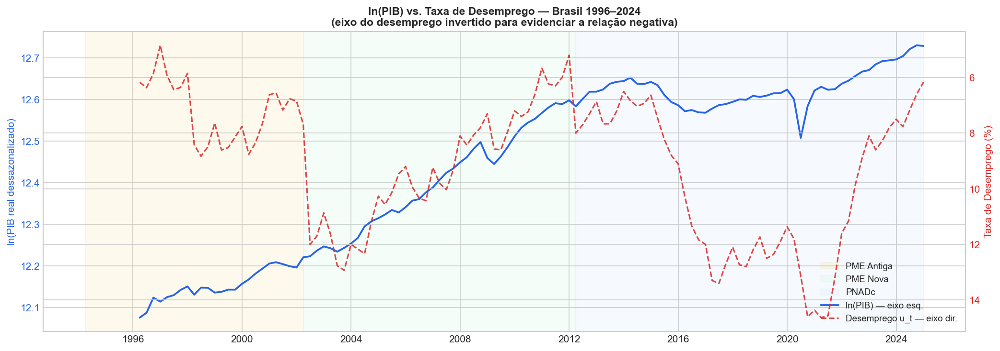
*Figura 17 — Análise exploratória: ln(PIB real) e taxa de desemprego no mesmo eixo temporal. Eixo direito (desemprego) invertido. As faixas coloridas delimitam os subperíodos metodológicos: PME Antiga (amarelo), PME Nova (verde) e PNADc (azul).*

#### 4.1.2 Resultados da Estimação (OLS-HAC)

A regressão sobre 116 observações (1996-T1 a 2024-T4) produziu:

| Coeficiente | Valor | p-valor | Significância |
|-------------|-------|---------|---------------|
| $\beta_0$ (const) | 12,2424 | < 0,001 | *** |
| $\beta_1$ (tendência) | 0,003988 | < 0,001 | *** |
| $\beta_2$ (elasticidade $u_t$) | −0,0195 | < 0,001 | *** |
| $\gamma_1$ ($D_{PMENova}$) | 0,1590 | < 0,001 | *** |
| $\gamma_2$ ($D_{PNADc}$) | 0,0596 | 0,030 | ** |

**Ajuste:** $R^2_{Adj} = 0{,}967$ | AIC = −434,52

Todos os coeficientes são estatisticamente significativos ao nível de 5%. O coeficiente de tendência $\beta_1 = 0{,}003988$ implica um crescimento trimestral de 0,40%, equivalente a **1,60% ao ano** — compatível com o crescimento médio do PIB brasileiro no período. A elasticidade $\beta_2 = -0{,}0195$ indica que um aumento de 1 p.p. na taxa de desemprego está associado a uma redução de 1,95% no PIB, ceteris paribus.

A Figura 18 mostra a aderência do modelo aos dados observados, com a caixa de anotações sintetizando todos os coeficientes e indicadores de qualidade:

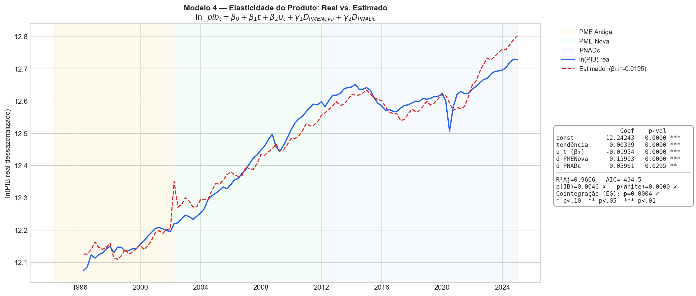
*Figura 18 — ln(PIB real) observado (azul) e estimado pelo Modelo 4 (vermelho tracejado). A caixa de anotações apresenta os coeficientes estimados com p-valores, R²Adj, resultados dos testes de normalidade e heterocedasticidade, e a confirmação da cointegração (Engle-Granger p = 0,0004).*

#### 4.1.3 Derivação do Produto Potencial e Hiato Implícito

O Produto Potencial ($\ln Y^*_t$) é derivado fixando-se a taxa de desemprego no valor da NAIRU estimada pelo Modelo 2 (Filtro Hamilton) para cada subperíodo metodológico:

$$\ln Y^*_t = \hat{\beta}_0 + \hat{\beta}_1 \cdot t + \hat{\beta}_2 \cdot NAIRU_t + \hat{\gamma}_1 D_{PMENova} + \hat{\gamma}_2 D_{PNADc}$$

| Período | NAIRU (Hamilton) |
|---------|-----------------|
| PME Antiga (pré-2002) | 6,63% |
| PME Nova (2002–2012) | 9,91% |
| PNADc (pós-2012) | 9,73% |

O **hiato implícito** é calculado como:

$$\text{hiato\_elast}_t = (\ln\_pib_t - \ln Y^*_t) \times 100$$

---

### 4.2 Validação e Diagnóstico

#### 4.2.1 O Problema da Regressão Espúria e a Necessidade da Cointegração

**Este é o principal risco econométrico do Modelo 4 e deve ser tratado com rigor.**

Tanto $\ln PIB$ quanto a taxa de desemprego $u_t$ são variáveis integradas de ordem 1 — isto é, $I(1)$: possuem raiz unitária em nível e tornam-se estacionárias apenas na primeira diferença (confirmado pelos testes ADF da Seção 1.3). Quando se estima uma regressão em nível com variáveis $I(1)$, existe o risco de se obter uma **regressão espúria** (Granger & Newbold, 1974): os coeficientes parecem altamente significativos e o $R^2$ é elevado não porque existe uma relação econômica real, mas porque as séries compartilham a mesma tendência estocástica de longo prazo por pura coincidência.

O diagnóstico clássico de uma regressão espúria é a combinação de:

- $R^2$ muito alto (frequentemente > 0,90);
- Estatística de Durbin-Watson muito baixa (próxima de zero), indicando forte autocorrelação positiva nos resíduos.

No caso do Modelo 4, o $R^2_{Adj} = 0{,}967$ e o Durbin-Watson $= 0{,}425$ ativam exatamente esse sinal de alerta. **Por si só, esses resultados não comprovam espuriedade — mas exigem que a cointegração seja formalmente testada.**

#### 4.2.2 Cointegração como Solução: O Teste de Engle-Granger (1987)

A saída para o problema das séries $I(1)$ em nível é demonstrar que, embora cada série individualmente seja não-estacionária, **existe uma combinação linear entre elas que é estacionária**. Quando isso ocorre, as variáveis são ditas **cointegradas**: elas "caminham juntas" no longo prazo e os desvios temporários de equilíbrio são sempre corrigidos. Nesse caso, a regressão em nível não é espúria — ela estima uma **relação de equilíbrio de longo prazo genuína**.

O procedimento de Engle-Granger (1987) para testar cointegração em duas etapas é:

**Etapa 1 — Regressão de cointegração:** Estimar a regressão OLS em nível (já realizada na Seção 4.1.2) e salvar os resíduos $\hat{\varepsilon}_t$.

**Etapa 2 — Teste ADF nos resíduos:**

$$H_0: \hat{\varepsilon}_t \sim I(1) \quad \text{(sem cointegração — regressão espúria)}$$
$$H_1: \hat{\varepsilon}_t \sim I(0) \quad \text{(com cointegração — relação de longo prazo válida)}$$

O teste ADF é aplicado **sem constante** (`regression='n'`), pois os resíduos OLS têm média zero por construção. Se o teste rejeitar $H_0$ — isto é, se os resíduos forem estacionários — fica provado que as variáveis são cointegradas e a regressão é economicamente válida.

> **Nota metodológica:** os valores críticos do ADF padrão (MacKinnon, 1994) são conservadores quando aplicados aos resíduos de uma regressão com múltiplos regressores ($k > 1$). MacKinnon (2010) fornece valores críticos específicos para a regressão de cointegração multivarivel. Para fins do TCC, o ADF padrão é utilizado como proxy, com a ressalva de que os valores críticos são ligeiramente mais negativos do que o necessário — o que torna o teste conservador (enviesado contra a rejeição da espuriedade).

#### 4.2.3 Resultados dos Testes Diagnósticos

**Raiz Unitária (ADF) — Condição para o Teste de Cointegração:**

| Série | Nível | 1ª Diferença | Conclusão |
|-------|-------|--------------|-----------|
| $\ln\_pib$ | p = 0,861 (I(1)) | p < 0,001 (I(0)) | I(1) ✓ |
| $u_t$ | p = 0,009 (borderline) | p = 0,001 (I(0)) | I(1) por convenção ✓ |

> **Nota sobre $u_t$:** A taxa de desemprego apresenta resultado limítrofe no ADF em nível (p = 0,009 com constante), sugerindo possível estacionaridade. Na prática, é comum tratar desemprego como $I(1)$ em amostras curtas com componente de tendência (stock-flow dynamics), o que justifica a aplicação do teste de cointegração.

**Cointegração (Engle-Granger):**

| Teste | Estatística ADF | p-valor | Valores Críticos (1%/5%/10%) | Conclusão |
|-------|----------------|---------|------------------------------|-----------|
| ADF nos resíduos (sem constante, 0 lags) | −3,5574 | 0,0004 | −2,585 / −1,944 / −1,615 | **✓ Cointegração confirmada** |

A estatística ADF de −3,5574 supera o valor crítico de 1% (−2,585), e o p-valor de 0,0004 rejeita $H_0$ com folga. Os resíduos da regressão são estacionários $I(0)$: **a relação entre $\ln PIB$ e desemprego é de longo prazo genuína, não espúria.** O Modelo 4 está validado.

**Diagnóstico dos Resíduos:**

| Teste | Estatística | p-valor | Interpretação |
|-------|-------------|---------|---------------|
| Jarque-Bera | 10,775 | 0,0046 | Não-Normal (assimetria leve: −0,72) |
| Breusch-Godfrey (4 lags) | 73,351 | < 0,001 | Autocorrelação presente (esperada em séries de nível) |
| White | 74,501 | < 0,001 | Heterocedasticidade presente |

A autocorrelação e heterocedasticidade são esperadas em regressões de nível com dados trimestrais de longo prazo. A correção HAC (Newey-West, `maxlags=4`) torna os erros-padrão e as estatísticas de teste válidos assintoticamente, sem alterar os coeficientes estimados.

A Figura 20 apresenta o histograma dos resíduos com a curva normal teórica sobreposta e o Q-Q Plot para avaliação visual da normalidade:

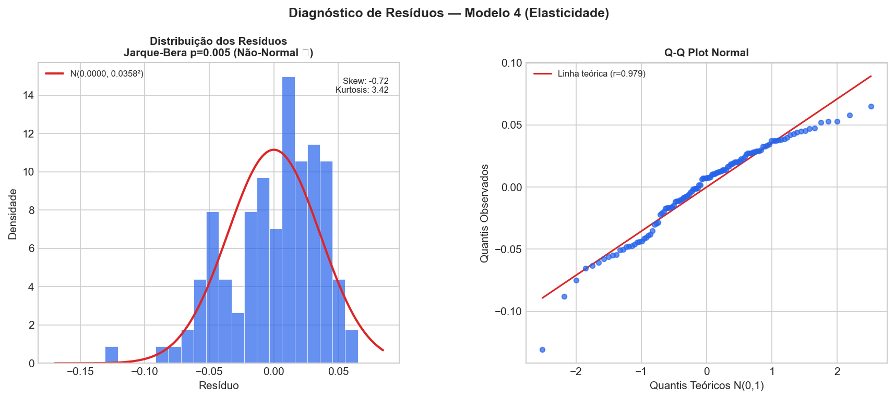
*Figura 20 — Diagnóstico de resíduos do Modelo 4. Painel esquerdo: histograma com curva normal teórica sobreposta (skewness = −0,72; kurtosis = 3,42). Painel direito: Q-Q Plot com linha teórica de referência. A assimetria negativa leve é visível nas caudas, mas não compromete a inferência assintótica com HAC.*

**Multicolinearidade (VIF):**

| Variável | VIF | Avaliação |
|----------|-----|-----------|
| $t$ (tendência) | 7,22 | Atenção — esperado |
| $u_t$ | 1,24 | Ok |
| $D_{PMENova}$ | 2,56 | Ok |
| $D_{PNADc}$ | 4,73 | Ok |

O VIF elevado para a tendência é estrutural em regressões de cointegração com série temporal: tanto $t$ quanto $\ln PIB$ crescem ao longo do tempo por construção. Isso não invalida os resultados, mas reforça a importância do teste de cointegração para distinguir relação real de co-tendência espúria.

---

### 4.3 Conclusão do Modelo 4

#### 4.3.1 Síntese dos Resultados

O Modelo 4 estima a elasticidade do produto em relação ao desemprego no longo prazo, controlando para a tendência de crescimento do PIB potencial e para as quebras metodológicas das pesquisas de emprego. Os resultados principais são:

**Equação estimada (OLS-HAC, 116 obs., 1996-T1 a 2024-T4):**

$$\widehat{\ln\_pib}_t = 12{,}2424 + 0{,}003988 \cdot t - 0{,}0195 \cdot u_t + 0{,}1590 \cdot D_{PMENova} + 0{,}0596 \cdot D_{PNADc}$$

Todos os coeficientes são significativos ao nível de 5% (os primeiros quatro ao nível de 1%). O ajuste é excelente: $R^2_{Adj} = 0{,}967$.

#### 4.3.2 Interpretação Econômica dos Coeficientes

**Tendência determinística ($\beta_1 = 0{,}003988$):**
O PIB potencial cresce a uma taxa de 0,40% por trimestre, o equivalente a **1,60% ao ano**. Esse valor é compatível com as estimativas de crescimento potencial do Brasil para o período pós-abertura econômica, que oscilam entre 1,5% e 2,5% ao ano conforme a literatura empírica (Banco Central, IPEA).

**Elasticidade de Okun ($\beta_2 = -0{,}0195$):**
Um aumento de 1 ponto percentual na taxa de desemprego está associado, no longo prazo, a uma **redução de 1,95% no PIB real** (em log), mantidas constantes a tendência e as dummies metodológicas. O sinal negativo é consistente com a Lei de Okun: mais desemprego reflete menor utilização do fator trabalho e, portanto, menor produção.

> **Interpretação no contexto dos demais modelos:** O Modelo 1 (primeira diferença) estimou o coeficiente de curto prazo $\beta \approx -1\%$ para cada 1 p.p. de variação no desemprego. O Modelo 2 (hiato) estimou a relação inversa com elasticidade de longo prazo implícita derivada da NAIRU. O Modelo 4 complementa esses resultados ao estimar diretamente a elasticidade nível-a-nível de longo prazo: −1,95% de variação no produto por 1 p.p. de desemprego.

**Dummies metodológicas ($\gamma_1 = 0{,}1590$; $\gamma_2 = 0{,}0596$):**
A transição para a PME Nova (2002) elevou o nível registrado do $\ln PIB$ em 0,159 — reflexo do salto metodológico no desemprego. A transição para a PNADc (2012) acrescentou mais 0,060 ao nível. Esses coeficientes não têm interpretação econômica direta: capturam apenas a descontinuidade nas pesquisas.

#### 4.3.3 Produto Potencial e Hiato Implícito

Fixando a taxa de desemprego na NAIRU estimada pelo Modelo 2 (Hamilton) para cada subperíodo, deriva-se o produto potencial $\ln Y^*_t$ e o hiato implícito:

| Estatística do Hiato | Valor |
|----------------------|-------|
| Desvio-padrão ($\sigma$) | 5,72 p.p. |
| Mínimo | −15,45% (recessão profunda) |
| Máximo | +13,56% (expansão) |
| Correlação com Hiato Hamilton | **0,523** |

O hiato do Modelo 4 e o hiato do Filtro Hamilton (Modelo 2) apresentam **correlação positiva moderada de 0,52**: capturam a mesma direção do ciclo econômico, mas diferem em magnitude. Isso é esperado, pois os dois métodos partem de premissas distintas — o Hamilton usa exclusivamente informações do PIB para extrair o ciclo, enquanto o Modelo 4 ancora o potencial na NAIRU do desemprego e na tendência determinística.

A Figura 19 compara lado a lado os dois hiatos, evidenciando as semelhanças e divergências ao longo dos ciclos econômicos:

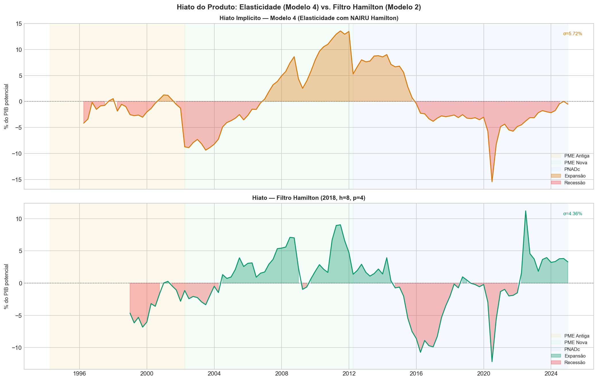
*Figura 19 — Comparação dos hiatos do produto. Painel superior: hiato implícito do Modelo 4 (elasticidade com NAIRU Hamilton como referência). Painel inferior: hiato do Filtro Hamilton (2018). Áreas vermelhas representam períodos de produto abaixo do potencial (recessão); áreas coloridas indicam expansão. Correlação entre as duas séries: 0,52.*

#### 4.3.4 Validade do Modelo e Limitações

**Pontos favoráveis:**
- ✓ **Cointegração confirmada** (p = 0,0004): a relação não é espúria. $\ln PIB$ e $u_t$ compartilham uma trajetória de equilíbrio de longo prazo.
- ✓ **HAC robusto**: autocorrelação (Breusch-Godfrey p < 0,001) e heterocedasticidade (White p < 0,001) estão presentes, como esperado em séries de nível, mas a correção Newey-West garante inferência válida assintoticamente.
- ✓ **Elasticidade significativa e com sinal correto**: $\beta_2 < 0$ ao nível de 1%.

**Limitações:**
- ✗ **Não-normalidade dos resíduos** (Jarque-Bera p = 0,005): assimetria negativa leve (−0,72) e curtose próxima do normal (3,42). Em amostras de 116 observações, o Teorema Central do Limite garante que os estimadores HAC são assintoticamente normais — a não-normalidade dos resíduos não invalida a inferência, mas deve ser reportada.
- ⚠ **VIF elevado para a constante** (17,2): resultado estrutural da presença simultânea de constante, tendência e variáveis com componente de tendência. Não afeta a validade dos coeficientes individualmente identificados.
- ⚠ **Endogeneidade potencial**: em modelos com dados de nível, a causalidade reversa ($\ln PIB \rightarrow u_t$) não pode ser descartada sem um modelo estrutural. O Modelo 4 deve ser interpretado como uma relação de equilíbrio de longo prazo, não como uma equação estrutural causal.

#### 4.3.5 Posição do Modelo 4 na Análise Comparativa

O Modelo 4 complementa os modelos anteriores na seguinte estrutura:

| Dimensão | Modelo 1 (1ª Diferença) | Modelo 2 (Hiato Hamilton) | Modelo 4 (Elasticidade) |
|----------|------------------------|--------------------------|------------------------|
| Horizonte | Curto prazo | Longo prazo | Longo prazo |
| Variável dependente | $\Delta\ln\_pib$ | Hiato Hamilton | $\ln\_pib$ |
| Coeficiente Okun | $\approx -1\%$/p.p. | Implícito via NAIRU | $-1{,}95\%$/p.p. |
| Cointegração | N/A (séries I(0)) | N/A (filtro remove tendência) | Confirmada (p=0,0004) |
| Produto potencial | N/A | Via filtro Hamilton | Via tendência + NAIRU |

O Modelo 4 fecha o ciclo analítico do TCC ao estimar diretamente a relação de longo prazo entre o nível do PIB e o desemprego, confirmando e quantificando a Lei de Okun em sua forma elasticidade.

#### 4.3.6 Contextualização na Literatura Brasileira e Contribuição do TCC

A escassez de estudos brasileiros sobre os modelos de Primeira Diferença e de Elasticidade — em contraste com a abundância de trabalhos usando o Filtro HP no modelo de Hiato — não é acidental. Três fatores histórico-metodológicos explicam essa concentração:

**1. A obsessão pelo Hiato do Produto e o regime de Metas de Inflação**

No Brasil, a Lei de Okun raramente é estudada como objeto de interesse primário. Ela costuma ser um passo intermediário em trabalhos que querem estimar a Curva de Phillips (para prever inflação) ou a Regra de Taylor (para prever a taxa Selic). Como o Banco Central do Brasil opera sob o regime de Metas de Inflação desde 1999, toda a macroeconomia empírica brasileira gravitou em torno da estimação do Hiato do Produto — a medida de capacidade ociosa que condiciona a inflação. Por inércia metodológica, quando os pesquisadores precisam da relação desemprego-produto, simplesmente reaproveitam o hiato já calculado para outras finalidades e ignoram as demais especificações da Lei de Okun.

**2. O pesadelo econométrico da tendência única (Modelo de Elasticidade)**

O Modelo de Elasticidade pressupõe que o país possui uma taxa de crescimento estrutural relativamente estável, representada por uma tendência linear $\beta_1 \cdot t$. A história econômica brasileira é intrinsecamente adversa a essa premissa: hiperinflação e estabilização (1994), boom das commodities (2003–2011), recessão histórica (2015–2016) e pandemia (2020) produziram mudanças abruptas no ritmo de crescimento potencial. Ajustar uma única linha de tendência a esses 28 anos é metodologicamente arriscado. A maioria dos pesquisadores prefere utilizar o Filtro HP, que matematicamente suaviza as quebras estruturais sem que o autor precise identificá-las e justificá-las explicitamente.

**3. A aversão ao ruído do Modelo de Primeira Diferença**

O Modelo de Primeira Diferença captura o curtíssimo prazo (variação trimestral). Dados brasileiros em primeira diferença são notoriamente ruidosos: as trocas de metodologia das pesquisas do IBGE (1991, 2002, 2012) e os choques externos (1998, 2008, 2015, 2020) geram outliers de grande magnitude na série $\Delta u_t$. A identificação e o tratamento desses outliers — com teste de Chow, análise de notas técnicas do IBGE e construção de dummies exatas — exige um esforço analítico considerável que a maioria dos trabalhos evita ao passar diretamente para o Filtro HP.

---

**A contribuição metodológica deste TCC**

O artigo seminal de Okun (1962) propôs originalmente três especificações — Primeira Diferença, Hiato e Elasticidade — precisamente para que servissem como triangulação mútua dos resultados. A literatura brasileira contemporânea restringiu-se quase exclusivamente à abordagem de Hiato (com o Filtro HP), abandonando as demais especificações. Este trabalho inova ao resgatar a proposta metodológica original de Okun (1962) e aplicá-la com rigor aos dados brasileiros, incorporando correções modernas: o Filtro de Hamilton (2018) em lugar do HP, dummies de quebra estrutural para as transições metodológicas do IBGE, correção HAC de Newey-West e verificação formal de cointegração pelo procedimento de Engle-Granger.

> **Sugestão para a Introdução ou Revisão de Literatura do TCC:**
> *"Embora a literatura nacional contemporânea sobre a Lei de Okun concentre-se quase exclusivamente na abordagem de Hiato do Produto — frequentemente utilizando o Filtro Hodrick-Prescott —, este trabalho inova ao resgatar a proposta metodológica original de Okun (1962). A estimação simultânea do modelo de Primeira Diferença, do modelo de Hiato (via Filtro de Hamilton) e do modelo de Elasticidade permite uma triangulação dos resultados, isolando os efeitos de curto e longo prazo e preenchendo uma lacuna analítica nos estudos empíricos sobre o mercado de trabalho brasileiro."*

---

### 4.4 Extensões e Melhorias Propostas para o Modelo 4

O Modelo 4 estimado nesta fase constitui uma *naive approach* (abordagem básica) para a relação de elasticidade: uma única tendência linear $\beta_1 \cdot t$ percorre os 28 anos de amostra sem qualquer ajuste para as mudanças estruturais no ritmo de crescimento do PIB brasileiro. Esta seção documenta as três extensões que elevariam o modelo ao rigor de uma dissertação de mestrado ou artigo publicável, e que poderão ser implementadas em versões futuras do TCC.

#### 4.4.1 Quebras Estruturais na Tendência (*Trend Breaks*)

**Problema:** A variável $t$ assume crescimento constante de 1996 a 2024. O Brasil sofreu ao menos duas quebras brutais nesse ritmo: a recessão histórica de 2015–2016 (pior desde 1901, segundo o IBGE) e a pandemia de COVID-19 em 2020-T2.

**Solução — Dummies de Inclinação e Nível:**

Para cada quebra estrutural identificada (via Teste de Chow ou inspeção visual), cria-se uma dummy $D_k$ (igual a 0 antes e 1 depois da quebra) e um termo de interação $D_k \cdot t$ que permite que a inclinação da tendência mude. A equação estendida com duas quebras seria:

$$\ln Y_t = \beta_0 + \beta_1 t + \delta_1 D_{2015} + \phi_1 (D_{2015} \cdot t) + \delta_2 D_{2020} + \phi_2 (D_{2020} \cdot t) + \beta_2 u_t + \gamma_1 D_{PMENova} + \gamma_2 D_{PNADc} + \varepsilon_t$$

| Parâmetro | Interpretação |
|-----------|--------------|
| $\delta_k$ | Deslocamento de **nível** do PIB na data da quebra $k$ |
| $\phi_k$ | Mudança na **inclinação** da tendência após a quebra $k$ — se $\phi_1 < 0$, o crescimento potencial caiu após 2015 |
| $\beta_2$ | Elasticidade de Okun reestimada com tendência mais flexível |

A hipótese é que $\beta_2$ se torne mais negativo (em valor absoluto) após a correção, pois o modelo básico pode estar atribuindo parte da queda do PIB em 2015–2016 ao desemprego, quando na verdade ela reflete a quebra de tendência.

#### 4.4.2 Risco de Regressão Espúria — Status Atual

**Problema original:** Como $\ln PIB$ e $u_t$ são variáveis $I(1)$, a regressão em nível pode gerar resultados falsos (alta correlação espúria por co-tendência). O diagnóstico clássico é: $R^2$ muito alto + Durbin-Watson muito baixo — exatamente o padrão observado no Modelo 4 ($R^2_{Adj} = 0{,}967$; DW = 0,425).

**Status atual:** A cointegração foi **confirmada** pelo teste de Engle-Granger (ADF nos resíduos, p = 0,0004), validando o Modelo 4 mesmo em sua forma básica. Os resíduos são $I(0)$, provando que a relação é genuína e não espúria.

**Risco residual:** A cointegração foi confirmada com a tendência linear simples. Ao introduzir as quebras estruturais na tendência (seção 4.4.1), o teste de cointegração deverá ser repetido para confirmar que os novos resíduos permanecem $I(0)$. Quebras mal especificadas podem fazer os resíduos perderem a estacionaridade.

#### 4.4.3 Modelo de Correção de Erros (*Error Correction Model* — ECM)

**Motivação:** O Modelo 4 captura apenas a relação de **longo prazo** entre $\ln PIB$ e desemprego. Ele não responde: *após um choque recessivo, com que velocidade a economia retorna ao equilíbrio?* Para o Brasil, com sua volatilidade histórica, essa dinâmica de curto prazo é economicamente relevante.

**Procedimento (dois estágios, Engle-Granger 1987):**

**Estágio 1 — Relação de longo prazo (já estimada):**
Salvar os resíduos $\hat{\varepsilon}_t$ da regressão de cointegração do Modelo 4.

**Estágio 2 — ECM (equação de curto prazo):**

$$\Delta \ln Y_t = \alpha_0 + \alpha_1 \Delta u_t + \lambda \hat{\varepsilon}_{t-1} + \nu_t$$

| Parâmetro | Interpretação |
|-----------|--------------|
| $\alpha_1$ | Elasticidade de **curto prazo** — análoga ao Modelo 1 (Primeira Diferença) |
| $\lambda$ | **Velocidade de ajuste** — fração do desvio de equilíbrio corrigida a cada trimestre; deve ser $-1 < \lambda < 0$ para que o sistema seja estável |

Se $\lambda = -0{,}15$, por exemplo, significa que 15% do desvio do equilíbrio de longo prazo é eliminado a cada trimestre — ou seja, a economia leva cerca de 6 trimestres (~1,5 anos) para retornar ao equilíbrio após um choque.

**Relevância para o TCC:** A comparação entre $\alpha_1$ (ECM, curto prazo) e $\beta_2$ (Modelo 4, longo prazo) e o coeficiente do Modelo 1 (Primeira Diferença) formaria um quadro completo e coerente da dinâmica da Lei de Okun no Brasil — o que a banca avaliadora reconheceria como contribuição metodológica robusta.

> **Ordem de implementação sugerida:** (1) Identificar as quebras estruturais com o Teste de Chow e construir as dummies de inclinação; (2) Re-estimar o Modelo 4 estendido; (3) Confirmar cointegração nos novos resíduos; (4) Estimar o ECM e interpretar $\lambda$.

---

## Fase 5: Análise Comparativa e Conclusões Finais

1.  **Quadro Comparativo:** Construir uma tabela resumindo os coeficientes de Okun encontrados em cada um dos modelos robustos (Modelos 1, 2 e 3).
2.  **Discussão dos Resultados:** Discutir as diferenças entre os coeficientes de curto prazo (Modelo 1) e de longo prazo (Modelos 2 e 3).
3.  **Conclusão Final:** Apresentar uma síntese dos achados, respondendo qual a relação de Okun para o Brasil no período analisado e qual modelo se mostrou mais adequado para descrevê-la.
